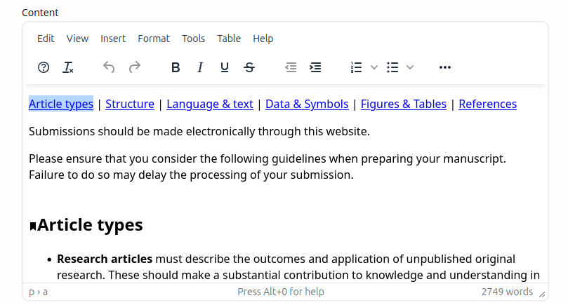
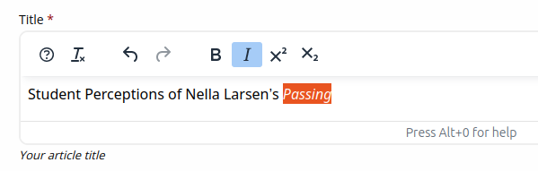
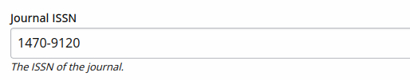

Technical Configuration
=======================

This section will discuss the technical configuration of Janeway focusing on the Django settings file. 

.. note:: This section is currently a work in progress.

Django Settings
---------------
Unlike traditional Django applications Janeway has two settings files, they are generally located in `src/core/`.

- janeway_global_settings.py
- settings.py (created during the installation process)

Global Settings
---------------
The global settings file is created by the Janeway team and is managed through version control. Generally speak you should not need to change anything in this file as you can use your local `settings.py` file to override variables.

Local Settings
--------------
This file is usually created during the setup process and can be based on the provided `example_settings.py` file.

- DEBUG
  - Should be set to False in any environment where an external user can access the install.
- URL_CONFIG
  - Set to either 'domain' or 'path' dependind on whether the primary way to access sites is via individual domains for each or path based urls eg. journal.press.com or press.com/journal/.
- DATABASES
  - You can set the database connection details for the install.
- CAPTCHA_TYPE: Can be one of three different variables: 'simple_math', 'recaptcha' or 'hcaptcha'.
  - simple_math - A very simple captcha using a basic mathematical question.
  - recaptcha - Uses Google's reCaptcha2. Has been shown to be less effective recently but v3 is not GDPR compliant. You should complete 'RECAPTCHA_PRIVATE_KEY' and 'RECAPTCHA_PUBLIC_KEY' otherwise you will get an error.
  - hcaptcha - Uses hcaptcha, a new addition to Janeway. You should complete 'HCAPTCHA_SITEKEY' and 'HCAPTCHA_SECRET' otherwise you will get an error.
- LOGGING
    - Provides the configuration for Python's logger. We recommend following the steps described in the `Django documentation <https://docs.djangoproject.com/en/1.11/topics/logging/>`_ for configuration.
    - By default, Janeway will log both to the console as well as to the file located at `logs/janeway.log` and rotates the file every 50MB. For production systems, you may want to change the location and/or rotation strategy as per the Django documentation

Error Logging with Sentry
-------------------------

As of version 1.5 we have removed core the Raven core requirement, this is because Sentry no longer uses Raven. We have made the decision not to include the Sentry SDK as a core requirement so the process for adding Sentry logging back is detailed below.

First you will need to install the Sentry SDK:

::

    pip install sentry-sdk

Next you will need to configure the SDK by adding the following to you settings.py file:

::

    import sentry_sdk
    from sentry_sdk.integrations.django import DjangoIntegration

    sentry_sdk.init(
        dsn="https://examplePublicKey@o0.ingest.sentry.io/0",
        integrations=[DjangoIntegration()],

        # Set traces_sample_rate to 1.0 to capture 100%
        # of transactions for performance monitoring.
        # We recommend adjusting this value in production,
        traces_sample_rate=0.0,
    )

Add your own dsn in place of the example. You should now start receiving sentry error reports. Information, including which version of the SDK to install, on Sentry's Django integration can be found over on their docs site: https://docs.sentry.io/platforms/python/guides/django/.

Full-text search
----------------

Janeway provides opt-in RDBMS-backed full-text search. In order to enable full-text search and indexing, the ``ENABLE_FULL_TEXT_SEARCH`` setting must be set to ``True`` under your settings file.
When enabling full-text search, the search interface will be different, offering users the ability to select what fields to perform the search on as well as allowing for results to be ordered by relevance 
(i.e. objects will be sorted by the frequency of the term in the selected fields)
Full-text search is supported on both MySQL and Postgresql backends, however due to the different implementation existing on each backend, there are a couple of extra steps to take on each.

Configuring full-text search in Postgresql
~~~~~~~~~~~~~~~~~~~~~~~~~~~~~~~~~~~~~~~~~~

For better search performance, it is recommended to add a full-text index to the columns Janeway will search.
We recommend using a Generalized Inverted Index (GIN) with Postgresql which will result in slower writes but faster reads when compared to the alternative GiST index.

In order to create GIN indexes, one must first install the ``btree_gin`` extension. Janeway will install this extension automatically (as well as index all relevant columns for full text search) when running the
following command:

``python src/manage.py generate_search_indexes``

Additionally, we recommend setting the following setting in your ``settings.py`` file:

``CORE_FILETEXT_MODEL = "core.PGFileText"``

The setting above will change the underlying model used to index full-text articles by storing just the index in the database
instead of the entire text. If you use the ``core.PGFileText`` model, articles will only take around 10% of the original space required to store
the entire text file (This feature is only available for ``postgresql`` users)

.. warning::
    If you intend to use the ``PGFileText`` model, you must set the ``CORE_FILETEXT_MODEL`` setting before you install Janeway and/or before you
    upgrade an installation to v1.4.2. Otherwise, the migration engine will install the regular ``core.FileText`` model instead.

Configuring full-text search in MySQL
~~~~~~~~~~~~~~~~~~~~~~~~~~~~~~~~~~~~~

In MySQL, Janeway uses binary search mode to find results in the database. Binary search in MySQL requires the columns object of the search to be indexed.
There is a command you can run once ``ENABLE_FULL_TEXT`` is set to True

``python src/manage.py generate_search_indexes``

The above command will generate the relevant indexes for full-text search to work within Janeway.

Press site search
-----------------

Janeway provides limited support for static site search of press website content. Currently it is only available when using the `Hourglass press-level theme <https://github.com/BirkbeckCTP/hourglass>`_.

To enable site search, set ``SITE_SEARCH_INDEXING_FREQUENCY`` to ``(4, 'daily')`` (or another crontab frequency) in your settings file. To disable it, set this setting to ``None``.

You can also immediately generate the search data by running the server and then running the command ``python manage.py generate_site_search_data``.

Theming
--------
Janeway includes three core themes by default:

- OLH (Foudation)
- material (Materialize)
- clean (Bootstrap)

A list of core themes is held in janeway_global_settings.py.

Theme Structure
~~~~~~~~~~~~~~~

Generally themes follow this structure:

- /path/to/janeway/src/themes/themename/
    - assets/
        - Contains CSS/JS/Images
    - templates/
        - Contains Django templates
    - __init__.py
    - build_assets.py
        - Should contain at least one method called build that takes no arguments, it should know how to process any SCSS and copy the resulting files into the main static folder or just pass if not required. See path/to/janeway/src/themes/OLH/build_assets.py as an example.
    - README.MD

Creating a New Theme
~~~~~~~~~~~~~~~~~~~~
You are welcome to develop your own themes and can use one of the existing themes as a template of what is required. You should follow the structure above and have full template coverage.

Creating a Sub Theme
~~~~~~~~~~~~~~~~~~~~
Creating a sub theme is much easier than creating one from scratch. A sub theme is essentially a copy of one of the existing themes but with the templates that aren't required stripped out. This is useful if say, for example, you only want to customise one or two templates as you will only need to track core changes to those files.

Once you have created your sub theme you can then set for the whole install with the INSTALLATION_BASE_THEME setting or the Journal Base Theme setting for journals that are using the sub theme (located on the Manager > Journal Settings page, this setting will appear once you set the Journal Theme to your non-core theme).

An example structure for a sub theme where we want to customise only the login page:

- /path/to/janeway/src/themes/speciallogintheme/
    - assets/
    - templates/
        - core/login.html
        - press/core/login.html
    - __init__.py
    - build_assets.py
    - README.MD

Automatic browser reloading
~~~~~~~~~~~~~~~~~~~~~~~~~~~

Using ``django-browser-reload`` you can watch templates and static files and trigger a browser refresh when there are changes, saving lots of keystrokes during front-end development.

Add the following to your ``src/core/settings.py``::

    INSTALLED_APPS = [
        ...,
        'django_browser_reload',
        ...,
    ]
    MIDDLEWARE = (
        ...,
        'django_browser_reload.middleware.BrowserReloadMiddleware',
        ...,
    )

Understanding text fields and text editors in Janeway
-----------------------------------------------------

Janeway tries to provide users with the best kind of
text field and text editor for each kind of text.

There are four main field types, and there is a
Janeway setting type for each one (`core.models.Setting`).

| Display model | HTML            | No HTML           |
| ------------- | --------------- | ----------------- |
| Block         | Rich Text Field | Plain Text Field  |
| Inline        | Mini HTML Field | Character Field   |

Rich Text Fields
~~~~~~~~~~~~~~~~

For multiline rich-text content like custom pages and news
items, we use a feature-rich text editor called TinyMCE.

   A content page with paragraphs, hyperlinks, headings, and more

Many users copy-paste from Word into these fields, so we use
a JavaScript event listener to offer them several pasting options.
Do they want to keep all the styling that Word put into their text?
Or do they want to just copy plain text and format it again if needed
in Janeway?

This content is stored in Janeway as an HTML string that is "bleached"
to make sure it does not contain malicious code. The bleaching
logic relies on a handful of allowlists that can be configured
in `settings.py`. The default allowlists are very broad. Separate
allowlists can be configured for elements, attributes, style rules,
and so forth.

When this content is loaded into Janeway sites and interfaces,
it must be “marked safe” for the user’s described
formatting to take effect. By default in Django,
HTML markup and other potentially harmful Unicode characters found in strings
that come from the database are escaped into their respective HTML entities.
For example `<` becomes `&lt;`. This means the browser does not process these
characters as HTML instructions, it just converts them to Unicode and presents
that to the user. The user sees raw HTML, not rendered HTML.
So if we *do* want HTML markup to be processed (because we’ve bleached it),
we have to “mark it safe” by using the `mark_safe` function in a view or the
`|safe` template filter in a template.

This field shows up most often in our codebase as some combination of
`JanewayBleachField` and `input=TinyMCE()`.

Janeway settings (`core.models.Setting`) that want this behavior must
have a type of `rich-text`.

Mini HTML Fields
~~~~~~~~~~~~~~~~

There is often the need to store one line of text like a label,
heading, name, or title. Sometimes light markup like bold and italics
is needed in these bits of text. For these we have the mini HTML field.

   An article title field allowing italics and a few other styling options

This field does not allow multiline markup, because its content needs to be usable
in layouts and interfaces where only inline content is expected. Anything
outside a few [phrasing
content](https://html.spec.whatwg.org/dev/dom.html#phrasing-content-2) elements
is removed by the bleaching logic before the string is stored in the database.
For details see `utils.const.get_allowed_html_tags_minimal` and
`utils.const.get_allowed_attributes_minimal`. For the user, this means any line
breaks introduced via the text editor will be removed when the field is saved.
We consciously limit the toolbar options to signal to users what markup is allowed.

This category shows up in our codebase most often
as `MiniHTMLFormField`, whish is used by default by the
`JanewayBleachCharField` model field.

Janeway settings (`core.models.Setting`) that want this behavior must
have a type of `mini-html`.

Plain Text Fields
~~~~~~~~~~~~~~~~~

Plain text fields are best for multiline content where HTML
is not supported. Usually the rich text field will be a better
choice but there are some cases where you cannot use HTML.

The field is rendered as a simple text area. Newlines can be
entered with the Enter key by the user, or programmatically via
newline marks like `\n`.

No bleaching is applied because this content
should not need to be marked safe, because there won’t be any
markup to process by the browser.

It shows up most often in the codebase as `TextField` or `Textarea`.

Janeway settings (`core.models.Setting`) that want this behavior must
have a type of `text`.

Character Fields
~~~~~~~~~~~~~~~~

For many other strings that are controlled via settings,
Janeway offers the character setting field.

   An ISSN field with no rich text options, just one line of plain text

This field is rendered as a simple text input on one line. It is used
for storing many different strings like email subject lines, email addresses,
unique identifiers, and URLs.

This category only typically shows up in our codebase as a `CharField`
or `TextInput`.

Janeway settings (`core.models.Setting`) that want this behavior must
have a type of `char`.
