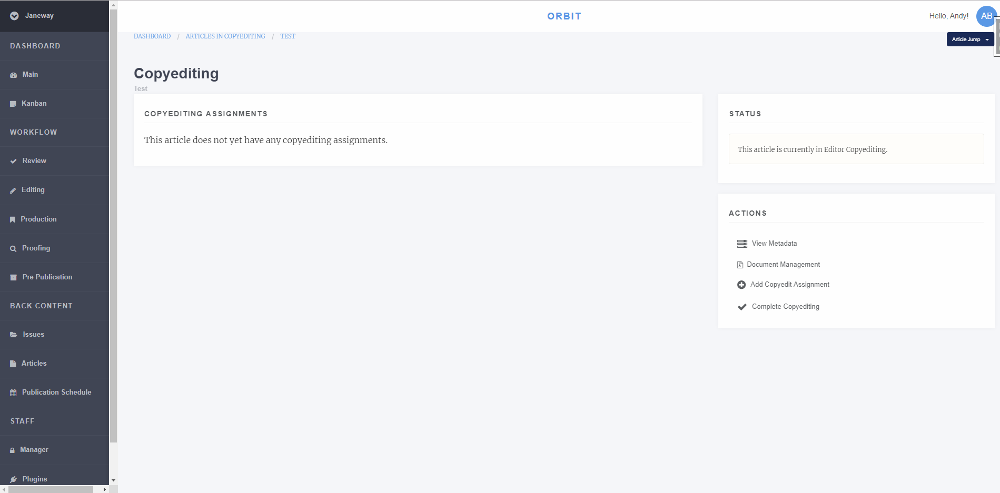
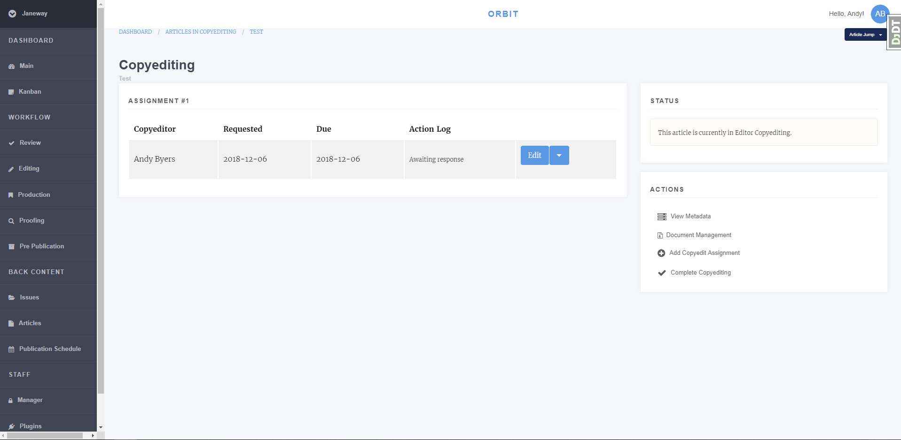
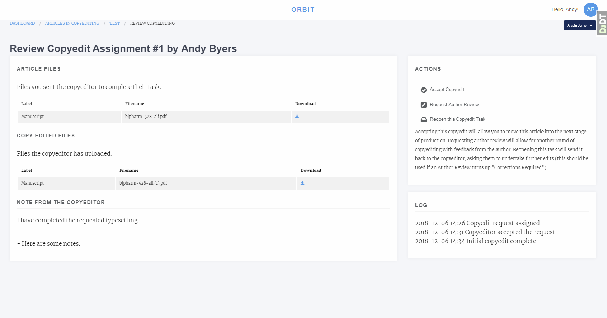

Copyediting
===========
The copyediting stage provides an interface to track copyediting requests.

   

    Janeway's Copyediting screen
    
    
Assigning a Copyeditor
----------------------
To assign a copyeditor select *Add a Copyedit Assignment*. This will present 
a screen with the following options:

1. Select a Copyeditor
    1.1 You can either select a copyeditor from the list or enrol another user the role before selecting them.
2. Select Files
    2.1 Select files will list manuscript files from the review stage including any new files uploaded as part of the revision process.
    2.2 If the file you want is not here, go back to the Copyediting screen and use Document Management to upload it.
3. Set Options
    3.1 A notes field is available for you brief the copyeditor.
    3.2 A due date field with date selector allows you to set the date this assignment is needed by.
4. Notify the Copyeditor
    4.1 Once you have clicked *Add Copyeditor* you will be directed to the Notification page where you can email the copyeditor if you whish, or skip if you don't.
    
    
Managing Copyediting Assignments
--------------------------------
You can make as many copyediting assignments as you like and track them from the copyediting screen.

    Janeway's Copyediting screen with an assignment
    
After an assignment has been made the copyeditor will be able to login to the system to do their work. Before the
task is accepted you have the opportunity to edit the notes and due date or delete the assignment, once the copyeditor
has accepted the task these options are removed and replaced with a *Review* button. The *Action Log* will also updated
with relevant dates like *Copyeditor accepted the request*. 

Review Copyediting
------------------

    Copyediting review page
    
The review page presents the response from the copyeditor including their notes and any files they uploaded. You can now do one of three things:

1. Accept Copyedit, this closes the task.
2. Request Author Review, ask the author to review the copyedits.
3. Reopen the task, ask the copyeditor to make some changes.

Accepting the copyedit closes this task, if you wish to make further requests from the copyeditor after pressing this you can assign the copyeditor again to a new task.

Requesting author review will ask the author to review the changes made and inform the editor if any corrections are required. The author can also upload a file if they have made corrections or used track changes.

Reopen the task asks the copyeditor to make further changes to the manuscript file. This is most often used after a Author Review returns *corrections required*.

Finishing Up
------------
When you are finished copyediting the manuscript you can select *Completed Copyediting* to move to the next stage. In the standard workflow the next stage is Production.