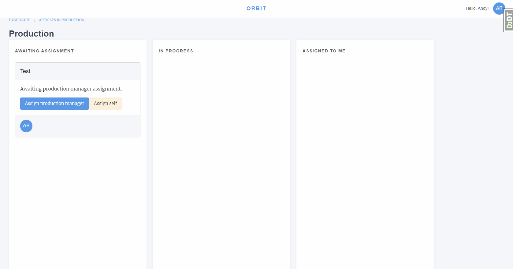
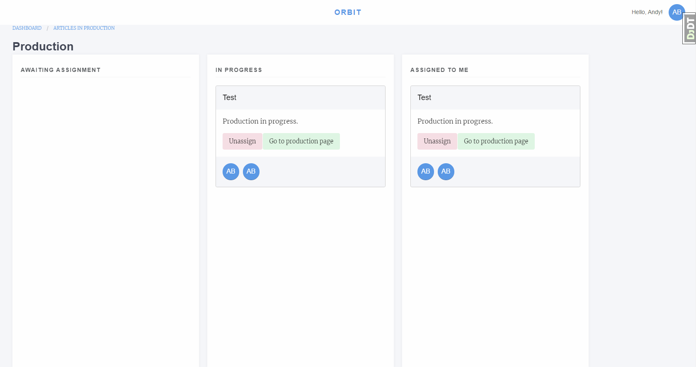
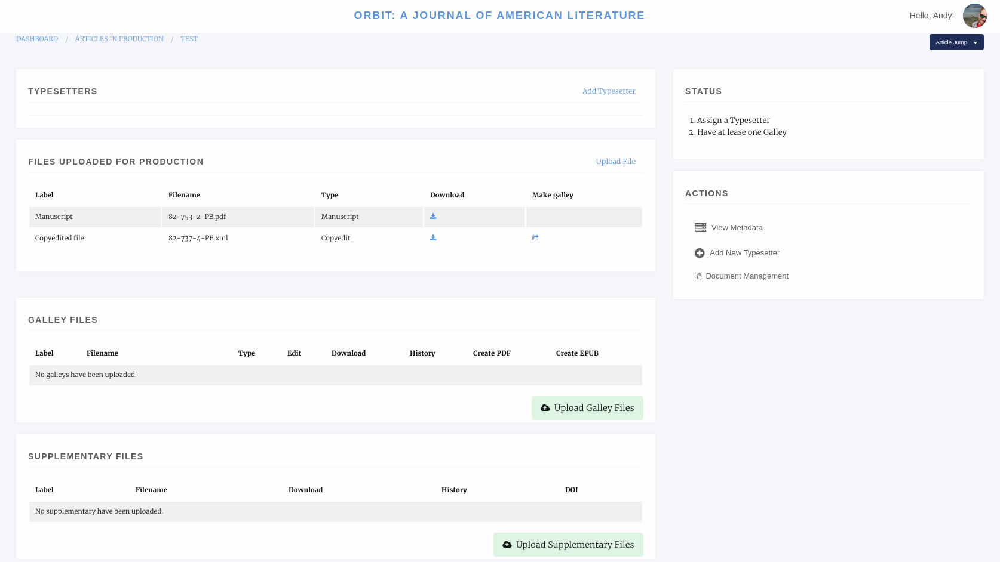
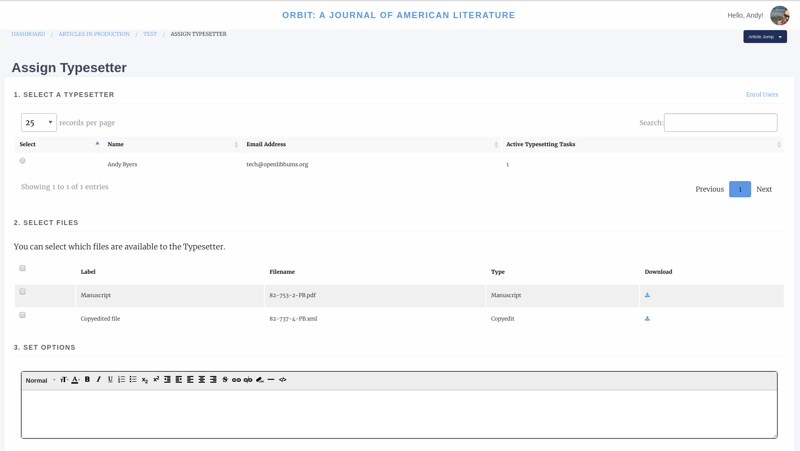
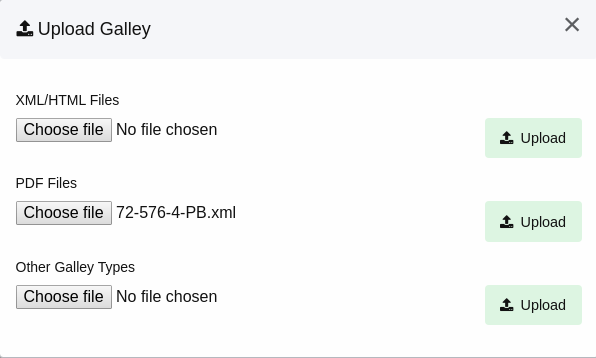
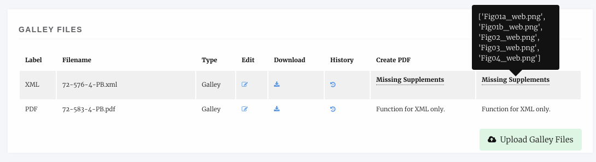
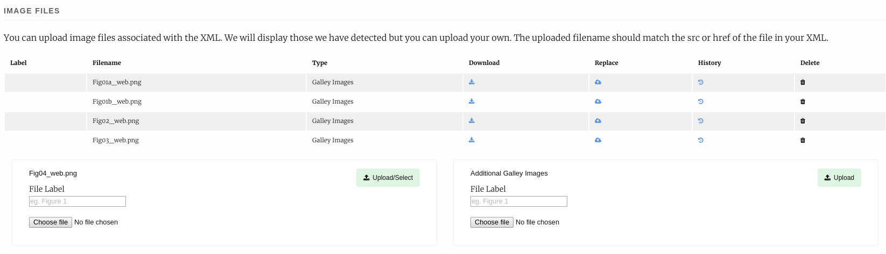

Production
==========
Janeway allows for the use of Production Managers. These may be users who handle the production or articles, external organisations, or publishers. Their job is to assign typesetters and/or create galley proof files.

For smaller organisations that do not utilise an external production team, the Editor can assign themselves as Production Manager, this will allow them to upload galley proofs or assign other users as typesetters for the article. 
If you are assigning an external production manager, you will still have access to the Production Management screen.

    Production Manager assignment interface

Assign a Production Manager
---------------------------
Select either:

1. Assign production manager
    1.1 Select a production manager from the lsit
2. Assign self
    2.1 This will make you the Production Manager

After assignment the article will move from Awaiting Assignment to In Progress, if you assigned yourself it will also show in Assigned to Me.

    Production Manager with assigned article

Production Screen
-----------------

From the production screen the Production Manager can:

- Assign typesetters
- Upload galley proofs
- Upload supplementary files and assign them DOIs

    Production Manager screen

Assigning a Typesetter
----------------------
To assign a typesetter first select *Add Typesetter*.

    Assigning a typesetter

1. Select a Typesetter
2. Select the files you would like this typesetter to work on
3. Add any notes like what outputs you would like
4. You have the option to send a notification email

Note, you can add as many typesetter assignments as you like.

Uploading Galleys
-----------------
Galley files are used for proofing and for displaying content on the live site. Janeway can display either JATS XML or HTML galleys and list most other formats as downloads.

To upload a galley click *Upload Galley Files*. You can then select either XML/HTML, PDF or Other. 

    Uploading a galley file

When uploading an HTML or XML file, with images Janeway will warn you that you need to upload them with a message like "Missing supplementary files."

    Missing Image files

We can upload these by selecting Edit Galley and using the upload boxes to upload the image files.

    Uploading image files

On the edit galley page we can also replace the galley file, edit its label and upload an accompanying CSS file if the article requires specific styling.

Finishing Up
------------
Once either the typesetters have completed their task or you have uploaded the Galleys yourself we can complete the production stage.
If in the event you require the typesetter to do some additional work on the galleys you can assign them again once their initial task is complete.

To complete the Production stage select *Mark production as complete* and optionally send an email to the editor (if you are the editor you can click skip to not send the email).
