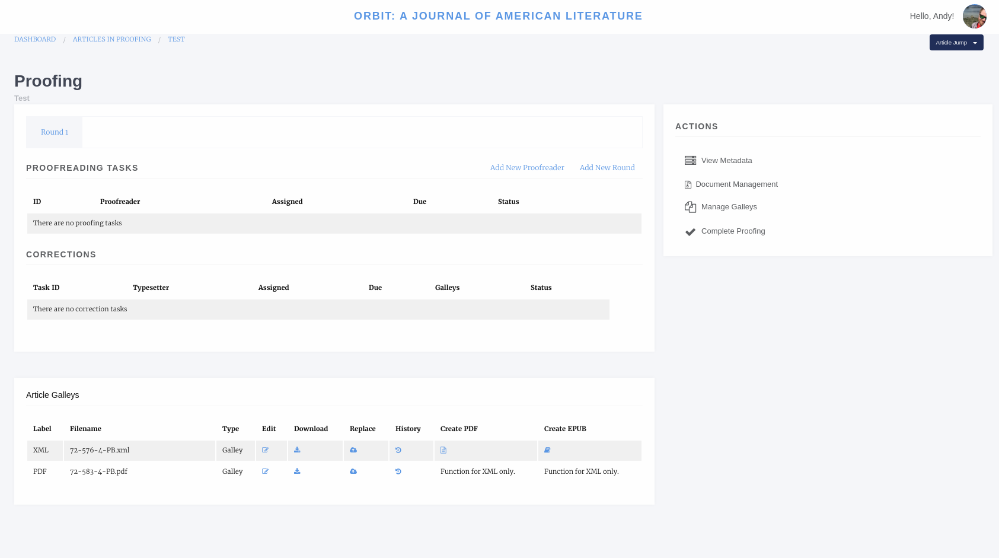
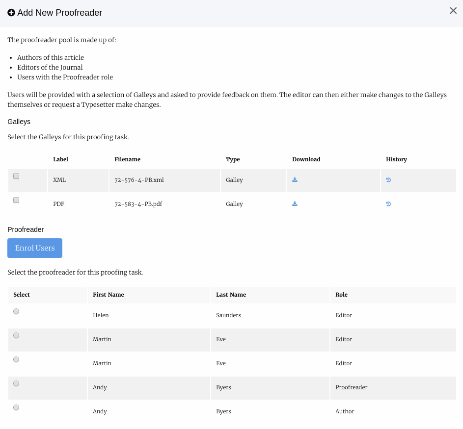
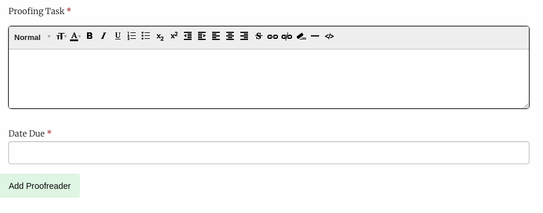
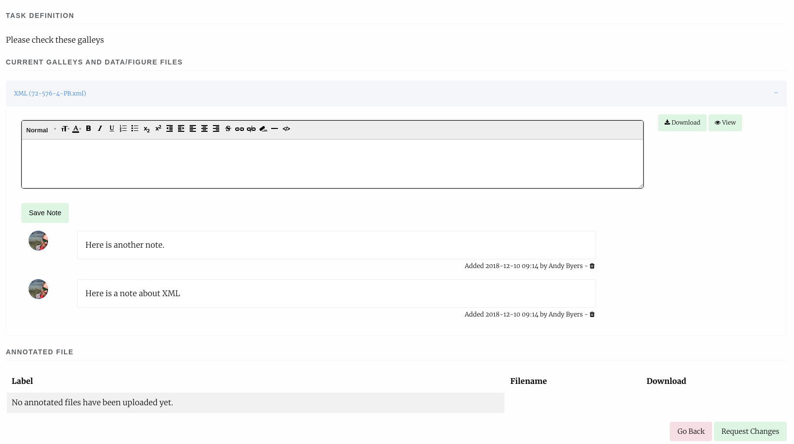

Proofing
========

The Proofing stage allows us to request proofreading from any of:

- The journal editors
- Users with the proofreader role
- Authors of the article

Much like Production we can assign a Proofing Manager to undertake the proofing stage on the Editors behalf or we can assign ourselves as the proofing manager. Either way Editors retain access to the Proofing Manager pages.

    Proofing manager screen
    
From this page we can assign proofreaders and upload new Galley files. To add a new Proofreader select Add New Proofreader.

Assigning a Proofreader
-----------------------

1. Select the files we want the proofreader to view. XML will be rendered into HTML and PDFs and EPUBs will be displayed in the browser.
All other file types will be served as downloads.

2. Select the proofreader. The list of potential proofreaders is made up of Editors, Users with the Proofreader role and the Authors of the paper. You can only select one proofreader but can add multiple assignments.

3. Task, you can use this text box to define the task for the proofreader eg. Please undertake a technical reading of theses galleys.

4. Due Date allows you to set a date for the task to be complete, please ensure you give people a reasonable amount of time to complete the task.

    Adding a proofreader part 1
    

    Adding a proofreader part 2

After completing this for you can optionally send an email to the proofreader with information about their task.

Editing a Proofing Assignment
-----------------------------
Before a proofing assignment has been accepted and is underway you will have the option to edit it using the *Actions* drop down. The edit interface allows you to change the galleys, task box and the due date of an assignment. It also has a delete button that will completely remove the assignment, though some information is retained in Janeway's logs.

Completed Proofing Assignments
------------------------------
Once a proofing assignment is completed, the *Actions* drop down is populated with three different buttons:

1. Review
2. Request changes
3. Acknowledge

Review
~~~~~~
The review page will display each of the assigned galleys and allow you to view the notes the proofreader made about the paper. You can also add your own notes here if you have further things to add (this is useful if you are using an external typesetter). If the proofreader uploaded  a annotated document you can also view it on this page.

    Reviewing a proofing task
    
If you are using external typesetters or have someone using the typesetting role, you can then request changes from them using the *Request Changes* button on this page, or from the action menu on the main Proofing screen.

Request Changes
~~~~~~~~~~~~~~~
You can use this page to request changes from a typesetter. The first thing to do is decide if you want to pull the proofreaders comments into the task box. If you do, press the *Import Comments* button in the top right of the page. You can then:

1. Edit the task
2. Set a due date
3. Select proofed galleys for editing
4. Select a file the proofreader uploaded (if any)
5. Select a typesetter

As always you will have the option of emailing the typesetter.

Acknowledge
~~~~~~~~~~~
Allows you to send a short thank you message to the proofreader acknowledging their work.

Corrections wihout Typesetter
~~~~~~~~~~~~~~~~~~~~~~~~~~~~~
If you are not using a typesetter but are making corrections yourself the main Proofing interface provides a place to replace existing galleys with new versions or to upload new files.

Finishing Up
------------
Once you are happy with the galley files you can complete the proofing stage. This will move you to the pre-publication page.