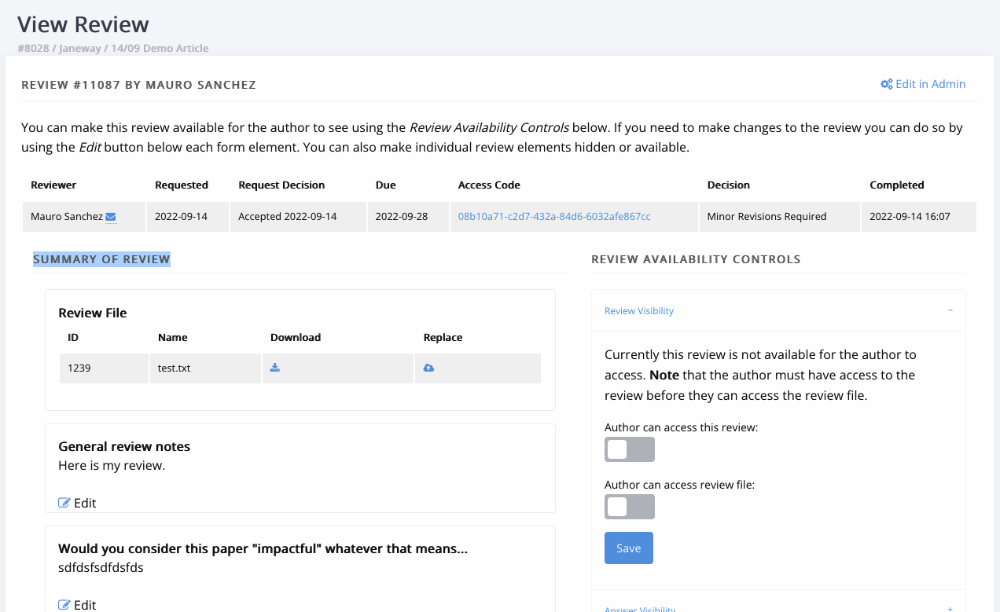
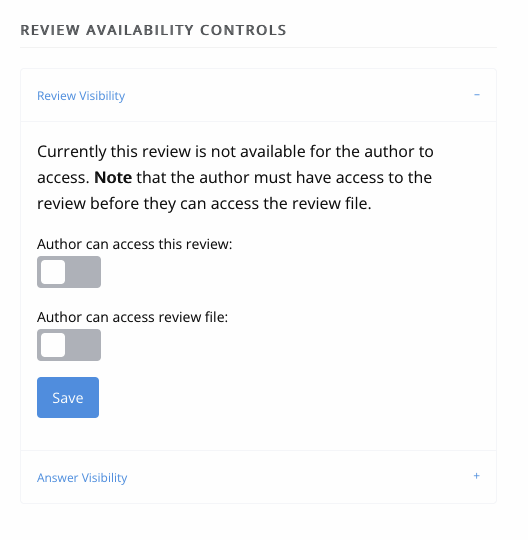
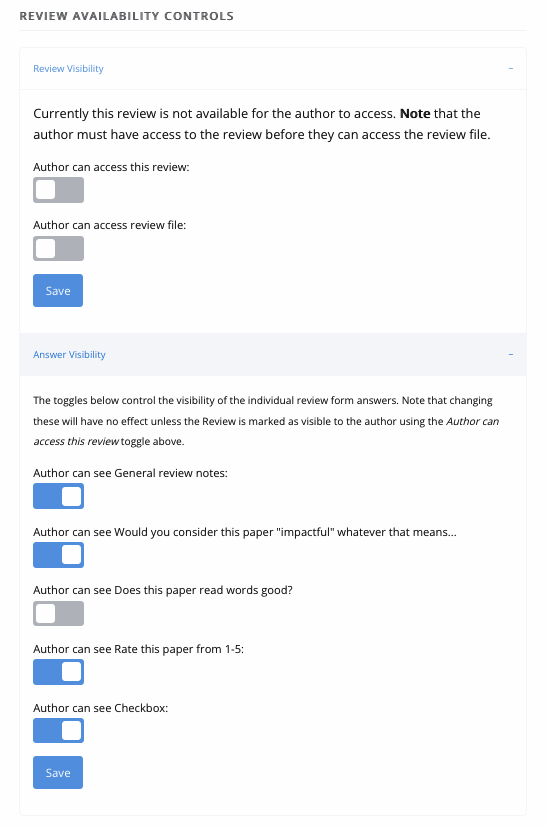
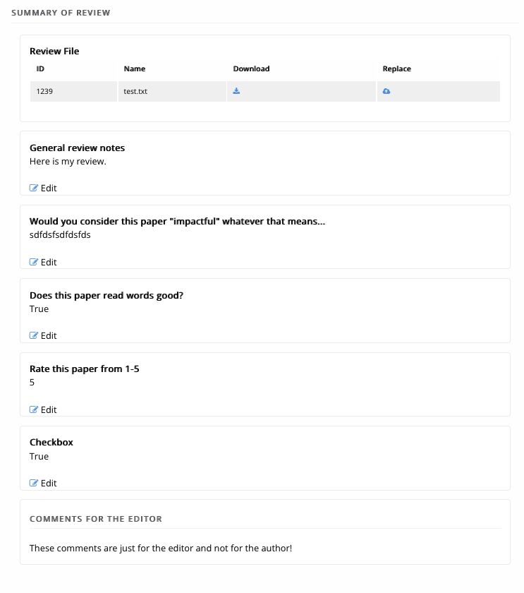

Review
====================

Unassigned Article
------------------

Once an Author has submitted an article it is the Editor's turn to review the unassigned article, assign an Editor and move it into Review. An Editor will be notified once an article is submitted, the email will contain a link, or the Editor can access the article from their Dashboard.

Selecting Unassigned will provide the Editor with a list of articles that haven't been assigned to an Editor yet and moved into Review. You can view the data for an article by selecting "View". On the left hand of the page, all of the article's metadata will be listed, on the right, its options and actions.

The first thing an Editor needs to do is assign an Editor or Section Editor to handle the article through the journal workflow. Once assigned, the Editor can do one of the following:

1. Move the article to Review.
2. Reject the article outright.
3. Accept the article outright.

Rejecting the article will allow the Editor to inform the Author with reasons for rejection, accepting the article will move it into Copyediting (if you have the default workflow) and moving to Review will move the article into the peer review process.

If you move the article into review and are its Author, you will be blocked by a permission denied page. If you opt to override the security warning, all other Editors will be notified of this.

.. figure:: ../nstatic/unassigned.gif
   :alt: Setting a projected issue and assigning an editor.
   :class: with-border

Review Page
-----------

The review page presents various actions:

1. Add Files
2. Delete Round
3. Add Reviewer
4. New Review Round
5. Request Revisions

.. figure:: ../nstatic/review_main_screen.png

Add Files
---------------

The Add Files option allows you to list which files will be available for the reviewers in the current review round. All reviewers for a given round will see the same files. You will also be asked to confirm that the selected files have been checked to ensure there is no identifying author information in them. If there are you can download, edit and replace the version in the system on this screen.

.. figure:: ../nstatic/review_add_files.gif

Delete Round
------------------

This is an 'end-all' button, it will remove the files and reviewers from the current round. You will be given a prompt that explains what will be deleted if you agree.

.. warning::
   There is no way to recover a review assignment once it is deleted, so only use this option if you are certain you wish to remove it. It is often better to add a new round which will close all open review assignments.

Add Reviewer
------------------

When adding a reviewer you have two options, you can select a reviewer and go through the process of setting up their review \(anonymity, form and due date\) or, if you've set up the required defaults, you can "Assign with Defaults". This will use the default type, anonymity, form and due date for your journal and send an automated email to the reviewer \(the former allows you to edit the email\).

Assuming you choose to select the options yourself, when you press "Add Reviewer" you will be taken to the "Notify" page where you can edit the outgoing email to the user. There is an option available to skip sending this email if you wish.

Once the Reviewer is assigned they will be able to access the system and let you know if they will complete the review and, if yes, access the review form you specified.

.. figure:: ../nstatic/review_add_reviewer.gif

Managing a Review
-----------------

Once you have added a review to your round, it will be listed on the review page. The initial stage of any review is "Awaiting acknowledgement" which means that you are waiting for the Reviewer to accept or decline to undertake the review. At this stage, you can:

1. View the review, though it will not contain much information yet.
2. Withdraw the review.
3. Delete the review.
4. If the review is withdrawn or declined by the Reviewer, you can use the new Reset option to set it back to Awaiting Acknowledgement.

Making Reviews Available to Authors
-----------------------------------
Once a peer review is complete, editors then have the option to make it available to the Author to read. By default, the review will not be available for the Author to read. When the review has a file, you will also have the option to make the file available for the Author to read. Once you have opened a review you will see details of the review assignment, a summary of the review and the review availability controls.

Allow Author to Read Review
~~~~~~~~~~~~~~~~~~~~~~~~~~~

You can make the review form visible to the Author by toggling *Author can access this review*, and the file available by toggling *Author can access review file*.

Controlling Individual Answers
~~~~~~~~~~~~~~~~~~~~~~~~~~~~~~

In addition to making the overall review available for authors to read, you can control the individual form answers under *Answer Visibility*. Toggling the answers on or off will determine whether the author can see them when they look at the review.

Editing Answers
~~~~~~~~~~~~~~~

You can edit individual answers to create an *edited version*. When viewing the review the author will see only your edited version and not the original version from the reviewer. You can reset the answer at any given time. Note that Janeway will retain a copy of the original and display it for other editors to see.

Once you have adjusted the visibility of Peer Review reports, and have clicked through to ‘Make a Decision’, you will see a summary of the Peer Reviews and what is and what is not revealed to authors before sending your Decision.

.. figure:: ../nstatic/review_visibility_4.png

Decision Helper
-----------------
.. warning::
    As of version 1.3.10, all review decisions have been moved to the Decision Helper page.

One of the options under Actions is "Make a Decision", this will take you to the Decision Helper page. On this page, you will see a summary of reviewer recommendations, their review form answers and a list of uncompleted reviews. The decisions available from this screen are:

- Accept Article
    - Accepts the article, allows you to email the author and moves the article into the next stage.
- New Review Round
    - This option adds a new review round, a clean slate of review! Any open review assignments on the current round are withdrawn and a new round is set up. This process is often done after round 1 is complete and the author has also completed some form of revisions. You will still be able to see Round 1 via a tab at the top of the page.
- Reject Article
    - Rejects the article, removes it from the workflow and allows you to email the author.
- Request Revisions
    - Allows you to request the author revise their paper.
- If enabled, Draft a Decision
    - Allows Section Editors to draft one of the above decisions for approval by an Editor.
- Share Peer Reviews
    - Allows an editor to email all of the reviewers who participated in the review of an article and share a link allowing them to read all of the review reports. Note: This must first be enabled before the option will be displayed. See the  :ref:`Sharing Peer Reviews<sharingpeerreviewsanchor>` section.

.. figure:: ../nstatic/review_decision_helper.gif

Request Revisions
-----------------

.. tip::
    Before requesting revisions make sure you have marked reviews as available to the author. The Request Revisions page will warn you if you have not done this for a given review.

Requesting revisions will allow you to ask the Author to make changes to the manuscript, this may be for editorial reasons or as the result of a round of peer review. Usually, the process would be:

1. Review Round 1
    1. Reviewer 1
    2. Reviewer 2
2. Accept/Decline/Revisions based on reviewer feedback
3. Request Revisions
4. Review Round 2
    1. Reviewer 3
    2. Reviewer 4
5. Action based on reviewer feedback

Draft a Decision
----------------
Draft Decisions (DD) is an optional workflow that requests that Section Editors submit a draft of their editorial decision for approval by an Editor before it is sent to the author via the system. When enabled, a Section Editor will only see the Draft Decision feature on the Decision Helper page.

Section Editors:

1. Go to the Decision Helper page.
2. Select Draft Decision.
3. Complete the form, following the onscreen instructions.

Editors:

1. Will be notified when a Draft Decision is made.
2. Open the link in email.
3. Review the draft.
4. Edit, Accept or Decline the Draft.
5. If accepted the decision event will fire.

.. figure:: ../nstatic/review_draft_a_decision.gif

Examples of Draft Decisions are: Accept, Minor Revisions, Major Revisions or Decline. Editors are required to approve these Draft Decisions (DD) before they are sent to Authors.

If the DD is Accept, an article is moved into Copyediting.

If the DD is Minor Revisions, the Section Editor should provide the Author with guidance on how to implement the feedback from the Peer Reviewers.

If the DD is Major Revisions, the Section Editor should provide the Author with guidance on how to implement the feedback from the Peer Reviewers. If an article requires Major Revisions, then another round of Peer Review must be undertaken once the Major Revisions are complete.

If the DD is Decline, the article will be archived and the author notified.

To approve a DD:

1. Click on the link in the email notifying you of the DD
2. Click ‘Edit’ in the ‘Existing Draft Decisions’ box on the upper right-hand side of the screen (NB do not start filling in the ‘Draft Decision’ form – your Section Editor will already have drafted an email to the author in ‘Existing Draft Decisions)
3. Review the email to the Author and the Peer Review reports. Helpful Tip: You can open the ‘Reviews’ tab for the article in a separate window to compare the Peer Review Reports with the DD
4. Click ‘Approve’ to action the DD

Sharing Peer Reviews
--------------------

.. note:: This is a new feature added in v1.5.1.

In Janeway, editors can share completed peer reviews among the reviewers who took part in an article review process. There are two ways to accomplish this, and both can be managed through the Review Settings interface.

1. The first method involves a new decision available on the decision helper screen. With this option, editors can mark the reviews of an article as shareable. Additionally, an email will be sent to all the reviewers who participated in the peer review, providing them with a link to access and view the review content.
2. The second option simplifies the process by automatically sharing completed reviews from previous rounds with reviewers in rounds 2 and beyond. When reviewers access the review interface, they will be given the choice to view anonymous reviews completed by their peers.

Please refer to the documentation on :ref:`Sharing Peer Reviews<sharingpeerreviewsanchor>` for detailed information on how to activate these functionalities.

Share Reviews Decision
~~~~~~~~~~~~~~~~~~~~~~
Once the setting is enabled a new decision option will show on the decision helper page.

.. figure:: /nstatic/share_review_decision_list.png

    New decision in the decision list.

Editors then can send an email to each of the reviewers providing them with a link to access and view the review content.

.. figure:: /nstatic/share_review_decision_page.png

    Interface for notifying peer reviewers.

Reviewers can use the link in the email to access the shared reviews interface.

.. figure:: /nstatic/share_reviews_reviewer.png

    Reviewer viewing completed reviews.

Display Completed Reviews in Review Interface
~~~~~~~~~~~~~~~~~~~~~~~~~~~~~~~~~~~~~~~~~~~~~
Once this setting is activated, editors don't need to take any additional action. Reviewers in round 2 and all subsequent rounds will automatically have access to view the reviews completed in previous rounds. For instance, in round 3, reviewers will be able to see the completed reviews from rounds 1 and 2, but not the reviews completed specifically for round 3.

.. figure:: /nstatic/share_reviews_during_review.png

    Round 2 reviewer viewing completed round 1 reviews.

Editors can modify the message that clarifies the reason why reviewers can see the reviews in the manager interface.

Sharing Author Response Letters
~~~~~~~~~~~~~~~~~~~~~~~~~~~~~~~
In the revision process, authors are encouraged to provide a written response to review comments. If editors want to share the authors' response letters along with peer reviews, they can enable the "Automatically Share Author Response Letters" option in the review settings section.

.. figure:: /nstatic/share_reviews_response_letters.png

    Response letter being shared with peer reviewers.

Triple Anonymous Peer Review
----------------------------

Triple Anonymous Peer Review in Janeway involves anonymising author information to ensure that section editors are unaware of the authors' identities during the review process. This review method ensures that the reviewer, section editor, and author remain anonymous to one another until the completion of the review stage. Here is an overview of how this feature operates:

Key Settings for Triple Anonymous Peer Review
~~~~~~~~~~~~~~~~~~~~~~~~~~~~~~~~~~~~~~~~~~~~~

- Section Editor Personally Identifiable Information Filter (``se_pii_filter``)

  - Must be toggled on to enable anonymisation of author data in the relevant interfaces.

- Reply-To Address (``replyto_address``)

  - Must be set to a valid email address. This is required to avoid leaking author email addresses during the review process.

These settings are accessible through the All Settings screen (Manager > All Settings).

Workflow of Triple Anonymous Peer Review
~~~~~~~~~~~~~~~~~~~~~~~~~~~~~~~~~~~~~~~~

- **Assigning the Section Editor**: The journal editor assigns a section editor to the manuscript. Before doing so, the manuscript file must be anonymous to prevent the section editor from seeing any personal data.
- **Assigning Reviewers**: The section editor can now manage the peer review process as normal.
- **Anonymised Data**: Instead of viewing the author's personal details (name, email, institution), the section editor will see '[Anonymised data]' in these fields throughout the review process.
- **Access to Information Post-Review**: Once the review is completed, section editors regain access to the author's personal information.

Areas with Anonymisation
~~~~~~~~~~~~~~~~~~~~~~~~

Here are the specific areas within Janeway where anonymisation is applied:

- **Dashboards**

  - Anonymises author data on the main dashboard, kanban view, and active submissions section.

- **Unassigned**

  - Anonymises author data for unassigned submissions.

- **Review**

  - Section editors cannot access the Document Manager, where author details might be stored.

- **View Metadata**

  - Author details are anonymised in the metadata view.

- **Edit Metadata**

  - Section editors are blocked from editing article metadata, ensuring no access to author information.

- **Article Log**

  - Author information is anonymised in the article log, ensuring section editors do not gain access to personal data through log entries.

- **Email Templates**

  - Limits the display of author information in email templates, particularly for decision letters (e.g., revision request, acceptance, and decline).

This system ensures a rigorous triple-anonymous process, safeguarding the identities of all parties involved.

An Example Review Round
-----------------------
Here is an example of a review round.

1. Add Files for Round 1.
2. Add Reviewer A to Round 1.
3. Add Reviewer B to Round 1.
4. Add Reviewer N to Round 1.
5. Wait for responses from Reviewers (Editor will be notified by email when Reviewer makes an action).
6. When responses are back: Make a Decision (Accept, Decline or Request Revisions).
    1. If Draft Decision is enabled and you are a Section Editor you will be asked to Draft a Decision for a Senior Editor to approve.
    2. Accept will move the article to the next stage.
    3. Reject will remove the article from the workflow.
    4. Request Revisions will allow the author to see any reviews that have been marked for their consumption and revise their manuscript.
7. If Revisions were requested and another round of review is required:
    1. Start a new Review Round.
    2. Go to the start.

Finishing Up
------------
When using the standard workflow, Copyediting follows Review.

To complete the Review stage you can select one of the following:

1. Accept Article, this moves the article into the next stage.
2. Decline Article, this removes the paper from the workflow.
