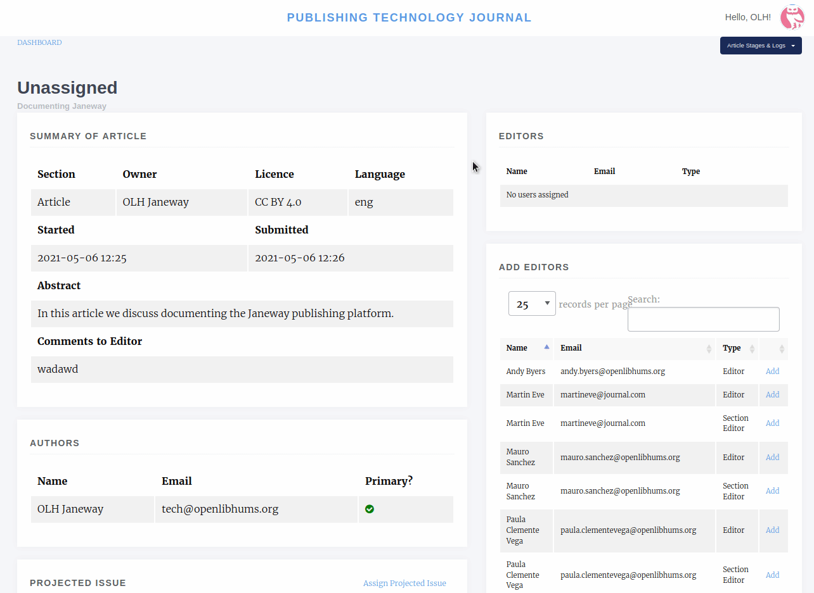
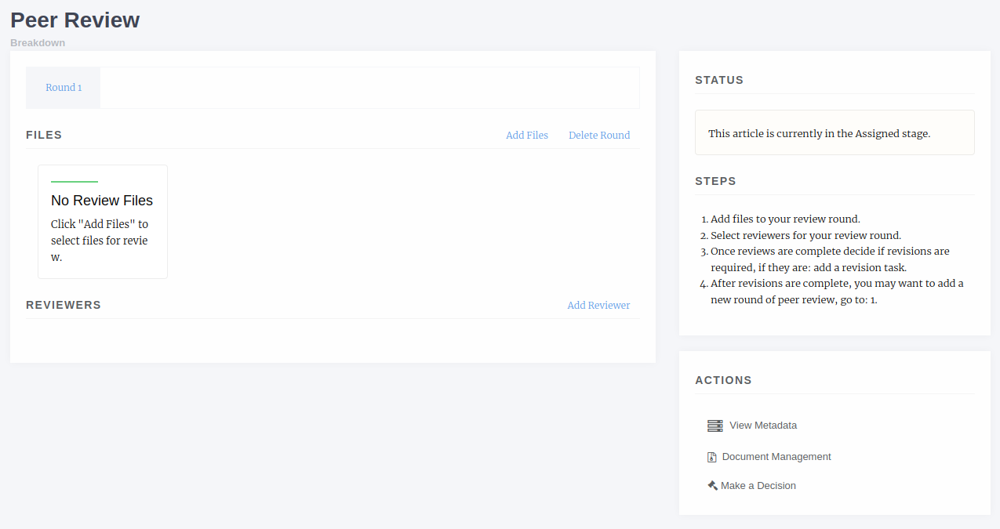
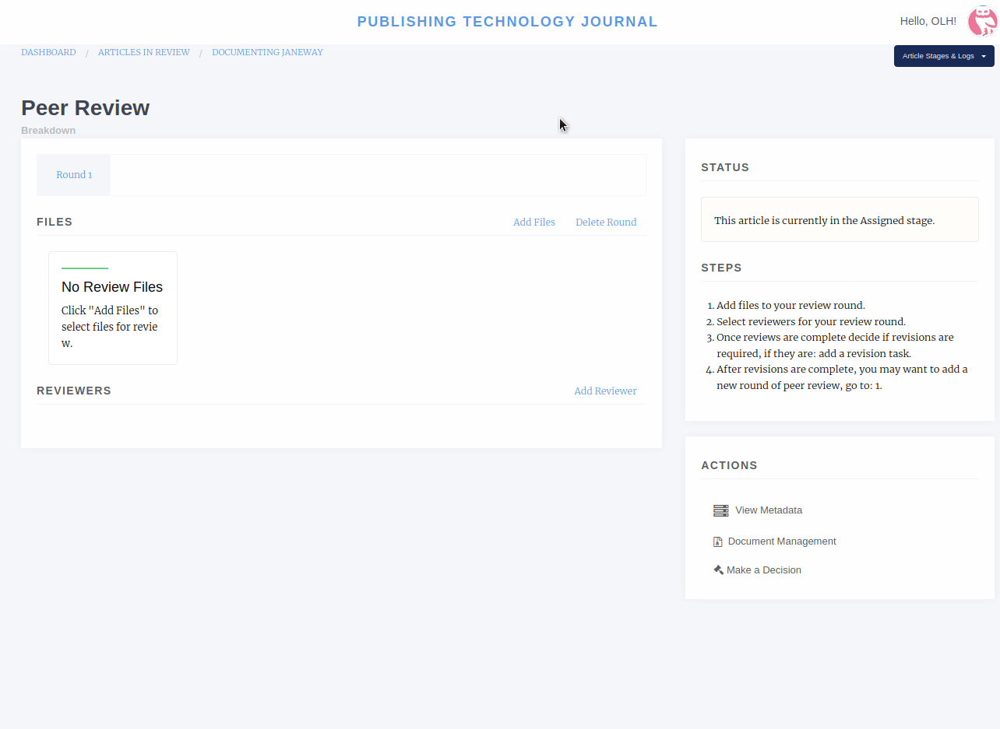
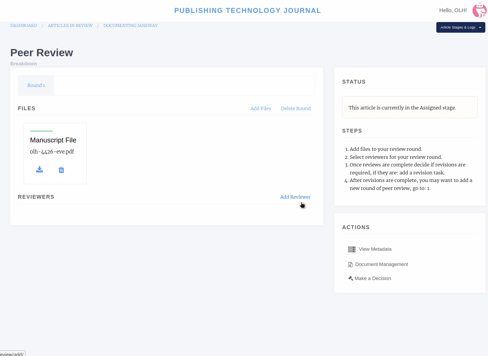
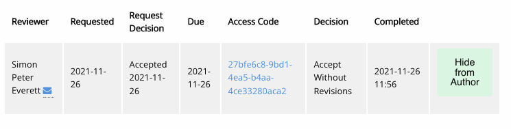
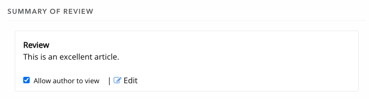
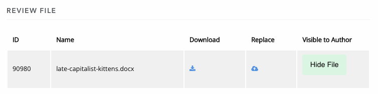
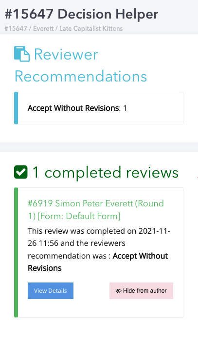
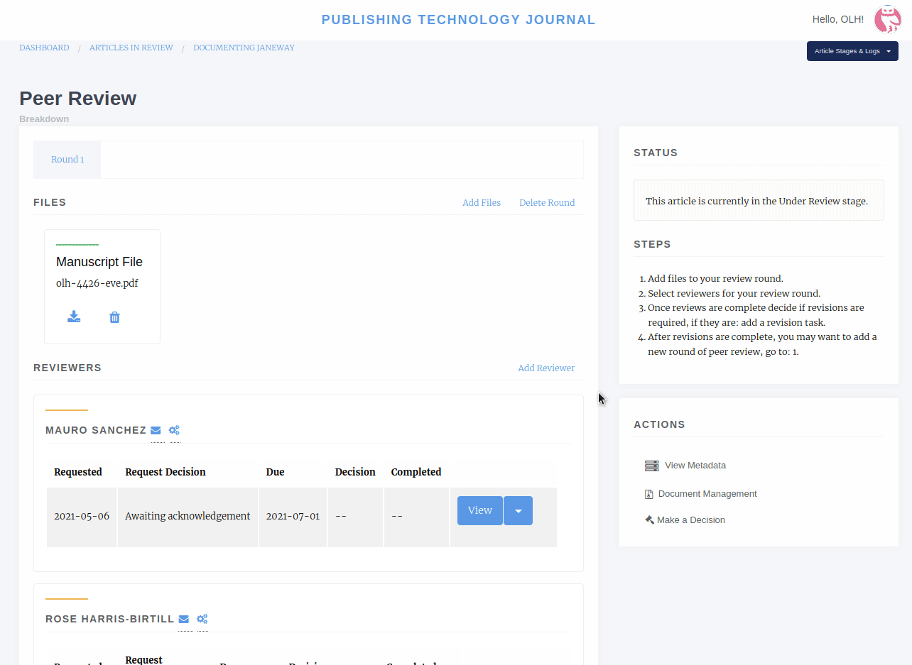
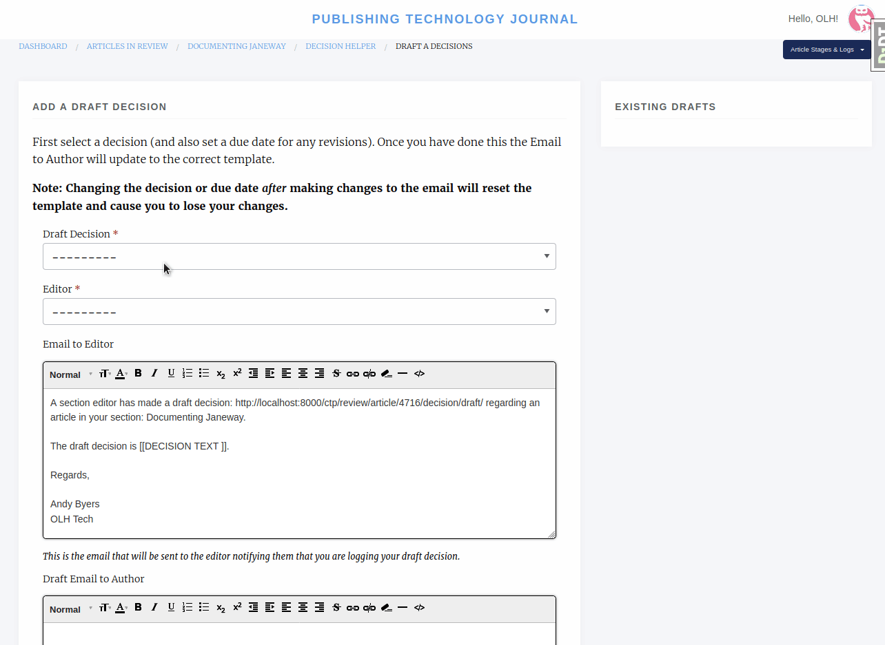

Review
====================

Unassigned Article
------------------

Once an Author has submitted an article it is the Editor's turn to review the unassigned article, assign an Editor and move it into the review process. An Editor will be notified once an article is submitted, the email will contain a link, or the Editor can access the article from the Dashboard page.

Selecting Unassigned will provide the Editor with a list of articles that haven't yet been assigned an Editor and moved into review. You can view the data for an article by selecting "View". On the left hand of the page all of the article's metadata will be listed, on the right, its options and actions.

The first thing an Editor needs to do is assign an Editor or Section Editor to the handle the article through the journal workflow. Once assigned, the Editor can then do one of the following:

1. Move the article to review
2. Reject the article outright
3. Accept the article outright

Rejecting will allow you to tell the author why, Accepting will move it into Copyediting (if you have the default workflow) and Moving to Review will move the article into the Review workflow.

If you move the article into review and are the author of an article you will be blocked by a permission denied page.

If you opt to over-ride the security warning, all other Editors will be notified of this.

Review Page
-----------

The review page presets various actions:

1. Add Files
2. Delete Round
3. Add Reviewer
4. New Review Round
5. Request Revisions

Add Files
---------------

The Add Files options allows you to list which files will be listed for the reviewers in the current review round. All reviewers for a given round will see the same files. You will also be asked to confirm that the files you've selected have been checked to ensure there is no identifying author information in them. If there are you can download, edit and replace the version in the system on this screen.

Delete Round
------------------

This is an end all button, it will remove the files and reviewers from the current round. You will be given a prompt that explains what will be deleted if you agree, **NB**. **there is no way to recover a review assignment once it is deleted so only use this option if you really want to remove it, better to add a new round which will close all open review assignments.**

Add Reviewer
------------------

When adding a reviewer you have two options, you can select a reviewer and go through the process of setting up their review \(visibility, form and due date\) or, if you've setup the required defaults, you can "Assign with Defaults". This will use the default type, visibility, form and due date for your journal and send an automated email to the reviewer \(the former allows you to edit the email\).

Assuming you choose to select the options yourself, when you press "Add Reviewer" you will be taken to the "Notify" page where you can edit the outgoing email to the user. There is an option available to skip sending this email if you wish.

Once the reviewer is assigned they will be able to access the system and let you know if they will complete the review and, if yes, access the review form you specified.

Making Reviews Available to Authors
-----------------------------------
Once a round of Peer Review is complete, you can choose whether to ‘Hide’ or ‘Make Visible’ the different elements of the review from authors.

**Allow Author to See**

Click through to ‘View’ a completed review: 

The first "Allow Author to See" button pertains to the review assignment itself. If this says ‘Allow Author to See’, the author cannot currently see this report.

If this button reads ‘Hide from Author’, the author can see the report.

The "Allow Author to See" checkbox pertains to the ‘Summary of Review’ field or individual elements of the review form, if enabled. The default here is "Allow Author to See". If this box is checked, the author can see review text input into Janeway. If this field has been changed by an editor, the author only sees the edited version (but editors can see both versions on their screen). If this box is unchecked, the author cannot see the review text (if a review form with multiple elements, editors can check some and uncheck others on a per-field basis).

If you make a change to the Summary of Review visibility options, click ‘Update Individual View Options’ to save.  

The third "Allow Author to See" button pertains to a review file, if uploaded. The default here is "Hide from Author". If this button appears as ‘Allow Author to View File’, the author cannot currently see the review file. Note: the editor must check and anonymise this file before making available to the author if working on a blinded basis. If this button reads "Hide File", the author can see the review file.

Once you have adjusted the visibility of Peer Review reports, and have clicked through to ‘Make a Decision’, you will see a summary of the Peer Reviews and what is and what is not revealed to authors before sending your Decision.

Decision Helper
-----------------
.. warning::
    As of version 1.3.10 all review decisions have been moved to the Decision Helper page.

One of the options under Actions is "Make a Decision" this will take you to the Decision Helper page. Once on this page you will see a summary of reviewer recommendations, their review form answers and a list of uncompleted reviews. The decisions available from this screen are:

- Accept Article
    - Accepts the article, allows you to email the author and moves the article into the next stage.
- New Review Round
    - This option adds a new review round, a clean slate of review! Any open review assignments on the current round are withdrawn and a new round is set up. This process is often done after round 1 is complete and the author has also completed some form of revisions. You will still be able to see Round 1 via a tab at the top of the page.
- Reject Article
    - Rejects the article, removes it from the workflow and allows you to email the author.
- Request Revisions
    - Allows you to request the author revise their paper.
- If enabled, Draft a Decision
    - Allows Section Editors to draft one of the above decisions for approval by an Editor.

Request Revisions
-----------------

.. tip::
    Before requesting revisions make sure you have marked reviews as available to the author. The Request Revisions page will warn you if you have not done this for a given review.

Requesting revisions will allow you to ask the Author to make changes to the manuscript, this may be for editorial reasons or as the result of a round of peer review. Usually the process would be:

1. Review Round 1
    1. Reviewer 1
    2. Reviewer 2
2. Accept/Decline/Revisions based on reviewer feedback
3. Request Revisions
4. Review Round 2
    1. Reviewer 3
    2. Reviewer 4
5. Action based on reviewer feedback

Draft a Decision
----------------
Draft Decisions (DD) is an optional workflow that requests that Section Editors submit a draft of their editorial decision for approval by an Editor before it is sent to the author via the system. When enabled, a Section Editor will only see the Draft Decision feature on the Decision Helper page.

Section Editors:

1. Go to the Decision Helper page.
2. Select Draft Decision.
3. Complete the form, following the onscreen instructions.

Editors:

1. Will be notified when a Draft Decision is made.
2. Open the link in email.
3. Review the draft.
4. Edit, Accept or Decline the Draft.
5. If accepted the decision event will fire.

Examples of Draft Decisions are: Accept, Minor Revisions, Major Revisions or Decline. Editors are required to approve these Draft Decisions (DD) before they are sent to Authors. 

If the DD is Accept, an article is moved into Copyediting. 

If the DD is Minor Revisions, the Section Editor should provide the Author with guidance on how to implement the feedback from the Peer Reviewers.  

If the DD is Major Revisions, the Section Editor should provide the Author with guidance on how to implement the feedback from the Peer Reviewers. If an article requires Major Revisions, then another round of Peer Review must be undertaken once the Major Revisions are complete.  

If the DD is Decline, the article will be archived and the author notified.

To approve a DD:

1. Click on the link in the email notifying you of the DD
2. Click ‘Edit’ in the ‘Existing Draft Decisions’ box on the upper right hand side of the screen (NB do not start filling in the ‘Draft Decision’ form – your Section Editor will already have drafted an email to the author in ‘Existing Draft Decisions)
3. Review the email to the Author and the Peer Review reports. Helpful Tip: You can open the ‘Reviews’ tab for the article in a separate window to compare the Peer Review Reports with the DD
4. Click ‘Approve’ to action the DD

Managing a Review
-----------------

Once you have added a review to your round, it will be listed on the review page. The initial stage of any review is "Awaiting acknowledgement" which means we are waiting on the reviewer accepting or declining to undertake the review. At this stage we can:

1. View the review, though it doesn't tell us much
2. Withdraw the review
3. Delete the review
4. If the review is withdrawn or declined by the reviewer we can use a new option Reset to set it back to Awaiting Acknowledgement

An Example Review Round
-----------------------
Here is an example of a review round.

1. Add Files for Round 1.
2. Add Reviewer A to Round 1.
3. Add Reviewer B to Round 1.
4. Add Reviewer N to Round 1.
5. Wait for responses from Reviewers (Editor will be notified by email when Reviewer makes an action).
6. When responses are back: Make a Decision (Accept, Decline or Request Revisions).
    1. If Draft Decision is enabled and you are a Section Editor you will be asked to Draft a Decision for a Senior Editor to approve.
    2. Accept will move the article to the next stage.
    3. Reject will remove the article from the workflow.
    4. Request Revisions will allow the author to see any reviews that have been marked for their consumption and revise their manuscript.
7. If Revisions were requested and another round of review is required:
    1. Start a new Review Round.
    2. Go to the start.

Finishing Up
------------
When in the standard workflow, after Review comes Copyediting.

To complete the Review stage you can select one of either:

1. Accept Article, moves the article into the next stage.
2. Decline Article, removes the paper from the workflow.
