Typesetting (Plugin)
====================

The typesetting plugin is a new workflow element introduced with the release of Janeway v1.3.8
This new element aims to simplify the production process by combining the generation of the final
article files (Refered to as 'typeset files') with the process of proofing such files.

Usually typeset files include but are not limited to:

 - A PDF file
 - An HTML file
 - An XML file such as JATS-XML (Janeway can render JATS-XML files on the website as HTML with the use of XSLT)

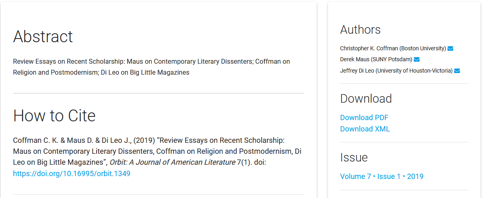

   Detail of a published article, showing the option to download the Tyepset files

All the typeset files will be available to be rendered or downloaded from the article page once your article is published.

To get started with the typesetting plugin, contact your site administrator. You can find more details `on GitHub <https://github.com/BirkbeckCTP/typesetting>`_.

In a future release of Janeway, Typesetting will replace the Production and Proofing workflow elements.

The Typeseting plugin dashboard
-------------------------------
When the typesetting plugin is installed and enabled as part of the workflow of a journal, every user will get a typesetting card on their dashboard.
These card, will show different buttons depending on the roles available to the user logged in.

- Articles in typesetting (Shown to Editors and Production managers)
- Typesetting tasks (Shown to Typesetters)
- Proofing tasks (Shown to all Authors, Editors, and Proofreaders)

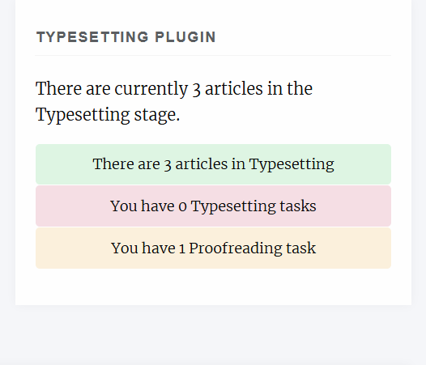

Articles in Typesetting
-----------------------
From this view, editors and production managers can see all the articles currently on the typesetting stage as well as an overview of their status.
There is an option to "Claim" an article. It does not have any practical effects, other than displaying who is managing the article to
all the members of staff. This doesn't not restrict access to the other editors and production managers in the journal.

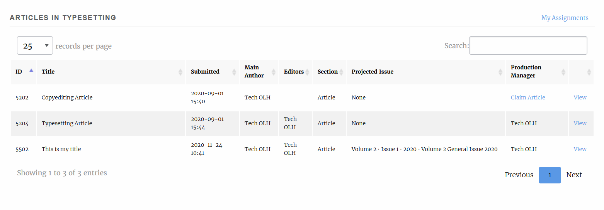

There is also a filter on the top-right-hand corner to display only articles that have been previously claimed by you ("My Assignments")

Typesetting Article (Editor/Production Manager view)
----------------------------------------------------
On this page, editors and production managers can control the production process of the article, including uploading article files, generating typeset files, or creating assignments for Typesetters and/or Proofreaders to upload new typeset files of proof typeset files respectively

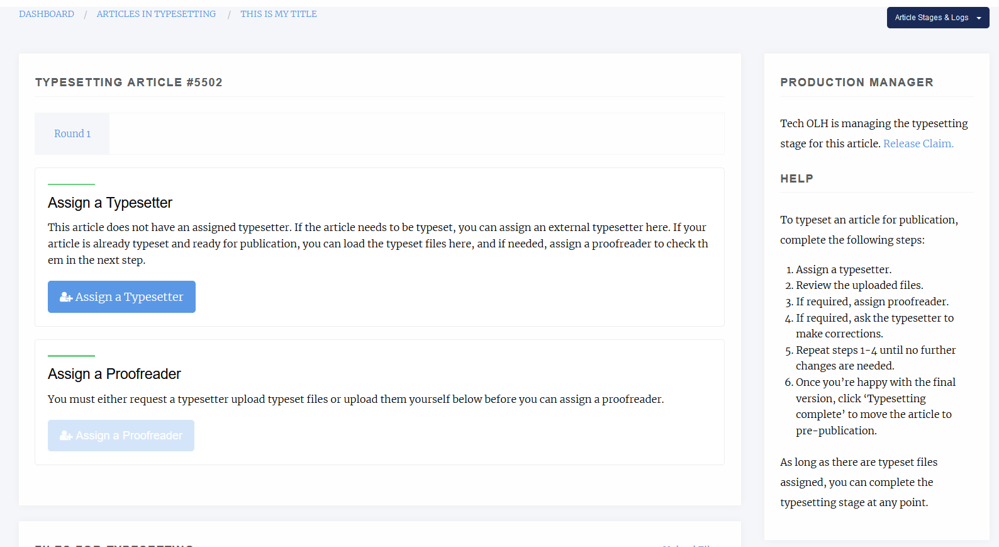

   Manager view of the 'Typesetting Article' page

As shown on the image above, there is a small step-by-step guide that assumes a user with the Typesetter role will produce the final Typeset file.
This however, is not the only workflow possible with the Typesetting Plugin.

Generating Typeset Files
------------------------
The typesetting plugin supports 3 mechanisms for adding typeset files.

1. Manual Upload:
   If you produce your typeset files by yourself (e.g.: Generate a PDF from MS word or a specialised tool), scroll down to the 'Current typeset files' section' where you will be able to upload them. When selecting your file, you can also add a custom label. This label will be presented to users in the article page as 'Download <label>' (e.g 'Download PDF'). Janeway will always set the label automatically for common typeset file types (PDF, XML, HTML...). For unknown file types it will set it as 'OTHER'.

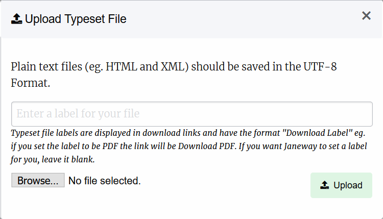

   Manager view of the 'Typesetting Article' page

.. tip::
   Labels can be used to denote the language of a file to readers. For instance labelling a pdf file as 'PDF (EN') and another as 'PDF (ES)' will allow readers to download the correct PDF for their language

.. tip::
   If you are unsure about the label to use, leave it empty. Janeway will try to workout the best label for your file and you can edit it later if necessary.

2. Generate a Typeset File with Janeway Tools:
   Janeway provides a plugin system that allows developers to write integration tools for the typesetting process. One example is the `Pandoc Plugin <https://github.com/BirkbeckCTP/pandoc>`_. which can generate an HTML typeset file from a MS Word document. If you are interested on installing this tool others of this kind, check what is available with your site manager.

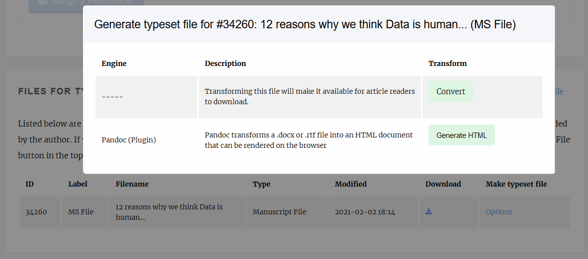

   Detail of the contextual menu for generating typeset files with plugins

.. tip::
   The first option is always 'Convert', which will make the current file available as a typeset file to readers. This feature is useful when you want to make the original manuscript file available for download to the readers as it is (e.g.: Allow the readers to read the original manuscript as a .docx or similar)

3. Delegate the task to a Typesetter:
   If your journal uses either a dedicated member of staff or a third party service for the generation of the typeset files, you can have them register on your site and enrol them as 'Typesetter' [TODO: link to roles docs]. Using this workflow will allow you to assign and manage typesetting tasks, handover the files for the authors/editors for proofing... All within the system.
   In order to assign a typesetter we recommend following these steps

3.1 Verify the 'Files for Typesetting':
   This section will show you all the manuscript files that have been created during the workflow, including the original manuscript, files for peer-review, copyedited manuscripts etc. You will be able to select one of this files as the source file for your typesetter to produce the typeset files. You will be able to select one or more of these files to be used by our typesetter. If you want to upload a new file at this point for the typesetter to use as a base, you can still do so from the 'Upload File' link on the top-right corner of the panel:

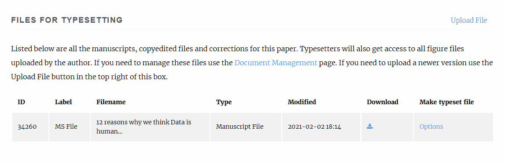

   Detail of the 'Files for Typesetting' section

.. tip::
   Images and other supplementary files are not shown on this panel. They can be managed from the 'Document Management' button, under 'Actions'. The Document Manager is always available throught the workflow in case you want to check, replace or delete any files for the article.

.. tip::
   The typesetter will have access to all the metadata fields for the paper, so we recommend checking that you revise the metadata to ensure it is production ready. You can do so from the 'Article Metadata' under 'Actions.'

3.2 Assign a Typesetter:
   From this page, you can now create a task for the typesetter to get started with the production of the Typeset Files. At this point, you will have to select :

   * A Typesetter to work on the article.
   * One or more manuscript files the typesetter should have access to. (They will have access to all the image files)
   * A Due date for the task to be completed by.
   * A Message for your typesetter, describing any details about the file to produce. (They will have access to all of the article metadata)

3.3 Send a notification email:
   When you complete the previous form, you will be presented with a screen to check the notification email. You can tweak the notification before it goes out to the typesetter in case you want to add any extra details as well as an option to attach any files to the email. There is no need to attach any of the article files, they will have access to all the files you made available for them in the previous step once they log into the system. There is also an option to skip the email notification, however we recommend you always send out this notification.

At this point, the task has been created and we can monitor its progress from the 'Typesetting Article' page.

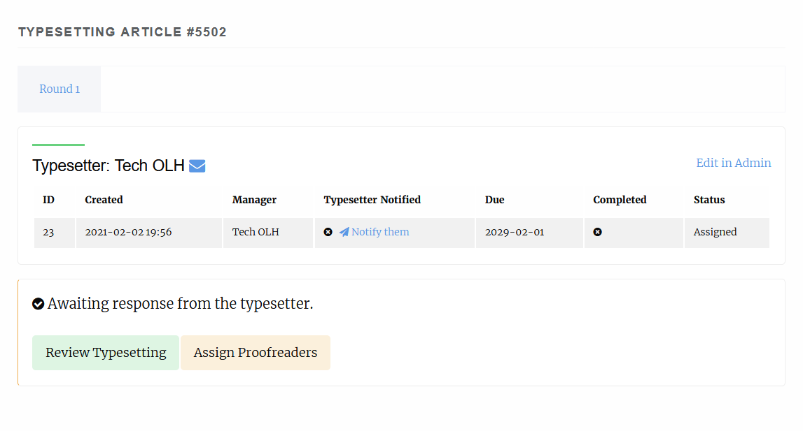

It shows details such as the current status of the task, whether or not the typesetter has accepted/declined to do the task as well as its due date. The 'Review Typesetting' button will, at this point allow you to edit any of the details of the assignment such as the files made available, the task assignment or the due date, as well as let you cancel the task if needed.

Reviewing the typesetting task
------------------------------
Once the typesetter has completed their task, you will receive an email notification.
The link on the email should direct you to the 'Typesetting Article', where you can hit the review button to check on the files provided by the typesetter:

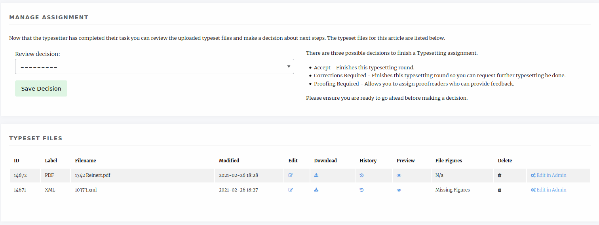

As an editor or production manager we can now select one out 3 choices
 - Request Corrections: If we notice a problem with the typeset files straight away, we can requet corrections to the typesetter.
 - Proofing required: Accepts the typeset files and records the decision to send the files for proofing
 - Accept: If no further proofing is required, we can accept the files as they are and end the typesetting stage.

Sending a proofreading request
------------------------------
Files provided by the typesetter are usually sent to the authors, and potentially other editors, for proofreading.
Janeway allows you to create a proofing task, where authors and/or editors can be invited to proof the typeset files.

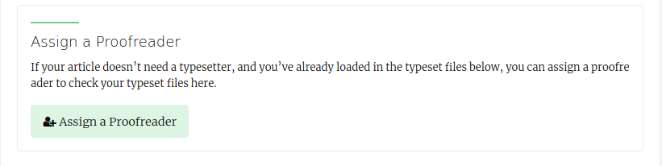

Reviewing a proofreading request
-------------------------------_
As the author/editors finish the proofing process you can review their comments.

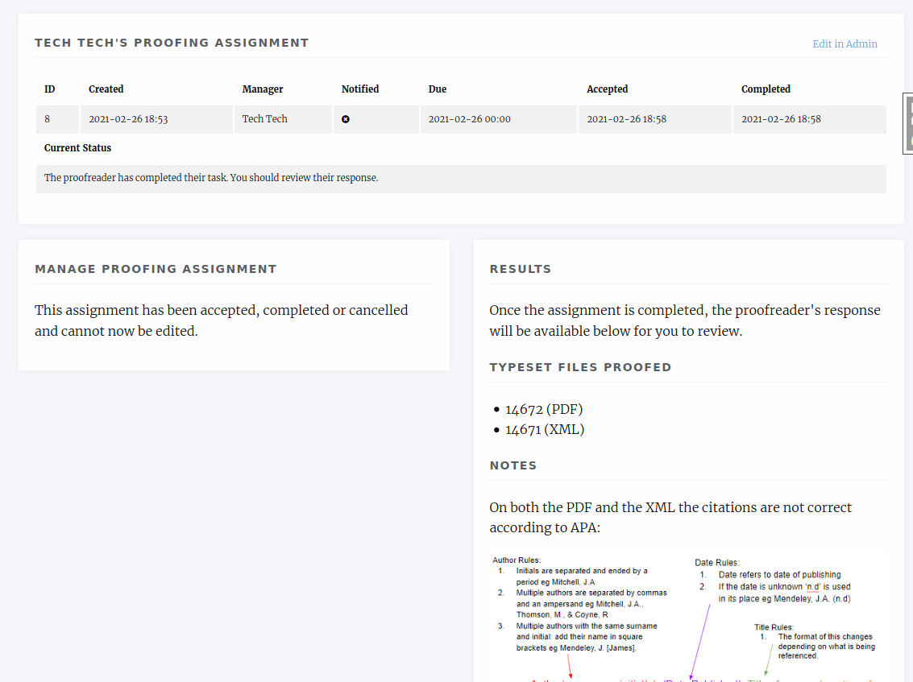

Depending on the feedback coming from the proofreading, it may be necessary to request corrections from the typesetter.
In Janeway you can request corrections from the typesetter by creating a new 'Typesetting round' that initiates the typesetting process for the article with the difference that we can now include the feedback from the proofreaders on our task

Requesting Corrections
----------------------
As soon as all proofing tasks are completed we will hit the request corrections button, which will start a new round of typesetting.

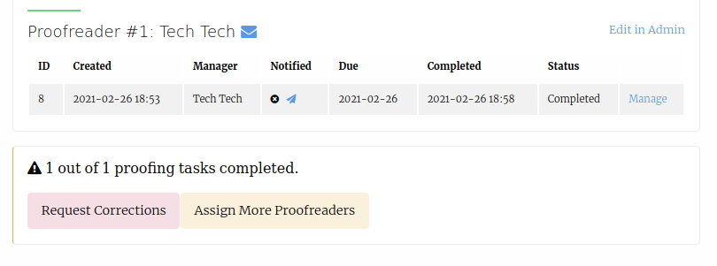

Now we can asssign a typesetter to work on the corrections (usually, the same typesetter that produced the Typeset Files in the first place). When creating the task, we will be presented with the option to include the feedback from the proofreaders.

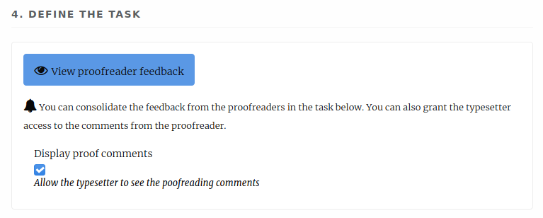

Even when the comments are made available, it is still recommended that the editor/production manager summarises the corrections requested using the "task" field (especially in cases where the proofreaders might request contradictory corrections).
We can also select which files the typesetter needs to apply the corrections to:

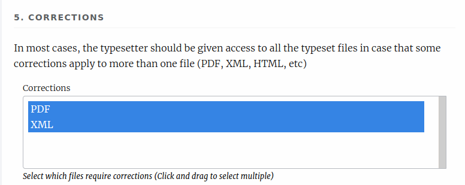

After the task is sent out, we just have to wait for the typesetter to complete it, at which point we can review their work and dispatch new proofing tasks to the author if necessary, or accept their changes and complete the process.
