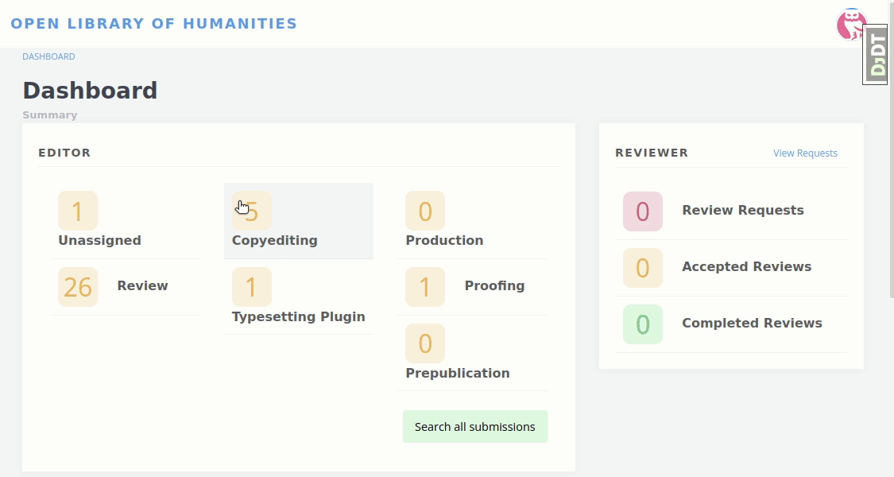
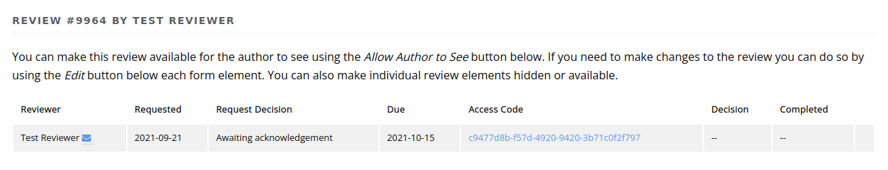

Frequently Asked Questions
==========================

Assigning Users Roles
---------------------
Janeway has nine roles.

- Author
- Editor
- Section Editor
- Reviewer
- Copyeditor
- Typesetter
- Proofreader
- Proofing Manager (this role will be deprecated in version 1.4)
- Production Manager

To add users to a role you can use the :ref:`Enrol Users<enrolusersanchor>` interface.

Email Logging
-------------
Outgoing emails (either sent by Janeway or by an Editor) are all collected in the article log.

You can view and Article's log by accessing an article either through its workflow stage or through the archive (Dashboard -> Left hand menu -> Back Content -> Articles) and using the "Stages, Logs and More" drop down select Log.
image

Reviewer Cannot Access a Review
-------------------------------
Its possible because of how emails are edited that an outgoing review request will not contain a valid review request URL. We recommend you reset your review_assignment email in this instance and here is a workaround to assist reviewers who have received the email without the link:

1. Go to the article review page.
2. For the Reviewer having the issue select the View button.
3. You'll see an Access Code like below image.
4. Copy this link and send it to the reviewer.

