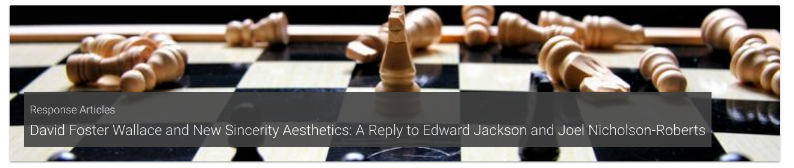
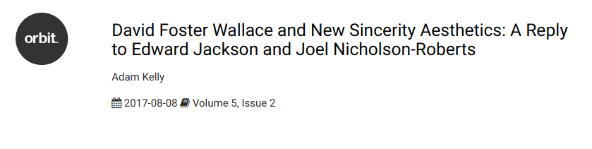
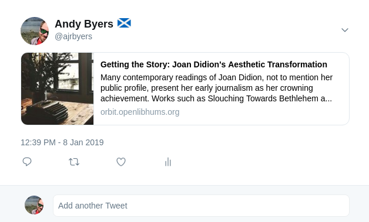
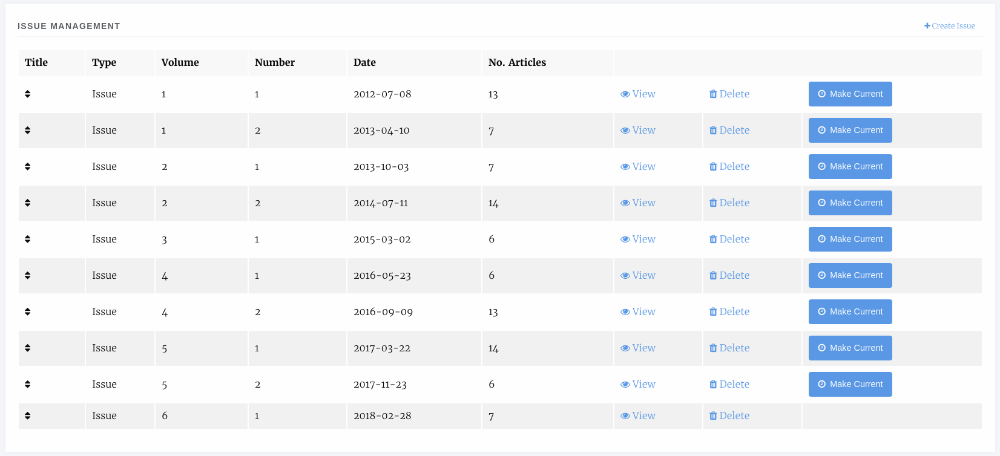
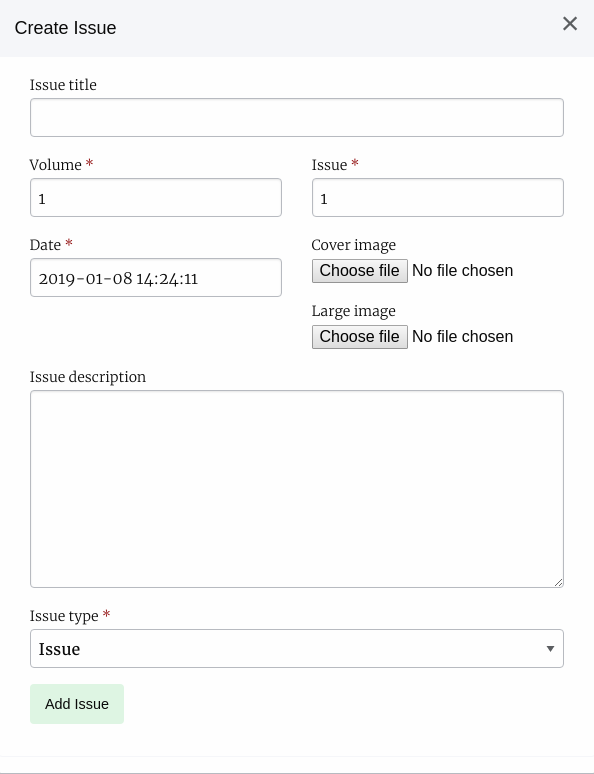
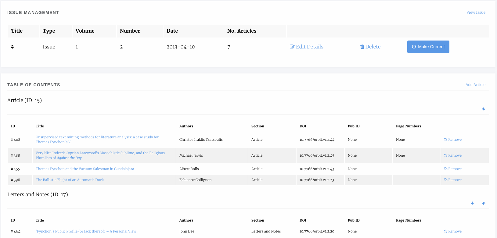
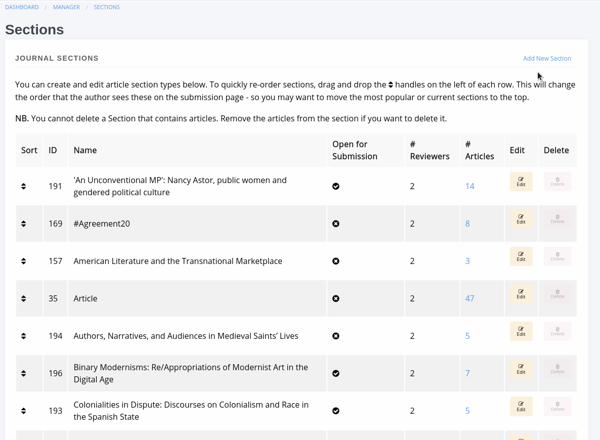
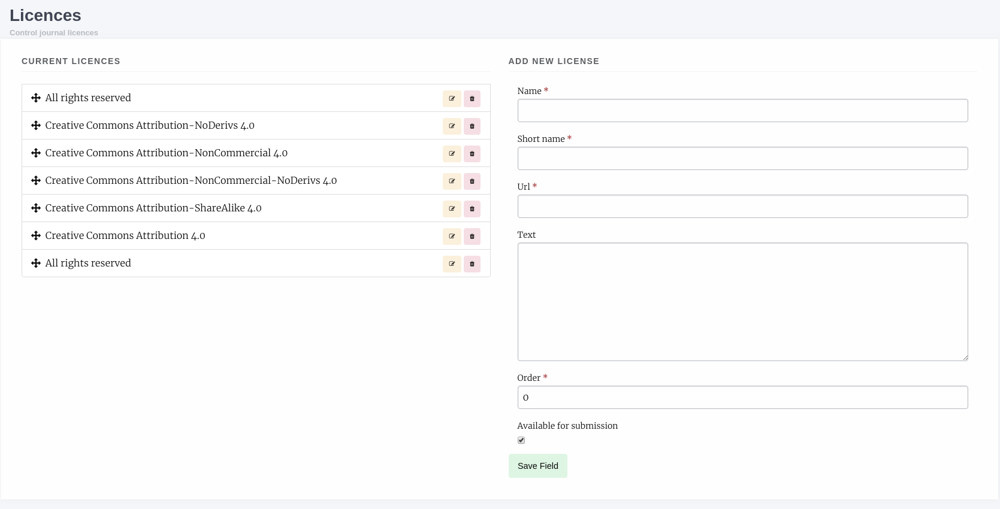

.. _articles_issues_guidelines:

Articles and Issues
===================

Article Display Settings
------------------------
The Article Display Settings page has settings for controlling the way articles look and for deciding how metrics are displayed.

- Disable Article Images
- Display Guest Editors
- Suppress How to Cite
- View PDF Option
- Disable Metrics Display
- Suppress Citation Metrics

Article Images Manager
----------------------
The article images manager pulls is an interface for editing all of the images for a given article.

- Large Image File
    - The large image is a file used in the heading of the article page on some themes. It is resized to 720x324 px upon uploading so it is recommended an image be either this size or larger. This image will also be used as the meta image if none is supplied and will be used on the carousel when Article display is enabled there.
- Thumbnail
    - The thumbnail is displayed on article listing pages like the All Articles list or the Issue Articles list,
- Meta Image
    - The meta image allows you to override the image displayed when the article is shared on social media. If no meta image is supplied the large image file is used.

    Example of large image file display
    

    Example of thumbnail display on the article listing page

    Example of a meta image on Twitter

.. _currentissueanchor:

Issue Manager
-------------
The issue manager lets you create, edit, delete and manage article records for issues.The main interface presents a list of your existing issue records with buttons to:

- Create a new issue
- Edit a given issue
- Delete a given issue
- Mark an issue as Current

It also displays some basic data about the issues like date published and the number of articles in an issue.

    Issue list

Creating a New Issue or Collection
~~~~~~~~~~~~~~~~~~~~~~~~~~~~~~~~~~

To create an issue select *Create Issue* in the top right and in the modal that appears you can complete the issue metadata.

- Title
    - Optional, a title for the issue.
- Volume
    - The volume number.
- Issue
    - The issue number.
- Date
    - The date published, if in the future the issue wont appear until the date published.
- Cover Image
    - The cover image, see example below.
- Large Image
    - A large image file used at the head of the issue page, will be resized automatically but should be landscape.
- Description
- Issue type
    - Issues can be standard issues or can also be collections which are used to collect articles from across the journal into narratives.

    New issue form

Issue Articles
~~~~~~~~~~~~~~
You can manage the article associated with a given issue by selecting the *View* option, the data of the issue will be displayed along with a list of articles grouped by section.

    An issue page
    
You can reorder the Section headers using the arrows Up and Down arrows on the right and you can re-order the articles within their sections by dragging and dropping them into the order you want. To add a new article into the issue select *Add Article* and select the article you want to add. 

In addition, if the issue has guest editors you can add them using the Guest Editor manager at the bottom of the Issue page.

Article Sections
----------------
.. Note::
    Article Sections has been redesigned as part of version 1.4

Sections are ways of grouping articles by their content type e.g. "Research Articles" or "Reviews". From this interface you can edit the sections that are available on your journal.

    Section Manager
    
For each section you can supply:

- Name
- Plural name
- Number of reviewers
    - the number of reviewers generally require for this article type, may be 0 for "Editorials" etc.
- Is filterable
    - Whether this section should appear in the All Articles list filter options.
- Sequence
    - Order sections should appear in, can be changed using this field or by dragging and dropping.
- Section editors
    - The section editors for the section, they can be assigned to handle articles within thier section.
- Editors
    - Editors for this section will be notified when new papers are submitted into it.
- Public submissions
    - Checked if you want new submissions to be able to select this section.
- Indexing
    - Whether this section is put forward for indexing.
- Auto assign editors
    - Articles submitted to this section will be automatically assigned to any editors and/or section editors selected on the 'Editors' and/or 'Section Editors box above.

You can edit sections but you cannot delete a section when it would orphan an article. If you wish to remove a section first migrate all of the articles using that section to a different section then the delete button will become available.

This field can also be disabled if you only have one article type, using the Submission Configurator.

Licence Manager
---------------
The Licence manager allows you to define what licenses are available for submission to your journal. By default Janeway loads all of the CC 4.0 licence types and an All Rights Reserved type. You can edit the list to fit your journals needs.

Each licence can have the following:

- Name
    - Full name e.g. Creative Commons Attribution 4..
- Short name
    - A shortened name e.g. CC BY 4.0.
- URL
    - A URL to a description of the licence.
- Text
    - The text of the licence.
- Order
    - Order in which the licence should appear, can be set here or changed via drag and dropping the licences.
- Available for Submission
    - If checked, this licence will be available for selection during submission.

    Licence Manager

This field can also be disabled if you only have one licence type, using the Submission Configurator.
