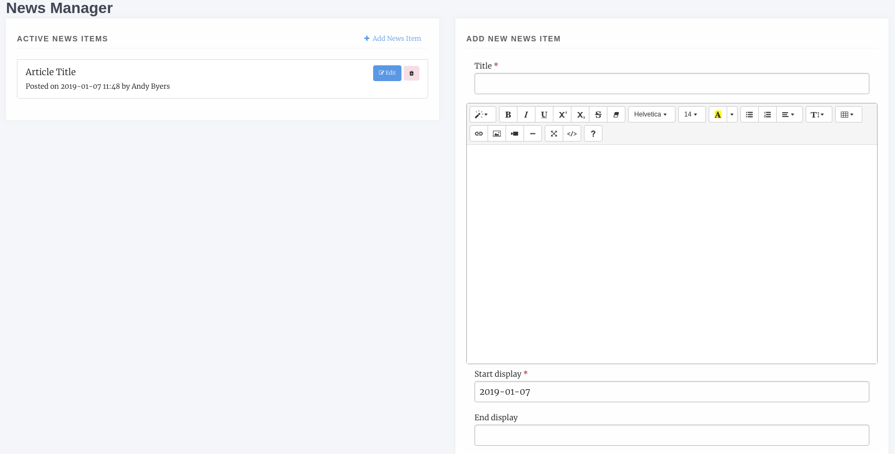
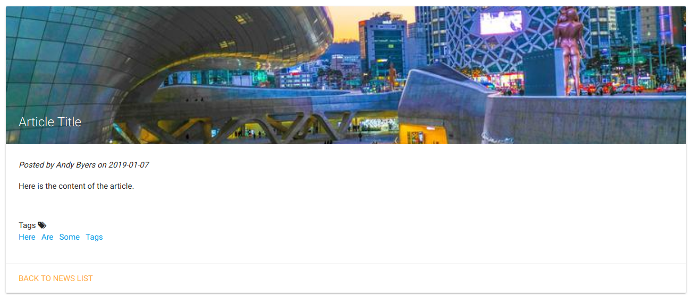
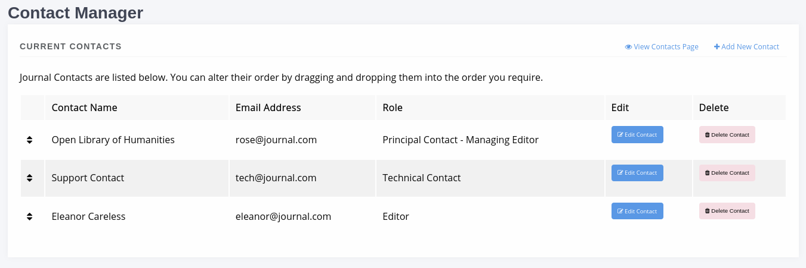
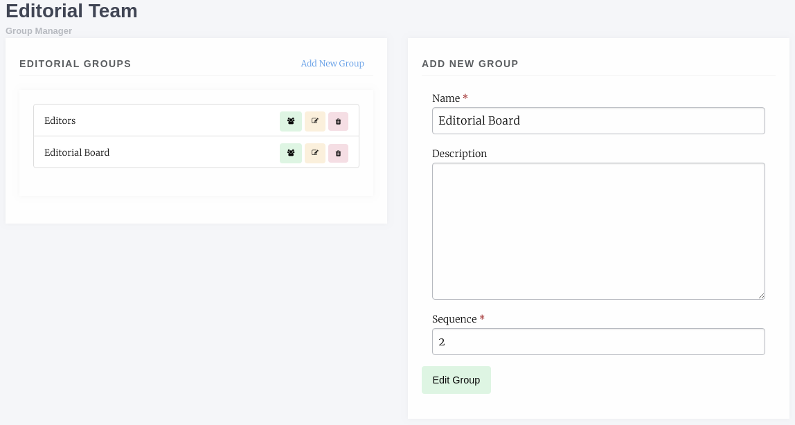
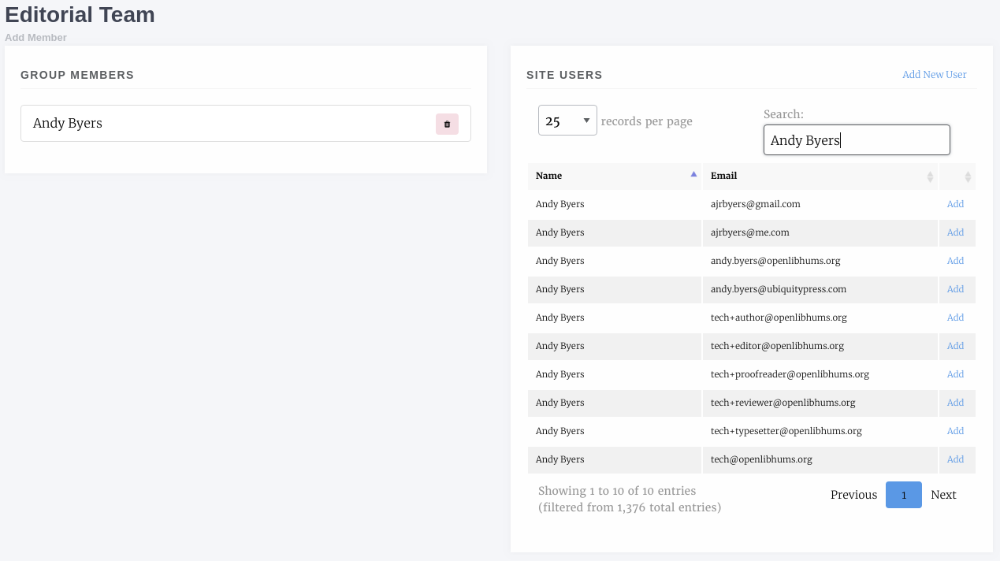
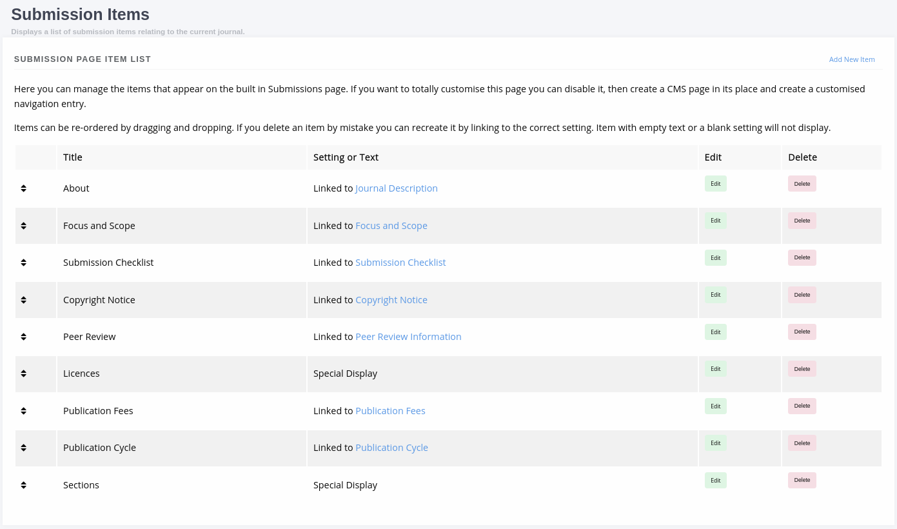
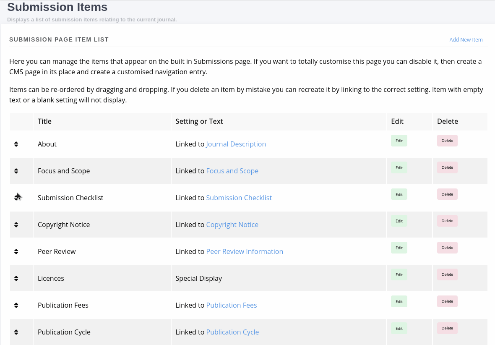
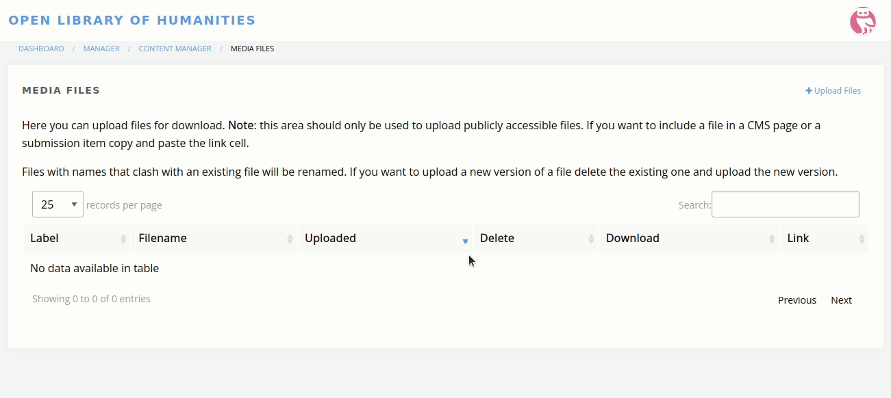

Content
=======
The content section allows us to control the navigation menu, content pages, news and editorial team in Janeway.

.. note::
   In version 1.4 the content manager page has been redesigned and updated.

Content
-------
The Content Manager is Janeway's CMS. Pages can be created an edited using our rich text editor.

.. figure:: ../../nstatic/content_manager.png

    Content and Navigation manager

Add a New Page
~~~~~~~~~~~~~~
To add a new page to your journal select "+ Add New Page". A new page requires the following:

- Name
    - This is the name of the page for the URL bar e.g. privacy-policy or author-guidelines. This field should not have any spaces in it.
- Display Name
    - The proper name for the page that will be displayed in the navigation e.g. Privacy Policy or Author Guidelines
- Content
    - HTML content, you should avoid pasting in from a text editor like Word as it will copy random styling across that will ignore your stylesheets
    
Once a new page has been created you will find it is available at https://yoururl.com/site/name e.g. https://orbit.openlibhums.org/site/privacy

Edit a Page
~~~~~~~~~~~
From the Content page you can see a list of the pages currently on your journal. Select Edit to make changes.

Delete a Page
~~~~~~~~~~~~~
To delete a page use the red Delete button.

.. warning::
   Data cannot be recovered so ensure you really want to remove a page before pressing the delete button.

Navigation
~~~~~~~~~~
As of 1.3.2 Navigation is made up of:

- Fixed nav elements that can be turned on/off
- User generated navigation entries

The future intention is that all navigation will be handled via elements.

- Fixed Nav Elements
    - Home
    - News
    - Articles
    - Issues
    - Collections
    - Editorial Team
    - Submissions
    - Contact
    - Start Submission
    - Become a Reviewer
    
To add a new Navigation element: from the Content Manager page select "Edit Nav", the following elements are presented in the form:

- Link name
    - The display name for the link
- Link
    - The actual link, either local `site/privacy` or remote `https://www.google.com`
- Is External
    - If linking outside of your janeway install, this should be checked
- Sequence
    - Used to order your nav elements, it should be a positive integer (number)
- Has sub navigation
    - If this element is the first that has a drop down, check this
- Top level nav item
    - A list of elements that have "Has sub navigation" checked, if you select and item from here your new nav element will appear under the selected drop down

News Manager
------------
The news manager allows you to create news items, assign display and take down dates and upload images to display alongside them.

News items can also displayed in the :ref:`carousel<carouselanchor>`.

To add a new news item select the *News Manager*. The interface displays exiting news items on the left and a form for adding new items on the right.

    News Manager interface
    
The form fields include:

- Title *
    - The title of the news item
- Body *
    - The HTML body of the news item
- Start display *
    - The date to start displaying this news item
- End display
    - The date to stop displaying this news item (can be left blank to display forever)
- Sequence *
    - Use for sorting when news items are posted on the same day
- Image file
    - An image file to fit the news piece, ensure you have the rights to post it
- Custom Byline
    - Lets you overwrite the name displayed as the originator of the news item
- Tags
    - A series of tags/keywords for the piece, you can filter news items by tags

    A news item with image and tags, material theme
    
Journal Contacts
----------------
You can control the contacts listing for your journal by adding and removing contacts through this interface. Only three fields are used for this:

- Name
    - The contact's name
- Email
    - The email address that should be contacted
- Role
    - The contact's role e.g. Editor or Publisher
    
Each outgoing message is recorded in the database and can be viewed in the admin area by staff.

    Contact Manager interface. The sort handles indicate you can drag and drop to re-order your contacts.

Editorial Team
--------------
The Editorial Team interface is relatively complex and is made up of:

- Editorial Groups
- Editorial Group Members

You can create as many groups as you like and add as many members as you like.

When you access the interface the form for making a new group is displayed on the right of the page and the existing groups listed on the left. For each group you can:

- Edit the membership
- Edit the group details
- Delete the group
- Drag and drop to re-order them

    The Editorial Team interface

.. tip::
   As of version 1.4 the Group description field supports HTML and presents a rich-text editor. If you do not wish to add an account for each user you can simply list them in the rich text box using, for example, a bulleted list.

Adding a New Group
~~~~~~~~~~~~~~~~~~
Creating a new group allows you to add members and display them on the Editorial Team page. Each group is headed by the group name you supply.

- Name
    - The group name e.g. Editoral Team or Advisors
- Description
    - Displayed under the Name header on the Editorial Team page
- Sequence
    - The order the groups should be displayed, you can reorder the groups by editing their sequence or by dragging and dropping their record
    
Adding Members to a Group
~~~~~~~~~~~~~~~~~~~~~~~~~
For an existing or newley created group you can use the Edit Members button (Green with a group of outlines) to change the membership of the group.

    An editorial team
    
On the left is a list of the current members, you can:

- Delete a member from the group
- Reorder the members by dragging and dropping a listing

Journal users are listed on the right and you can add a user to the group using the *Add* button. If a user account does not exist for the user you can use the *Add New User* button to add them.

Submission Page Items
---------------------
A new addition to v1.4 the Submission Page Items system lets you totally customise the Submission page to your liking. The existing submission items have automatically been setup for you and can now be edited.

    List of default submission items generated in the v1.4 upgrade process.

You can manage submission items in three ways:

- Link to a setting
- Custom HTML
- Special Display

From the main screen you can add new, edit existing and delete items as well as re-order them by dragging and dropping rows of the table.

    List of default submission items generated in the v1.4 upgrade process.

Link to a Setting
~~~~~~~~~~~~~~~~~

You can opt to link a submission item to an existing setting so it will display the same content as that setting. This is currently used for the majority of the automatically generated submission page items. Some examples of this are:

- About
- Focus and Scope
- Submission Checklist

You can tell when a submission item is linked to a setting under the 'Setting or Text' column in the main table or the 'Existing setting' field being completed when editing a submission item.

Custom HTML
~~~~~~~~~~~

A submission item can also just have some custom HTML, you can fill out the 'Text' rich text box. When using the Text field you should not select an Existing Setting or this will take precedence when the page is rendered.

Special Display
~~~~~~~~~~~~~~~

Special Display settings are used to display Licenses and Sections on the Submission page. To add these blocks you need to set the title of the item to either:

- licenses

or

- sections

You must also leave 'Text' and 'Existing setting' blank. This will render a special template that displays all publicly available sections or licenses.

Media Files
^^^^^^^^^^^
The Media Files manager lets editors upload and host small files. Examples include:

* Author Guidelines
* Proofing Guidelines
* Article Submission Templates

Once a file is uploaded a link is provided that you can then insert into CMS pages or templates.

.. note::
    The Media Files section should not be used to upload videos unless you have sufficient storage space/bandwidth. If you use Janeway Hosting you should contact the support team.

    Upload and deletion of a media file.
