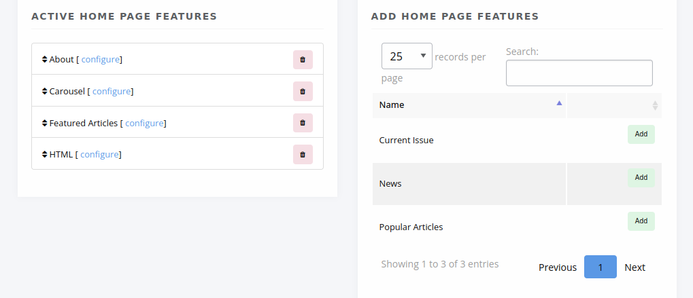
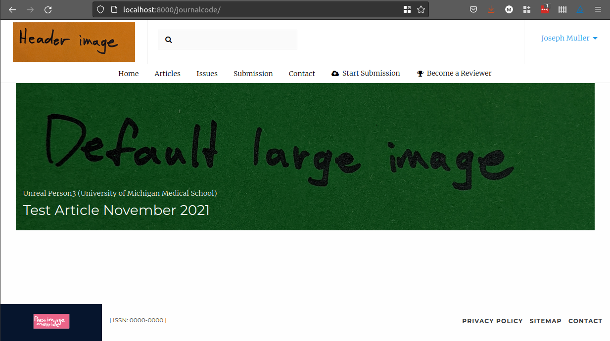
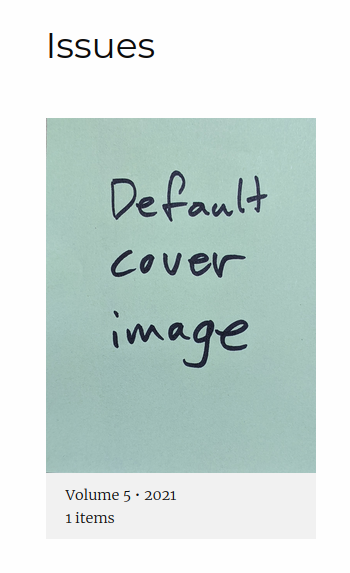
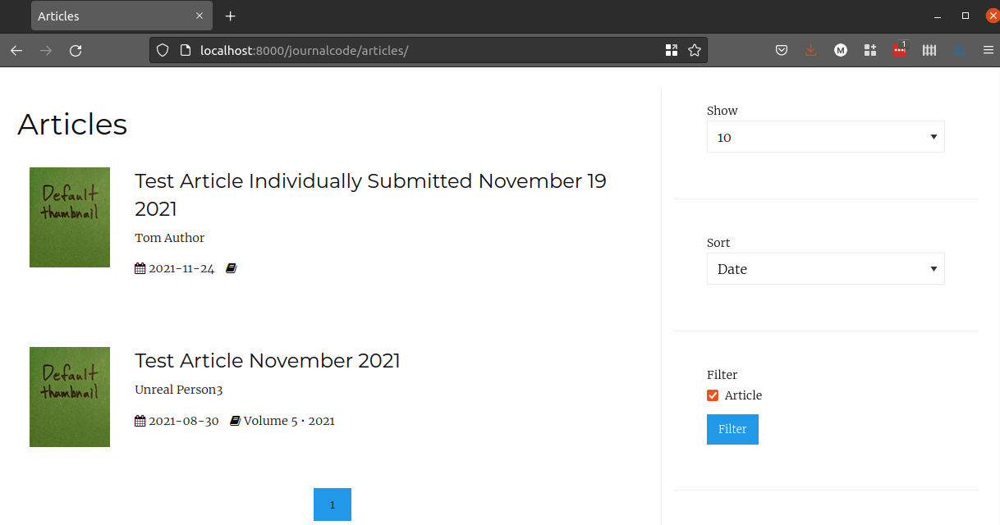
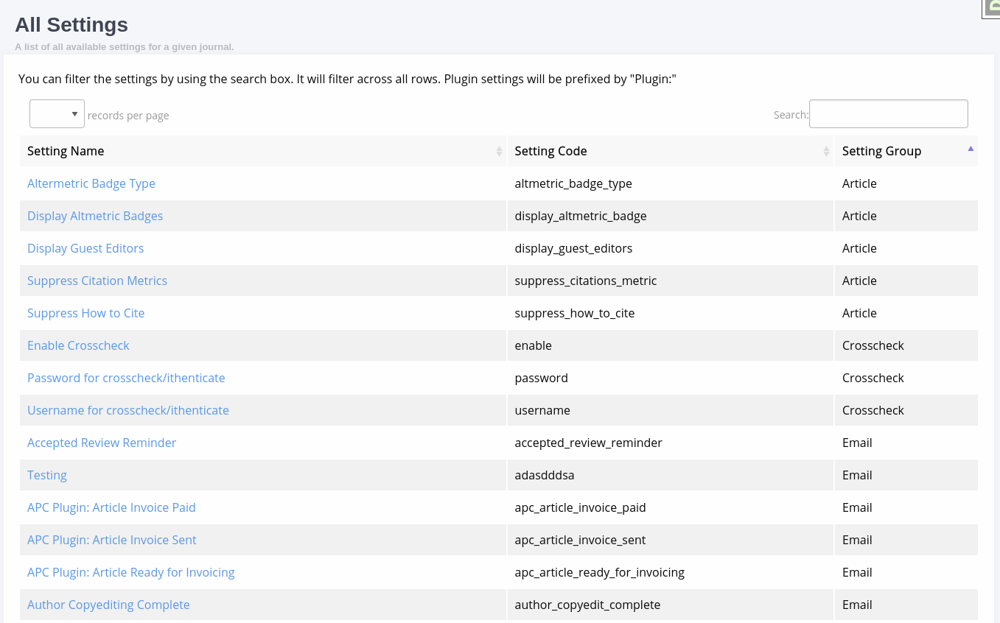

.. _journal_settings:

Journal Settings
================

In journal settings, you can set basic information about the journal, configure home page elements, upload logos and banner images, and adjust some display elements.

If you have the Janeway role Editor or Staff, you can access Journal Settings by selecting **Manager** under **Staff**.

General
-------
The general journal settings page is home to various configuration settings for the journal. Each field is explained in Janeway.

- Journal information (title, ISSN, description, keywords, design theme)
- Publisher information (name, website, contact)
- Email settings for system-generated emails
- Remote website settings
- Language settings
- Integration with Slack or Discord

Home Page
---------
Here you can activate features for your journal home page.

   The Journal Home Settings page

To add a homepage element, select **Add** under **Add Home Page Features** and then select **configure** to see options for that element. You can reorder elements by dragging and dropping them.

About
    Displays the journal description. If you edit the description here, it will also change in the other places it appears.

Carousel
    .. _carouselanchor:

    A rotating banner that can be configured to display one of the following:

    - Latest articles
    - Latest news
    - A combonation of both

    You can select the number of items to display as well as select the items you want to include or exclude.

Current Issue
    Takes whichever issue is marked as current and displays its table of contents on the home page. To learn how to select a current issue check the :ref:`issue page<currentissueanchor>`.

Featured Articles
    Allows you to select a series of articles to display on the homepage. The selected articles are displayed in a grid that will cascade onto a new line every three articles.

HTML
    A generic segment that you can customize according to your needs. It can hold text as well as more complex HTML such as a Twitter timeline.

News
    Displays a list of the most recent news items. You can configure the number of items to display (the default is 5).

Popular Articles
    Displays the most-accessed articles. You can configure the number of items as well as how recent the articles should be.

Images
------
Below are explanations of the fields you see in Settings. See also the :ref:`Styling section<imageguidelines>`.

.. tip::
    Janeway will automatically resize images to fit the designated spots it has for them, but it won't change the proportions of width to height.

   Header image in top left and large image in center, with OLH theme

Header image
    Typically the journal logo goes here. It appears in the top left corner on desktop or laptop screens, and at the top of the page on mobile devices.

Default large image
    This image shows up in several places, depending on how your theme and home page are configured:

    - At the top of the article page if no article image is set specifically (see Article Images Manager) and article images are set to display (see Article Display Settings). If not set *and* article images are set to display, article metadata may not show up properly.

    - In the carousel on the home page for any items that don't have associated images. (In this spot it replaces the press-level "Default carousel image")

    Use a wide image (about 4 parts width to 1 part height) with good resolution when set at 300 or 400 pixels tall.

Press override image
    This can be set to replace the press logo that appears in the footer when using the OLH theme or the clean theme.

Default cover image
    The default image for issue covers when no image is set specifically for that issue.

Default thumbnail
    The default image for each article when viewing an article list. A width-to-height ratio of about 3 to 4 is recommended. If no thumbnail is set, this defaults to the Janeway logo.

Favicon
    The tiny little image you often see in the browser tab before the name of a webpage. Use a very small image of equal width and height. If not set, no Favicon will appear.

Styling
-------
This page displays some general settings for controlling the styling of your journal.

- Full Width Nav (only used by the Material theme)
- Display Editorial Team Images
- Enable Multi Page Editorial Team (splits the editorial team into pages by Group)

All Settings
------------
The all settings page lists every under-lying journal-level setting within Janeway and allows you to edit them. The setting groups are:

- Crossref
- Email
- Email Subject
- General
- Identifiers
- Preprints
- Review

This is a fallback area for editing a setting when you can't find it in the interface or for editing settings introduced into your instance.

Accessing Settings in Templates and Code
----------------------------------------

.. highlight:: py

Setting values can be accessed inside templates using **{{ journal_settings.group_name.setting_name }}**::

    {{ journal_settings.crosscheck.enable_crosscheck }}

In Django they can be accessed with **get_setting**::

    request.journal.get_setting('group_name', 'setting_name')
