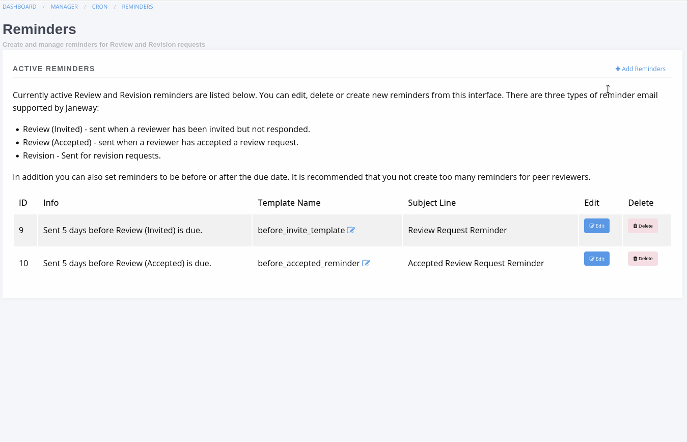
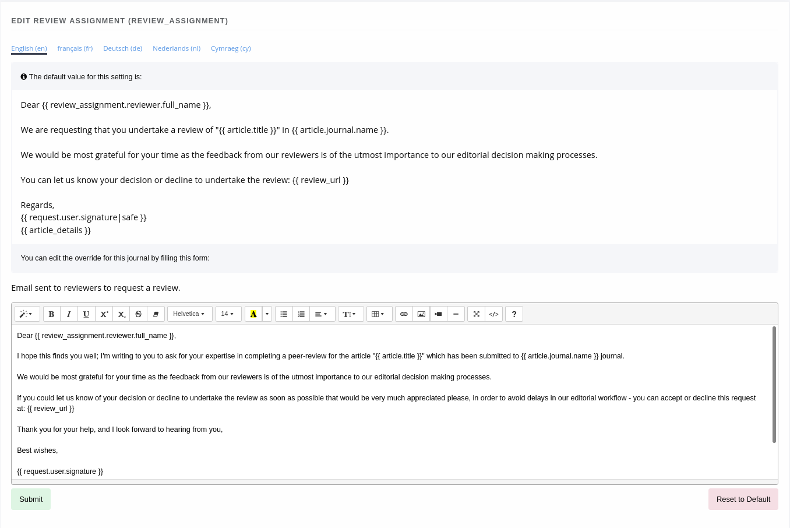

Other
=====
The *other* section covers three things:

- Cache
- Reminders
- Email Templates

Clearing the Cache
------------------
Janeway uses a cache to speed up page loading, you can reset the cache from the Manager page by clicking the Clear Cache button.

Scheduled Reminders
-------------------

.. Note::
    The Scheduled Reminders manager has been updated as part of version 1.4.

Janeway lets you define your own email reminders for overdue Reviews and Revision assignments. They are defined using the following:

- Type
    - Review (new), Review (accepted) or Revision reminder.
- Run Type
    - Whether to run before or after the request is due.
- Days
    - The number of days before or after the request is due this reminder should be sent.
- Template Name
    - The name of the template that should be used when sending the reminder. If this template does no exist you will be asked to create it.
- Subject
    - The email subject to send with the reminder.
    
A reminder email has access to three objects in the template:

- review_assignment or revision (depending on which type of reminder)
- journal - the journal sending the reminder
- article - the appropriate article

On the edit template page there is a small guide showing some of the variables you can use when generating these templates.

    Creating, editing and deleting a reminder.

Once a reminder is created a Cron job on the server will start processing requests but it will not process these for Review and Revision requests that have passed the reminder dates.

.. tip::
    If automated reminders are not being sent for your journal the most likely explanation is that the cron job has not been setup properly. You should contact your administrator who can setup the call to the send_reminders management command.

Email Templates
---------------
The email templates system allows you to search through and edit all of the email templates for a given journal.

.. warning::
    Editing an email template could cause it to break.

Each email template has access to different objects which makes documenting this quite difficult. We will be updating our `FAQ <https://janeway.freshdesk.com/support/solutions/folders/43000574528>`_ with information on templates that are edited regularly.

When editing a template you will see the default version of the email at the top and a rich-text editor below. If you do not have a specific setting for your journal (ie. you've never overwritten the default setting) the rich text box will appear blank. To get started you can copy the default version into the rich-text box and make your edits.

.. tip::
    When editing an email that has a URL placeholder (like {{ review_url }} ) it is important that you do not add anything immediately after this placeholder as email clients may interpret them as part of the link.

    Editing an email template.