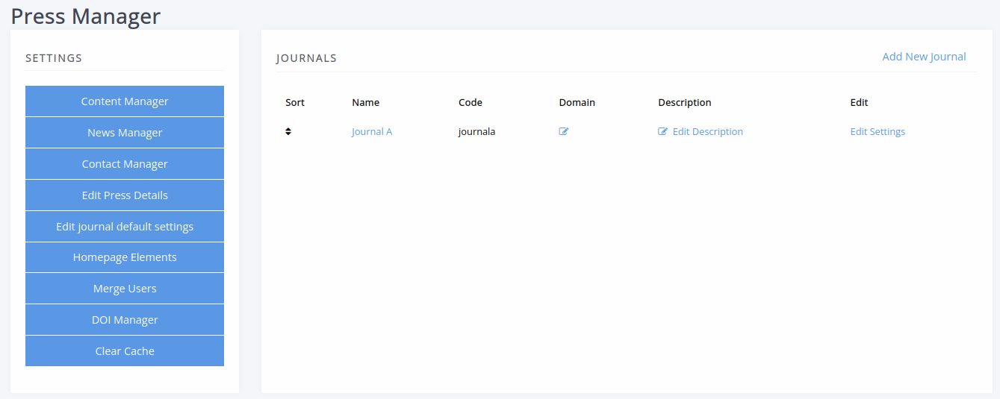
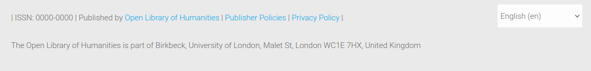
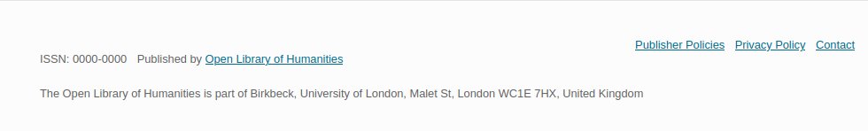

.. _press_settings:

Press Manager
=============

You can configure the press level of Janeway on the Press Manager page, which is accessible to users with the role of **staff**.

   The Press Manager page

Many base press-level settings are available under **Edit Press Details**.

Journal footer text
-------------------

As a press manager, you can control some of the elements that appear in website footer of every journal.

Some journal indexers require a postal address to be displayed on every journal website. You can add this kind of information with **Edit Press Details** > **Journal footer text**.

   A customised journal footer in the OLH theme

   A customised journal footer in the material theme

   A customised journal footer in the clean theme

You can also add custom links to the footer, such as to publisher policies, using the Content Manager at the press level.
