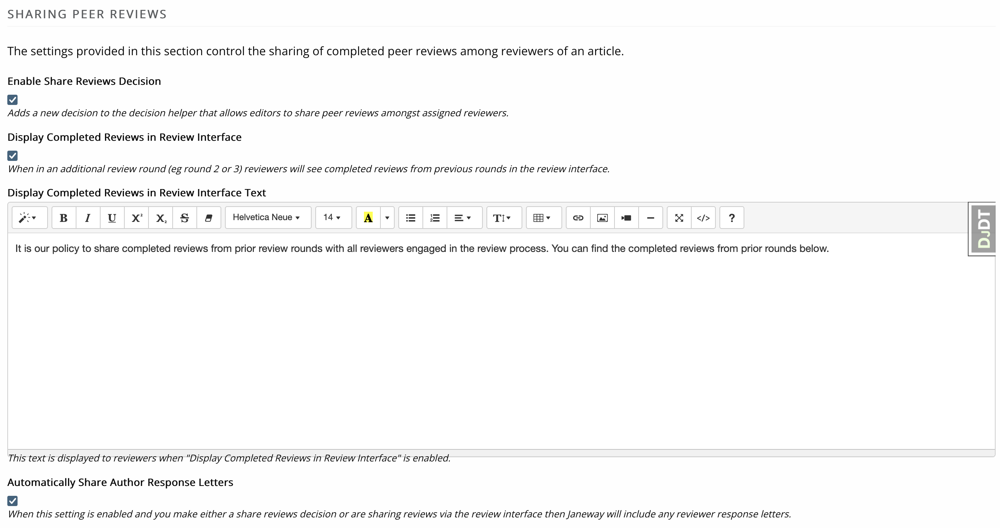
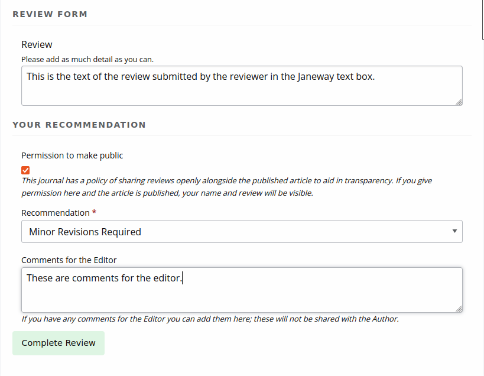
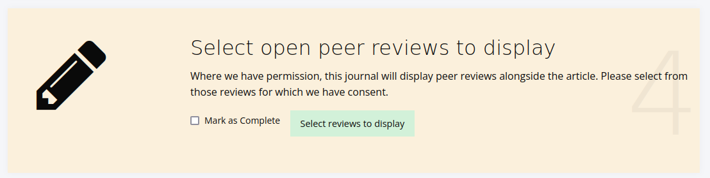
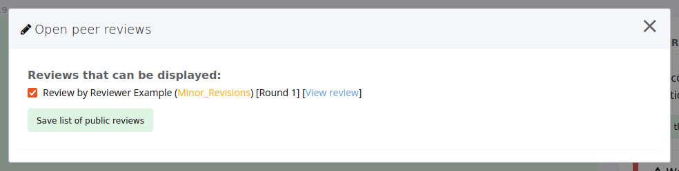
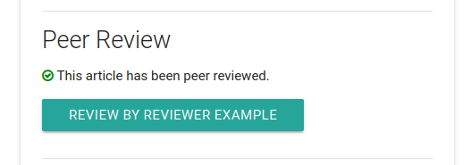

Review
======
The management interface has two sections that allow you to manage peer review settings for journals.

- Review Settings
- Review Forms

.. _reviewsettings:

Review Settings
---------------
Under review settings we can control how peer review operates for the given journal. The settings editable here are:

- Review Guidelines
    - A set of generic review guidelines that a reviewer should follow.
- Default Review Visibility
    - Either Open, Anonymous or Double Anonymous, this is the default information visibility for a review assignment. If open, authors can see reviewers and vice versa, if single anonymous reviewers can see authors, if double anonymous neither can see information on the other. When using double anonymous review, the editor must ensure the manuscript files are anonymous.
- Default Review Days
    - The default number of days a reviewer is given, this is used to then control reminders. This field is set to 56 days (8 weeks) initially. The due date can be changed on a per review basis.
- One Click Access
    - If enabled a special access token is appended to the reviewer link in the assignment email, this link allows the reviewer to view the review without logging into the system. Once the review is complete the token is deleted so it cannot be reused. Tokens are UUID4s which are unique. 
- Draft Decisions
    - If enabled, section editors will not be able to accept papers, instead they can make recommendations to senior editors who can then accept papers.
- Enable open peer review
    - Turns on the open peer review feature (see below).
- Default Review Form
    - The default review form that will be automatically selected when assigning a reviewer.
- Reviewer Form Download
    - If enabled this allows the Reviewer to download a copy of the review form in DOCX format to complete offline and then upload.
- Enable save review progress
    - If enabled, reviewers will be able to save the progress in a peer-review assignment and come back later to complete it later (Only recommended for journals using custom review forms that are particularly long)
- Accept Article Warning
    - This is a block of text displayed to the editor before they accept an article, prompting initial DOI and metadata registration with Crossref if the journal or press is set to use Crossref. You can use the setting to provide a readout of current metadata so the editor can do a quick check of what will be sent to Crossref. To show registration information, populate the setting with ``{{ article.registration_preview|safe }}``
- Enable expanded review details
    - When this setting is enabled, the editor's review dashboard will show all active reviews. Otherwise it will show just a count of completed reviews.

Displaying Review Data to Authors
~~~~~~~~~~~~~~~~~~~~~~~~~~~~~~~~~
Janeway has various controls for how review data is displayed to authors. These settings are:

- Hide Review Data from Authors Before Release
    - When this setting is enabled, authors will see no information about active peer reviews until the editor makes them available. Otherwise they will see a list of review assignments.
- Enable Peer Review Data on Author Page
    - When this setting is enabled, authors will have access to more information about the reviews for their article (requested, due, and complete dates) on the article page. If it is left off, they will only have access to the review comments.
- Enable Peer Review Data on Review Pages
    - When this setting is enabled, authors will have access to more information about their reviews on the review page.

The settings "Enable Peer Review Data on Author Page" and "Enable Peer Review Data on Review Pages" do similar things but on different pages. "Enable Peer Review on Author Page" is used on the author's article page, which they have access to from the point of submission. "Enable Peer Review Data on Review Pages" is used on the review page, which authors only get access to after an editor grants the author access. Both are off by default.

.. _sharingpeerreviewsanchor:

Sharing Peer Reviews
--------------------

.. note:: Added in v1.5.1 editors have two options to share reviews with other peer reviewers.

In the review settings page, under the "Sharing Peer Reviews" header there are four settings that control how editors can share peer reviews.

    Settings for controlling sharing of peer review.

Enable Share Reviews Decision
~~~~~~~~~~~~~~~~~~~~~~~~~~~~~
This adds a new option to the decision list and allows the editor to email all of the reviewers who have completed a review for the given article and share with them a link to view each of the other reviews that have been completed for that article.

.. note:: Reviews that are not complete or do not have a decision are excluded from being shared.

Display Completed Reviews in Review Interface
~~~~~~~~~~~~~~~~~~~~~~~~~~~~~~~~~~~~~~~~~~~~~
When enabled and in an additional review round (eg round 2 or 3) reviewers will see completed reviews from previous rounds in the review interface.

.. note:: Reviews that are not complete, do not have a decision or are part of the same round of review are excluded from being shared.

Display Completed Reviews in Review Interface Text
~~~~~~~~~~~~~~~~~~~~~~~~~~~~~~~~~~~~~~~~~~~~~~~~~~
Default text displayed to explain why reviews are being shared with other peer reviews. Can be customised at the per-journal level.

Automatically Share Author Response Letters
~~~~~~~~~~~~~~~~~~~~~~~~~~~~~~~~~~~~~~~~~~~

.. note:: This setting works in conjunction with either "Enable Share Reviews Decision" and "Display Completed Reviews in Review Interface"

Additionally shares any completed author response letters along side the peer reviews for both peer review sharing options.

Review Forms
------------
Janeway allows you to generate as many review forms as you like. When a new journal is created a default review form is generated automatically (called Default Form) it has one element: a text area called "Review".

.. figure:: /nstatic/review-forms.png

    Review Form interface
    
To create a new form complete the form on the right:

- Form Name
- Slug 
    - a version of the form name but in all lower-case, no spaces e.g. default-form
- Intro
    - Guidance text specific to this form
- Thanks
    - Text that is displayed after the reviewer has completed their review
    
Once you have created your new form you can add Fields known as Elements in Janeway by selecting the yellow edit button. Elements can be:

- Text Field
- Text Area
- Checkbox
- Select (dropdown)
- Email
- Upload
- Date

To add a new Element:

- Click Add Element
- In the modal supply a name and kind
    - If you choose "select" as kind you will need to add the options to the Choices field, these should be seperated by the bar "|" characted e.g. choice 1|choice 2|choice 2 or 1|2|3|4|5 if you wanted a numeric choice. If you select any other Kind, ignore the Choices field.
- Required
    - If this field MUST be completed, ensure this box is checked, if it is optional make sure it is not checked
- Order
    - The order in which this element will appear on the form
- Width
    - 1/3, 1/2 or Full width. If you put two half width elements next to each other in order they will both display on the same line
- Help text
    - This text will display under the Name field on the form and explain what the reviewer needs to do with this field. 
- Default visibility
    - If enabled, by default this element will be visible to the reviewer once the Editor has approved the review for them to see. If disabled, the author will not see this element unless the Editor overrides the default setting.

As you go along you can use the Preview Form button to see what the form will look like. Here is an example of the default form edited to have two additional fields with 1/2 widths.

.. figure:: ../../nstatic/review-forms-preview.png

    Review Form preview

Open Peer Review
----------------

This feature allows peer reviews to be made public with the consent of the reviewer, and when chosen for public display by the editor. By default, this feature is off and peer reviews will remain confidential.

.. note:: Open peer review only shows text that is typed into the peer review assignment box, not uploaded files. This is for accessibility and display purposes. Accordingly, if you enable open peer review, we recommend encouraging reviewers to use the text box rather than uploading files.

When the setting is enabled, reviewers are asked for their permission to make the review public.

    Reviewers are asked for permission to make reviews public

Then, during prepublication, the editor can choose which of the consented reviews (if there are any) to make open.

    Editor selects peer reviews to display

    Reviews that can be displayed

If a peer review has been approved for public display by both the author and the editor, readers will be able to open a pane to view the peer review text.

    Button to open peer review

.. figure:: ../../nstatic/open-peer-review-pane.png

    Open peer review pane

