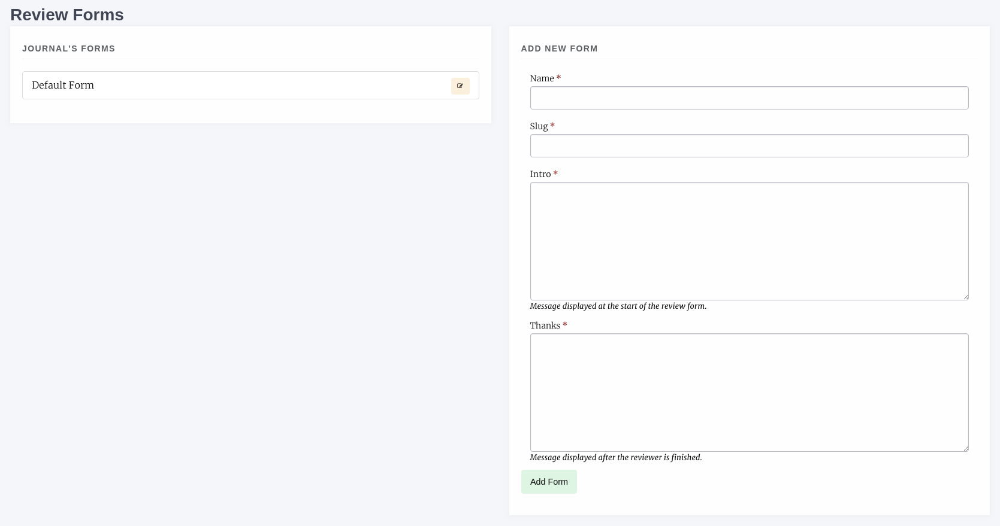
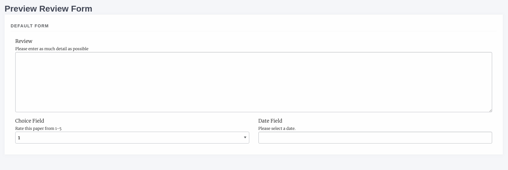

Review
======
The management interface has two sections that allow you to manage peer review settings for journals.

- Review Settings
- Review Forms

Review Settings
---------------
Under review settings we can control how peer review operates for the given journal. The settings editable here are:

- Review Guidelines
    - A set of generic review guidelines that a reviewer should follow.
- Default Review Visibility
    - Either Open, Blind or Double Blind, this is the default information visibility for a review assignment. If open, authors can see reviewers and vice versa, if blind reviewers can see authors, if double blind neither can see information on the other. When using double blind the editor must ensure the manuscript files are anonymous.
- Default Review Days
    - The default number of days a reviewer is given, this is used to then control reminders. This field is set to 56 days (8 weeks) initially. The due date can be changed on a per review basis.
- One Click Access
    - If enabled a special access token is appended to the reviewer link in the assignment email, this link allows the reviewer to view the review without logging into the system. Once the review is complete the token is deleted so it cannot be reused. Tokens are UUID4s which are unique. 
- Draft Decisions
    - If enabled, section editors will not be able to accept papers, instead they can make recommendations to senior editors who can then accept papers.
- Default Review Form
    - The default review form that will be automatically selected when assigning a reviewer.
- Reviewer Form Download
    - If enabled this allows the Reviewer to download a copy of the review form in DOCX format to complete offline and then upload.
- Enable save review progress
    - If enabled, reviewers will be able to save the progress in a peer-review assignment and come back later to complete it later (Only recommended for journals using custom review forms that are particularly long)
- Enable Peer Review Data Block
    - When this setting is enabled authors will have access to view more information about the reviews for their article (requested, due, and complete dates). If it is left off they will only have access to the review comments.
    
Review Forms
------------
Janeway allows you to generate as many review forms as you like. When a new journal is created a default review form is generated automatically (called Default Form) it has one element: a text area called "Review".

    Review Form interface
    
To create a new form complete the form on the right:

- Form Name
- Slug 
    - a version of the form name but in all lower-case, no spaces e.g. default-form
- Intro
    - Guidance text specific to this form
- Thanks
    - Text that is displayed after the reviewer has completed their review
    
Once you have created your new form you can add Fields known as Elements in Janeway by selecting the yellow edit button. Elements can be:

- Text Field
- Text Area
- Checkbox
- Select (dropdown)
- Email
- Upload
- Date

To add a new Element:

- Click Add Element
- In the modal supply a name and kind
    - If you choose "select" as kind you will need to add the options to the Choices field, these should be seperated by the bar "|" characted e.g. choice 1|choice 2|choice 2 or 1|2|3|4|5 if you wanted a numeric choice. If you select any other Kind, ignore the Choices field.
- Required
    - If this field MUST be completed, ensure this box is checked, if it is optional make sure it is not checked
- Order
    - The order in which this element will appear on the form
- Width
    - 1/3, 1/2 or Full width. If you put two half width elements next to each other in order they will both display on the same line
- Help text
    - This text will display under the Name field on the form and explain what the reviewer needs to do with this field. 
- Default visibility
    - If enabled, by default this element will be visible to the reviewer once the Editor has approved the review for them to see. If disabled, the author will not see this element unless the Editor overrides the default setting.

As you go along you can use the Preview Form button to see what the form will look like. Here is an example of the default form edited to have two additional fields with 1/2 widths.

    Review Form preview
