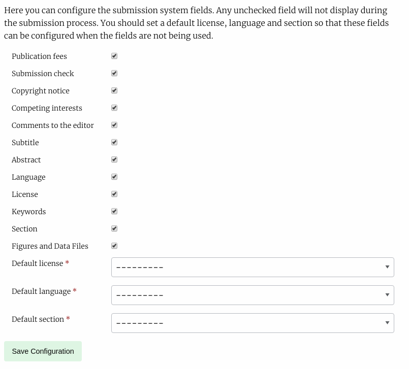

Submission
==========
The management interface has three sections that allow you to manage submission settings for journals.

- Submission Settings
- Submission Fields Configurator
- Additional Submission Fields

Submission Settings
-------------------
This section allows you to control generic submission settings that affect how submission is experienced.

- Disable Journal Submission
    - If checked, this setting disables the submission system.
- Submission Intro Text
    - Introductory text for the head of the Submission page.
- Copyright Notice
    - Copyright information for authors usually includes information on licenses used for publishing and rights retained.
- Submission Checklist
    - Usually a numeric list of items an author should check before submitting the paper.
- Acceptance Criteria
    - The criteria the journal uses to evaluate your paper.
- Publication Fees
    - Any publication fees associated with submitting the paper.
- Editors for Notification
    - This allows you to select which Editors are notified of new papers being submitted.
- User Automatically Author
    - If enabled the submission system assumes the user submitting the paper is also an author, they can be removed if required.
- Competing Interests
    - This setting is deprecated in favour of the Submission Configurator version.
- Submission Summary
    - This setting will be moved to the submission configurator. If enabled, this asks for a lay summary of the paper to be submitted.
- Accepts Preprint Submissions
    - If preprints are enabled and this setting is enabled an author will be able to submit a preprint directly from the preprint service into the journal for evaluation.
- Focus and Scope
    - The journal's Focus and Scope, displayed on the Submissions page.
- Publication Cycle
    - The journal's publication schedule e.g. Yearly or Continuous, displayed on the Submissions page. 
- Peer Review Info
    - Information on how peer-review is conducted, displayed on the Submissions page.
- File Submission Guidelines
    - General instructions for authors when they get to the file upload stage.
- Manuscript File Submission Instructions
    - Specific instructions for manuscripts, appearing on the manuscript upload pop-up.
- Limit Manuscript Types
    - If enabled, only Doc, Docx, RTF and ODT files will be accepted as manuscript files during submission
- Data and Figure File Submission Instructions
    - Specific instructions for figures and data files, appearing on the figure and data upload pop-up.

Submission Fields Configurator
------------------------------
The submission fields configurator lets you enable or disable submission fields. This page has three complexities:

- Disabling License, Language or Section
    - If you disable one of these fields you need to set a default value
    

    Submission Fields Configurator
    
- You can enable or disable almost all fields, except Title, Manuscript Files and Authors.

Additional Submission Fields
----------------------------
The additional submission fields page allows us to add custom fields to the Article Info submission page. It works in a similar fashion to the Review Forms generator.

Field types are:

- Text Field
- Text Area
- Checkbox
- Select (dropdown)
- Email
- Upload
- Date

To add a new Element:

- In the form add Name and select a Kind
    - If you choose "select" as kind you will need to add the options to the Choices field, these should be seperated by the bar "|" characted e.g. choice 1|choice 2|choice 2 or 1|2|3|4|5 if you wanted a numeric choice. If you select any other Kind, ignore the Choices field.
- Required
    - If this field MUST be completed, ensure this box is checked, if it is optional make sure it is not checked
- Order
    - The order in which this element will appear on the form
- Width
    - 1/3, 1/2 or Full width. If you put two half width elements next to each other in order they will both display on the same line
- Help text
    - This text will display under the Name field on the form and explain what the reviewer needs to do with this field. 
