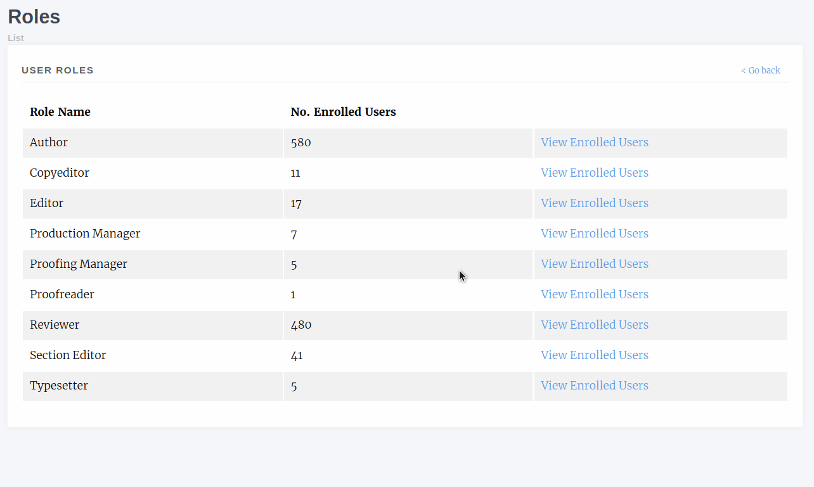

Users
=====
The Users section of the manager has various controls for different permission levels.

Editors have control of:

- Enrolled Users (users who have a role on your journal)
- Enrolling Users (giving users a role on your journal)
- Journal Roles (viewing users with a given role)

Staff have additional controls for:

- Inactive Users (users who have not activated their accounts)
- Authenticated Users (lists users with active sessions)
- Merge Users (available at the press level)

Enrolled Users
--------------
The journal users interface lists all users who have one or more roles on your journal. From this page we can:

- Edit a user
- Add new users
- Add multiple users to roles
- View a user's assignment history
    - Editorial assignments
    - Review assignments
    - Copyediting assignments
    - Production assignments

.. figure:: ../../nstatic/enrolled_users.png

    The enrolled users interface. From here we can search, add new users and assign additional roles amongst other things.

Editing a User
~~~~~~~~~~~~~~
The edit user interface is relatively standard though there are a few things to note:

- Is staff should only be given to Journal Managers/Publishers and can only be assigned by other staff
- Is admin grants access to Janeway's admin data layer
- Is superuser will set a user to have all roles across the entire system

Enrol Users
--------------
.. _enrolusersanchor:

The enrol users page allows Editors to search for existing user accounts and assign them a role in their journal.

.. warning::
    As of version 1.3.10 of Janeway editors can no longer browse a list of users and must search by name or email address to find existing users.

You can search for existing user accounts by:

- First Name
- Last Name
- Email Address

.. tip::
    You don't need to search by all three fields. You can search by just first name or email address for example.

Once you have found an account you will be able to see which roles they have and which are available to be assigned to them.

.. figure:: ../../nstatic/enrol_user.gif

    This user has two roles (Author and Editor) and can be assigned any of the other roles.

Inactive Users
--------------
The inactive users screen is accessible to staff only and lists all users who have not yet activated their account. You are cautioned only to activate accounts that you've confirmed ownership for.

Roles
-----
The roles interface presents a list of Janeway's core roles:

- Author
    - Any user who registers with your journal is given this role
- Copyeditor
- Editor
    - Handles processing of articles and assignment of tasks
- Production Manager
    - Handles the assignment and processing of Typesetting articles
- Proofing Manager
    - Handles assignment of proofreaders and requesting typesetting changes
- Proofreader
- Reviewer
- Section Editor
- Typesetter

Once you have selected a role you will be presented with a list of users who currently have that role. There is also an option to remove the role from that user.

Authenticated Users
-------------------
Presents a list of users who are currently logged into your install of Janeway. Only accessible to staff.

Merge Users (Press Manager only)
--------------------------------
From the press manager, staff memebers can now merge two accounts together, in order to remove any potential duplicates.
All linked objects (tasks, articles, roles, files...) will be transferred from the source account onto the destination account.
The account profile itself is left untouched, so any profile details on the source account will be lost.
