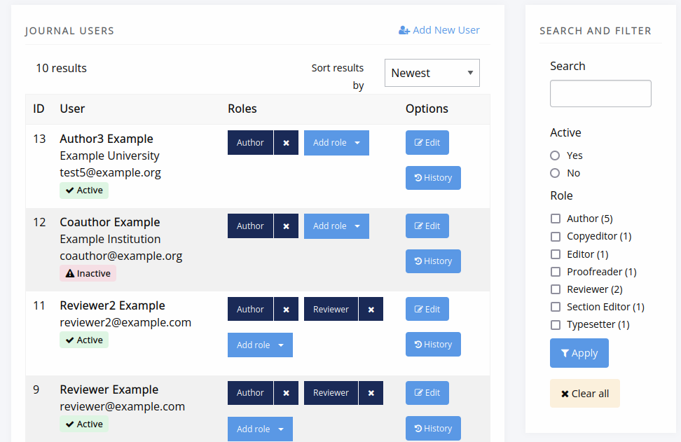
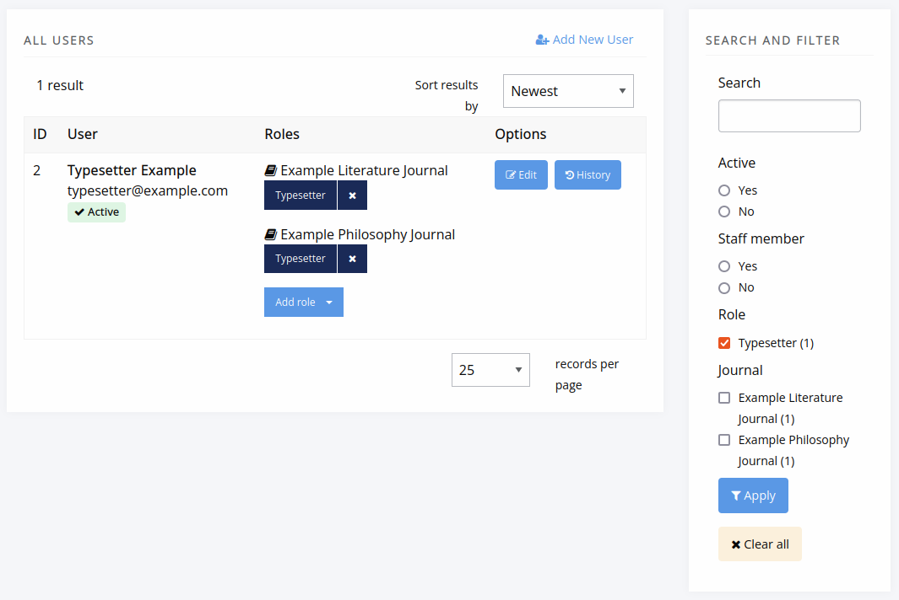
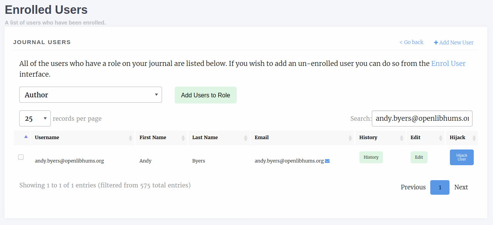
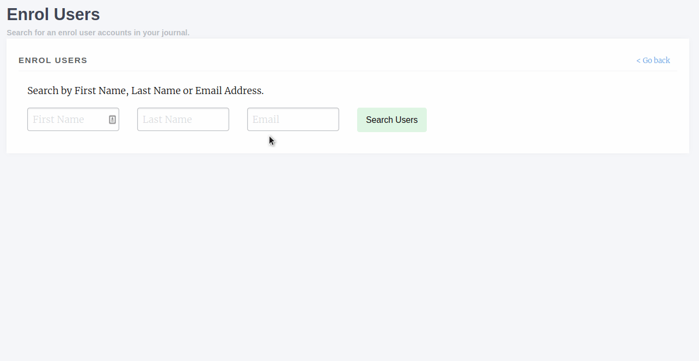
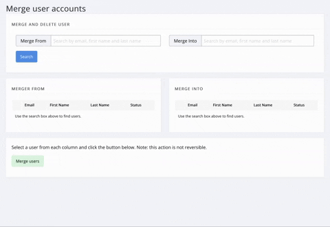

Users and Roles
===============

The **Users and Roles** section of the manager has various controls for
different permission levels.

Editors have control of:

- User accounts at the journal level
- Account roles in the journal
- Account activation

Staff have additional controls for:

- Viewing authenticated users (users with active sessions)
- Merging user accounts

Journal Users (New)
-------------------

If you are an editor or staff member, you can manage user accounts for
a journal via the **Journal Users** page.

    The Journal Users page.

You can search by a variety of fields, including name, email, ORCID,
institution, and biography. You can filter by role, whether an account
is active.

You can also add and remove roles, edit accounts, and if needed create accounts.

Each user’s assignment history is also available from this view.

All Users (New)
---------------

If you are staff, you can see all users across a press (a.k.a. Janeway
installation).

    The All Users page at the press level.

At this level, you can filter by journal and staff-member status
and manage roles across journals, in addition to the actions an editor can take.

Roles
-----
Janeway's core roles are as follows:

- Author
    - Any user who registers with your journal is given this role
- Copyeditor
- Editor
    - Handles processing of articles and assignment of tasks
- Journal Manager
    - Has a similar level of permission to the Editor role, but can be given extra access (see below)
- Production Manager
    - Handles the assignment and processing of Typesetting articles
- Proofing Manager
    - Handles assignment of proofreaders and requesting typesetting changes
- Proofreader
- Reader
    - This role indicated whether a user is signed up for now article notifications
- Reviewer
- Section Editor
- Typesetter

Editing a User
~~~~~~~~~~~~~~
The **Edit User** interface is relatively standard, though there are a few
things to note:

- **Is staff** should only be given to Journal Managers/Publishers and can only be
  assigned by other staff
- **Is admin** grants access to Janeway's admin data layer
- **Is superuser** will set a user to have all roles across the entire system

Enrolled Users
--------------
The journal users interface lists all users who have one or more roles on your journal. From this page we can:

- Edit a user
- Add new users
- Add multiple users to roles
- View a user's assignment history
    - Editorial assignments
    - Review assignments
    - Copyediting assignments
    - Production assignments

    The enrolled users interface. From here we can search, add new users and assign additional roles amongst other things.

Enrol Users
-----------
.. _enrolusersanchor:

The enrol users page allows Editors to search for existing user accounts and assign them a role in their journal.

.. warning::
    As of version 1.3.10 of Janeway editors can no longer browse a list of users and must search by name or email address to find existing users.

You can search for existing user accounts by:

- First Name
- Last Name
- Email Address

.. tip::
    You don't need to search by all three fields. You can search by just first name or email address for example.

Once you have found an account you will be able to see which roles they have and which are available to be assigned to them.

    This user has two roles (Author and Editor) and can be assigned any of the other roles.

Inactive Users
--------------
The inactive users screen is accessible to staff only and lists all users who have not yet activated their account. You are cautioned only to activate accounts that you've confirmed ownership for.

Authenticated Users
-------------------
Presents a list of users who are currently logged into your install of Janeway. Only accessible to staff.

Merge Users (Press Manager only)
--------------------------------
The press manager now enables staff members to merge two accounts to eliminate potential duplicates. All associated objects such as tasks, articles, roles, and files will be moved from the source account to the destination account. The account profile remains unchanged, meaning any profile information in the source account will be lost.

.. warning:: When searching for users to merge, note that the user account in the left column will be merged into the user account in the right column.

    A press manager is merging Andy Byers' account into Katheryn Janeway's account.

Granular Manager Permissions
----------------------------
In version 1.5 we introduced more granular manager permissions. Initially these are centered around the journal manager and editor roles. We are introducing a new setting group "Permission", and within this group we will be adding new permission controllers starting with:

- Licenses
    - Controls whether a user can access the licenses control pages base on their roles, defaults to Editor and Journal Manager
- Sections
    - Controls whether a user can access the sections control pages base on their roles, defaults to Editor and Journal Manager

Currently there is no interface for updating the roles that can access these pages and the setting is JSON stored in the database.

.. warning:: You should only edit the Permission settings if you are sure about the change you are making.

By default both settings read `["editor", "journal-manager"]`. If, for example, you wanted to stop editors from editing licenses you could change it to read `["journal-manager"]`. Once saved, only users with the journal manager role will be able to access the licenses pages.

Granular Settings Permissions
-----------------------------
In version 1.5 we introduced granular settings permissions. Staff can now determine, for any given setting object, which roles are allowed to edit it. This is done via the Django Admin panel (Core > Settings), using the `editable_by` field. Staff can alter the roles that are allowed to see and edit a setting.

.. Note:: If a setting is also displayed on a settings group page (for example the General or Submission settings page) and a user does not have the appropriate permission to edit that setting it will be filtered out of the form and not be visible.

As with the manager permissions changes the default to settings permission maintains the status quo and by default all settings are editable by editors and journal managers.
