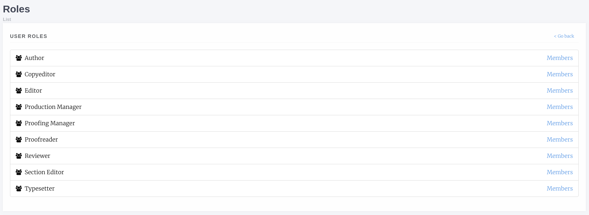

Users
=====
The users section allows control of:

- Journal Users
- Inactive Users (staff only)
- Roles
- Authenticated Users (staff only)

Journal Users
-------------
The journal users interface lists all users who have one or more roles on your journal. From this page we can:

- Edit a user
- Add new users
- Add multiple users to roles
- View a user's assignment history
    - Editorial assignments
    - Review assignments
    - Copyediting assignments
    - Production assignments

Editing a User
~~~~~~~~~~~~~~
The edit user interface is relatively standard though there are a few things to note:

- Is staff should only be given to Journal Managers/Publishers and can only be assigned by other staff
- Is admin grants access to Janeway's admin data layer
- Is superuser will set a user to have all roles across the entire system

Inactive Users
--------------
The inactive users screen is accessible to staff only and lists all users who have not yet activated their account. You are cautonined only to activate accounts that you've confirmed ownership for.

Roles
-----
The roles interface presents a list of Janeway's core roles:

- Author
    - Any user who registers with your journal is given this role
- Copyeditor
- Editor
    - Handles processing of articles and assignment of tasks
- Production Manager
    - Handles the assignment and processing of Typesetting articles
- Proofing Manager
    - Handles assignment of proofreaders and requesting typesetting changes
- Proofreader
- Reviewer
- Section Editor
- Typesetter

Selecting *Members* for a role will present two lists, one with users who have this role and one with users who do not have this role. You can then use the Add and Remove buttons to assign or unassign roles.

    The roles interface
    
Authenticated Users
-------------------
Presents a list of users who are currently logged into your install of Janeway. Only accessible to staff.

Merge Users (Press Manager only)
--------------------------------
From the press manager, staff memebers can now merge two accounts together, in order to remove any potential duplicates.
All linked objects (tasks, articles, roles, files...) will be transferred from the source account onto the destination account.
The account profile itself is left untouched, so any profile details on the source account will be lost.
