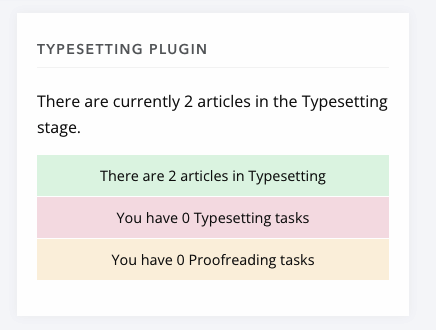
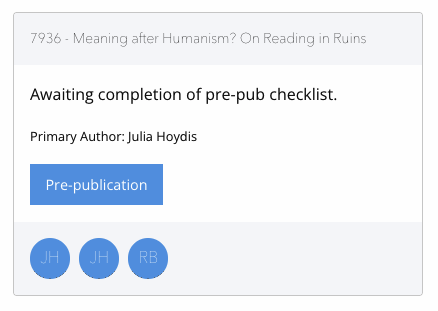

Plugins, Events and Hooks
=========================

.. Warning:: This section is a work in progress and does not contain full documentation of what Plugins can do in Janeway.

Janeway is, first and foremost, a Django application. This means that you can create a normal django application and include it in Janeway via the normal `Django routes <https://docs.djangoproject.com/en/1.11/intro/tutorial01/#creating-the-polls-app>`_. In addition we provide a small plugins framework to make adding new elements to the core easier.

Plugins
-------
Janeway plugins look very similar to Django applications. The Janeway team maintain a `suite of plugins <https://github.com/BirkbeckCTP?q=plugin&type=all&language=&sort=>`_ that you can use. Janeway plugins are usually laid out in this manner:

- example_plugin
    - install
        - settings.json
    - templates
        - example_plugin
            - index.html
            - ...
    - plugin_settings.py
    - urls.py
    - models.py
    - forms.py
    - views.py
    - admin.py
    - hooks.py

.. Note:: Not all of these elements are required for every plugin but this is a generic example of a plugin that has its own models, views and templates.

.. Tip:: We have a plugin generator that you can use to create empty plugins: https://github.com/BirkbeckCTP/generic_plugin_generator

plugin_settings
~~~~~~~~~~~~~~~
The plugin settings file tells Janeway about your plugin and is used to connect it with core areas of Janeway.

::

    from events import logic as events_logic
    from utils import plugins
    from utils.install import update_settings

    PLUGIN_NAME = 'Example Plugin'
    DISPLAY_NAME = 'Example'
    DESCRIPTION = 'Just Another Example'
    AUTHOR = 'Birkbeck Centre for Technology and Publishing'
    VERSION = '0.1'
    SHORT_NAME = 'example'
    MANAGER_URL = 'example_manager' # this must be a named URL route in your plugin urls.py
    JANEWAY_VERSION = "1.3.9" # the minimum version of Janeway that this plugin works with

    # The following settings are only used if your plugin is used as part of the article workflow.
    IS_WORKFLOW_PLUGIN = True
    JUMP_URL = 'example_article' # a named URL route that will include the article_id kwarg
    HANDSHAKE_URL = 'example_articles' # the initial page, usually lists all articles in the plugin's stage
    ARTICLE_PK_IN_HANDSHAKE_URL = True
    STAGE = 'example_plugin' # name of the stage stored against an article when in this stage, can be used to filter articles by the plugin's stage
    KANBAN_CARD = 'example/elements/card.html' # path to a template that can be included in the Kanban page, is looped over per article in the plugin's stage
    DASHBOARD_TEMPLATE = 'example/elements/dashboard.html' # path to a template that is included on Janeway's dashboard page

    class ExamplePlugin(plugins.Plugin):
        plugin_name = PLUGIN_NAME
        display_name = DISPLAY_NAME
        description = DESCRIPTION
        author = AUTHOR
        short_name = SHORT_NAME
        stage = STAGE

        manager_url = MANAGER_URL

        version = VERSION
        janeway_version = JANEWAY_VERSION

        is_workflow_plugin = IS_WORKFLOW_PLUGIN
        handshake_url = HANDSHAKE_URL
        article_pk_in_handshake_url = ARTICLE_PK_IN_HANDSHAKE_URL

    def install():
        ExamplePlugin.install()
        update_settings(
            file_path='plugins/example/install/settings.json'
        )

    # Plugins can register for hooks, when a hook is rendered in a template the registered function will be called.
    def hook_registry():
        return {
            'article_footer_block':
                {
                    'module': 'plugins.example.hooks',
                    'function': 'example_hook',
                },
        }

    # Plugins can register for events (see events/logic.py for a list) when an event is fired the registered function is called.
    def register_for_events():
        # Plugin modules can't be imported until plugin is loaded
        from plugins.example import events

        events_logic.Events.register_for_event(
            ON_ARTICLE_SUBMITTED,
            events.example_event_func,
        )

   The typesetting plugin's dashboard template renders this block.

   Kanban cards look like this, they use the workflow/admin css (foundation).

Other than the unique nature of plugin_settings, hooks and events plugins operate like normal Django applications.

.. Note:: To avoid clashes with core elements all plugin URLs are imported and available at plugins/SHORT_NAME/path/

Events
------
The events framework is designed in a similar way to Django signals but for workflow events. A plugin or Django application can register a function to be called when an event is fired.

::

    from events import logic as events_logic
    events_logic.Events.register_for_event(
        ON_ARTICLE_SUBMITTED, # The event to be registered for
        events.example_event_func, # The function to be called
    )

Plugins can register for events by adding code similar to the above in the register_for_events function in plugin_settings.

Each event has a set of keyword arguments (kwargs) that will be passed to it. You can see these in ``events.logic.Events``.

::

    def example_event_func(**kwargs):
        request = kwargs.get('request')
        article = kwargs.get('article')
        # do something here

Hooks
-----
Janeway also has hooks in its templates. This allows a plugin to insert HTML or do something when a hook is fired on a template. There are only a few of these hooks throughout the system, the main example is to allow plugins to add nav items:

::

    def hook_registry():
        return {
            'press_admin_nav_block': {'module': 'plugins.example.hooks', 'function': 'admin_hook'},
        }

In this example when the press_admin_nav_block hook is fired, ``plugins.example.hooks.admin_hook`` will be called. The function should return HTML, it can do this by returning a string or by rendering and returning a template.

::

    def admin_hook(context):
        return '<li><a href="{url}"><i class="fa fa-money"></i> Example Plugin Admin</a></li>'.format(
            url=reverse('example_admin_index'),
        )s

You can find hooks in the source by searching for  ``{% hook``. Here is a non-exhaustive lise of hooks in Janeway:

- templates/admin/core/article.html
	- edit_article
	- core_article_tasks
	- core_article_footer

- templates/admin/core/nav.html
	- journal_admin_nav_block

- templates/admin/journal/manage/archive_article.html
	- request_edit

- templates/admin/press/nav.html
	- press_admin_nav_block

- templates/admin/production/assigned_article.html
	- conversion_buttons

- templates/admin/submission/start.html
	- publication_fees

- templates/admin/submission/submit_review.html
	- submission_review

- themes/theme_name/templates/core/base.html
	- base_head_css

- themes/theme_name/templates/core/nav.html
	- nav_block

- themes/theme_name/templates/journal/article.html
	- article_footer_block