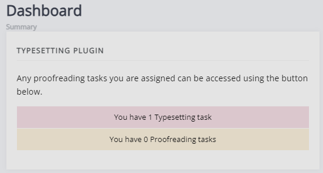
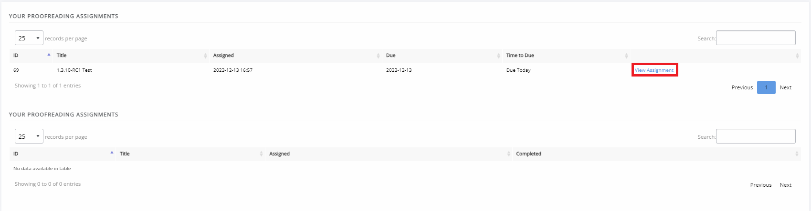

Proofreader Guide
=================
The following users can be assigned as proofreaders:

- Authors of the paper
- Editors
- Users with the Proofreader role

As a proofreader you will be assigned proofing tasks for a paper after it has gone through a round of typesetting. When a new assignment is made you will receive an email with a link that leads to the journal dashboard. Here you can see your proofreading tasks, they will be displayed as part of the typesetting card as proofreading is part of the typesetting stage.

On the proofreading overview page, you can see tasks in progress (on top) and completed tasks (on the bottom).
ith a date.

Proofingreading Assignment
-------------
The proofing task page is broken down into three sections

- Task definition
- Files for proofreading
- Annotated files upload

Task Definition
^^^^^^^^^^^^^^^
The task definition is a note written by the Editor when they create the proofing task. This will include instructions / guidance from the editors. (The below is an example and may differ between journals.)
.. figure:: nstatic/task_definition.png
    :alt: The task definition block section, displaying instructions and the notes from the editor.

Galleys
^^^^^^^
This section lists the files for proofreading (galleys) that have been assigned to you. Common galley types are:
- PDF
- HTML
- XML

For HTML and XML galleys Janeway has a preview button that opens a preview on a separate browser window. 
.. figure:: nstatic/proofing_galleys.png
    :alt: The ‘files for proofreading’ section displaying the galleys, with the ‘View file’ option highlighted.’

You can leave comments in the textbox in the section below - you do not need to annotate the HTML/XML files directly.
PDFs can be downloaded and annotated, but comments can similarly be entered in the textbox in the section below.

.. figure:: nstatic/proofing_notes.png
    :alt: The ‘Notes’ textbox

.. tip::
    You can write as many notes as you like, press Save Note to create a new one and the box will reset.

Annotated files upload
^^^^^^^
In this section you can upload any annotated files and other notes and documents (if you prefer to leave notes in an annotated file, rather than in the textbox).
.. figure:: nstatic/proofing_files_upload.png
    :alt: The ‘Files’ section of the proofreading assignment page. It has a note stating annotated files can be uploaded here. There is also a note stating that once this page has been completed, you cannot return to it. There is a ‘Mark task as complete’ button at the bottom of the page.

When you are done with your proofreading task, you can mark the task as complete. You will not be able to return to this page after and the task will be marked as complete. If you have not opened one or multiple of the proofreading files, Janeway will give you a warning.

