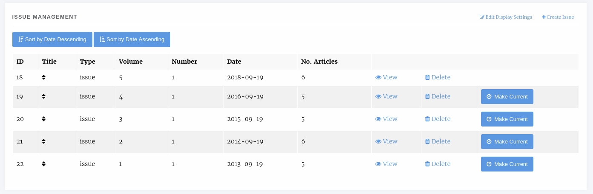
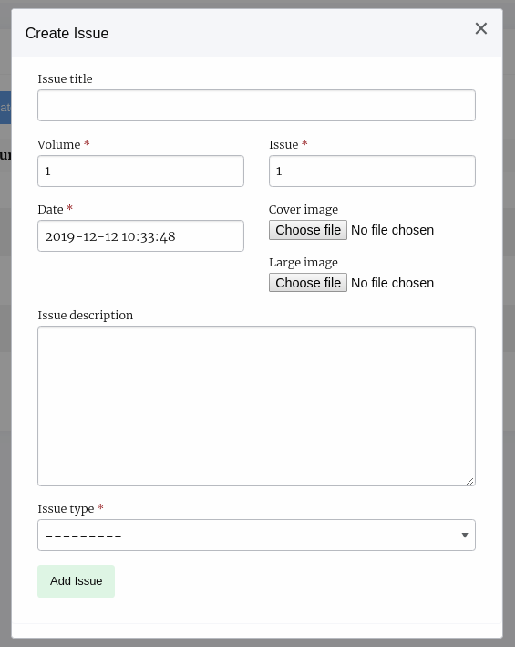
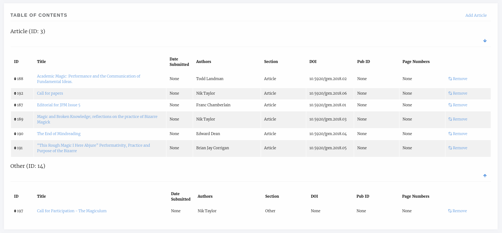
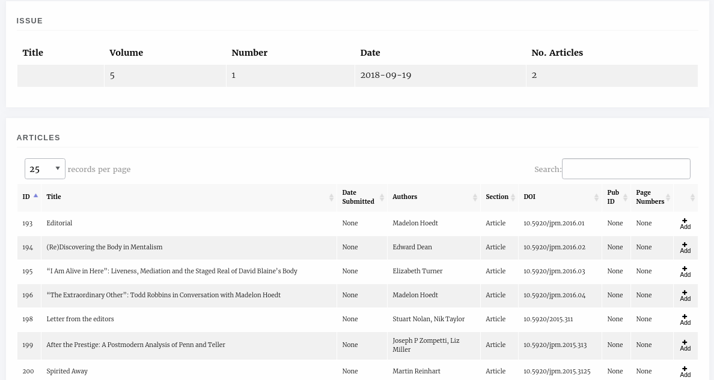
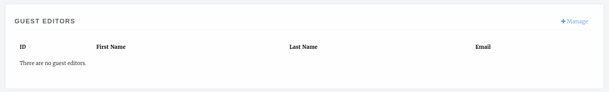
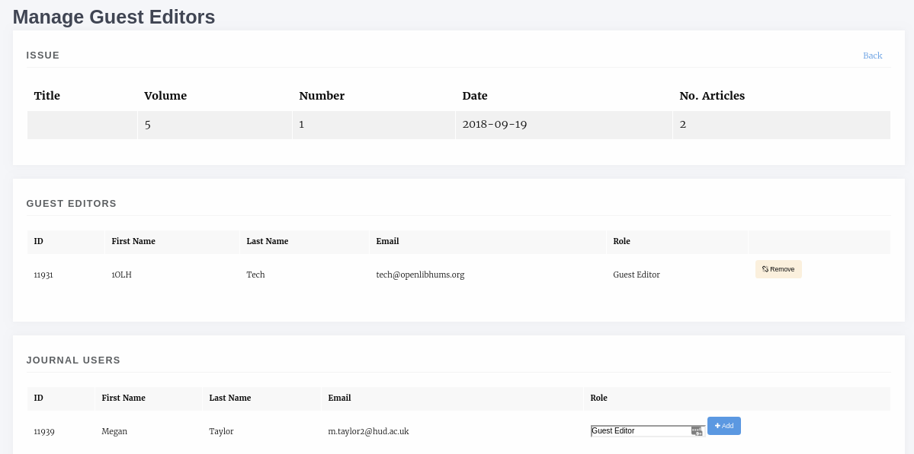
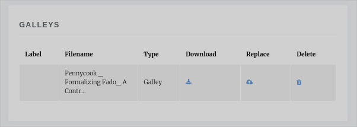

Issues
======
Articles do not have to be part of an issue. There are some services that do require an article have an issue or volume (such as Crossref) so we recommend that if you do continues publication that you create a yearly volume/issue to add papers to.
Articles are added to Issues during the Pre Publication stage, however, Issues can be managed on their own through the Issue Manager, a link to which is available on the Manager page and the main sidebar.

    The Issue Management page.

.. tip::
    To set the current issue, click the Make Current button. The Issue without this button _is_ the current issue.

.. tip::
    To re-order the issues you can drag and drop the rows of the tables or use the sort buttons at the top of the page.

Issue Types
-----------
Janeway comes with two issue types built in: Issue and Collection. Collections differ in so much as they are not a primary Issue for a paper but tend to be collections of papers with similar topics across multiple different issues. So an article may be in the Thomas Pynchon Collection but it's primary Issue may be Volume 1 Issue 2 2019. You can also define your own issue types in the Django admin area.

Display Settings
----------------
In the top right of the Issue Management page there is the Edit Display Settings button. This allows you to configure how issue titles are displayed.

You can turn these elements on or off:

- Volume number
- Issue number
- Issue year
- Issue title
- Article number
- Article page numbers

Here are a few example issue displays:

- Volume 6 • Issue 3 • Fall 2015 • 5–17
- Winter 2009 • 19 pages
- Volume 35 • 2021 • Number 49

.. tip::
    If you want to display a totally custom issue title, disable everything except issue title, and use that field to form the issue display for each issue.

.. tip::
    You can use the article number field to set an arbitrary number for each article, whether to distinguish articles within each volume or issue or to number articles across volumes and issues. Article number is an optional field separate from article ID and can be set in Edit Metadata.

Creating and Editing Issue Details
----------------------------------
You can create new issues from this page using the Create Issue button and you view and edit the detail of individual issues by selecting them.

    An empty create issue form

Information on the sizes of the cover image and large image can be found in the :ref:`Styling<imageguidelines>` section

Manage an Issue
---------------
Clicking on View takes you through to the manage issue page where you can alter an individual issue. The page is split into 4 sections.

- Issue Management
- Table of Contents
- Guest Editors
- Galleys

Issue Management
^^^^^^^^^^^^^^^^
Here you can see the metadata for your issue, edit it, delete it and if the issue is published there is a link to view it on the front end.

Table of Contents
^^^^^^^^^^^^^^^^^
In the Table of contents section you can add articles to the issue, sort the sections and sort the articles within their sections.

For each section there are arrow icons that allow you to move the section up and down, each of the articles can be dragged and dropped into order from inside their section.

    Issue table of contents

You can drop an article from an issue using the Remove link and add new ones clicking the Add Article link.

    Articles that can be added to issues

A list of all articles published in the journal that are not already in the issue is displayed and you can use the Add button to place it in the issue.

Guest Editors
^^^^^^^^^^^^^
An issue can list Guest Editors if the articles aren't being handled by the normal editorial team. Use the Manage button to control who appears as a Guest Editor for an issue/collection.

    An issue with no guest editors

    An issue with no guest editors

When adding a new guest editor you can also enter a role, the default text for this role is *Guest Editor* though you can change it. Use the Add button to add a new guest editor.

Galleys
^^^^^^^
You can upload a Galley file for the whole issue, usually a PDF so that users can download the whole issue in one go.

    An issue with no guest editors

.. tip::
    If you don't upload a Galley for the issue then Janeway will allow users to download a zip file of all the individual article galley files.
