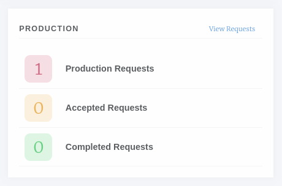
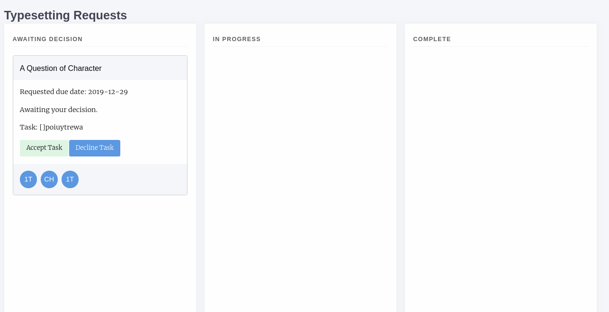
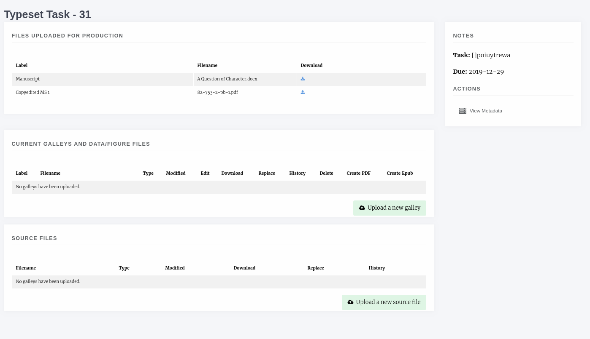
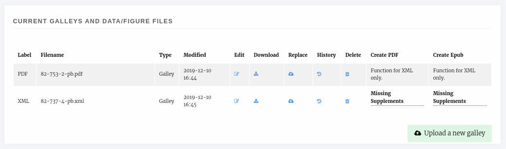
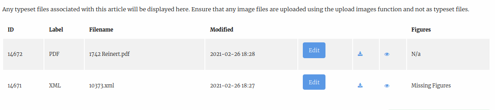
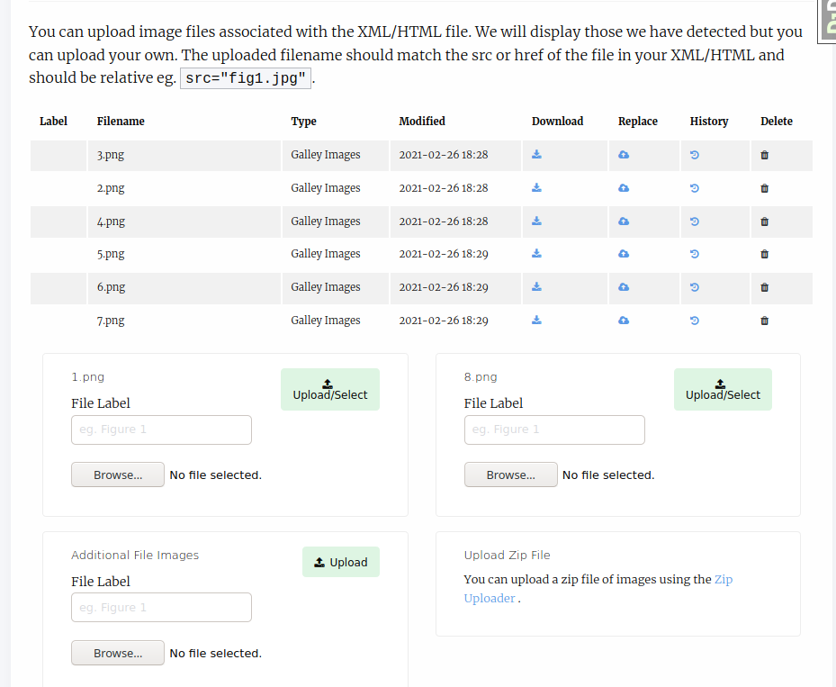
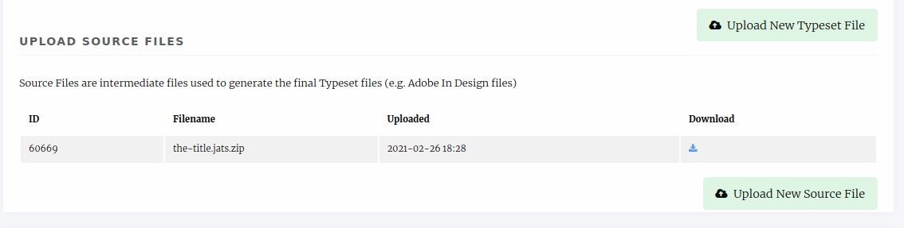

Typesetter Guide
================
When a typesetting task is assigned you will receive an email notification and also be able to see the task on your dashboard under _Production_.

    Production block

Clicking on view requests will display three columns

- Awaiting Decision
    - New Assignments.
- In Progress
    - Assignments you have accepted but no completed.
- Completed
    - Assignments you have completed.

    Typesetting requests

Typesetting a Paper
-------------------
Once you have accepted a request you can then use the view button to display the typesetter interface. This allows typesetters to pull files and view the metadata of the paper so they can produce Galley proofs. The interface is broken in 4 sections.

- Files uploaded for production
    - Lists the files that are to be used in generating the galley proofs.
- Current Galleys
    - Lists any galley proofs that already exist.
- Source Files
    - This is an area for you to upload any intermediate source files (indesign etc).
- Notes
    - Displays the request from the editor and a link to view the article's metadata.

    Typesetter interface

Uploading a Galley
------------------
You can use the Upload a new galley button to upload a new file. There are three upload options.

- XML/HTML
- PDF
- Other (for any other file types)

Janeway processes each differently (or in the case of Other, not at all) so ensure you select the correct upload box.

.. warning::
    Janeway operates with the UTF8 encoding, so you should ensure your plain text galleys (HTML and XML) use this encoding.

Missing Supplements
^^^^^^^^^^^^^^^^^^^
When you upload an XML or HTML galley Janeway will scan it for images and warn you if there you need to upload those images. You can do this by editing the galley file.

    Article with galleys, XML galley has two missing images

In the Edit Galley screen you can upload individual image files, select from exising figure files or upload a zip file of images.

.. tip::
    If you have lots of images ensure they have the correct name (eg, whatever they are called in the XML/HTML file) and zip them. You can use the zip uploaded to upload them in one go.

Managing Galleys
----------------
In addition to uploading images alongside galley files you can also:

- Replace the galley if you've made changes to the original file.
- Upload a CSS file to go along with the galley.
- Change the XSLT file used to render the galley.
- View the galley's history or delete it.

Completing Typesetting
----------------------
Once you have uploaded the required galleys and their files you will notice a new Note to Editor box has appeared in the Notes section, you can use this to complete your task.

Once you have marked it as complete the card will move into the Completed column.

Typesetting Plugin (New!)
-------------------------
The Typesetting plugin is the new workflow used in Janeway for typesetting.
It is currently deployed as a plugin but we intend to replace the above process with this new system in the near future.

With this new plugin, we aim to simplify the process of working on corrections for the typesetter with a brand new interface that is used both when uploading the initial typesetting files as well as when working on corrections. The summary of improvements includes:

- Unified interface for all typesetting tasks
- Better and more complete display of the article metadata
- Error detection warnings: Incomplete corrections, missing figure files, missing metadata...
- Full display of the proofreading comments and corrections requested
- Single input form for uploading galley files

On your dashboard, there should be a card indicating the number of typesetting tasks that are currently awaiting for you to complete:

.. figure:: nstatic/typesetting/typesettingcard.png

When uploading a new Galley (now referred to as 'Typeset Files'), there is now a single button interface where the typesetter uploads a file and gives it an optional label. Janeway will use the best label for the file provided, but typesetters can edit the label to add a different one if necessary.

.. figure:: nstatic/typesetting/upload_typeset_file.png

   Screenshot of the new file upload box

Image Files
^^^^^^^^^^^

When a typeset file in the XML or HTML format is uploaded that has image links Janeway will detect them and prompt the typesetter to upload them. Image filenames should match those within the XML or HTML.

At this point, press the edit button and upload each image on the box matching the filename from the XML/HTML file:

If an XML or HTML file has a large number of images it is often faster to use the zip uploader. Create a .zip archive file and within it place each of the image files. The image filename must match the link in the typeset file otherwise it will not import them.

Source Files
^^^^^^^^^^^^

If any intermiadate files have been used for the production of the Files (such as Adobe In Design files), they can be uploaded under the 'Source Files' section

   Screenshot of the source files form

Finishing Up
^^^^^^^^^^^^

Before you can complete the task, Janeway will warn you of any potential problems it detects with your files, such as potential missing images on the XML/HTML files or Typeset Files that have not yet been corrected.

.. figure:: nstatic/typesetting/images_missing_warning.png

Once you are done with the typesetting or correction task, you can leave a note for the editor and complete it for the editor to review.

Typesetting Recipes
-------------------

Right-to-Left Text Direction
^^^^^^^^^^^^^^^^^^^^^^^^^^^^

.. highlight:: xml

Arabic and many other languages are written right to left, requiring special markup in an XHTML environment that operates left-to-right by default.

Here is an example in JATS XML of an isolated bit of Arabic text in a document that is otherwise left-to-right:

.. figure:: nstatic/typesetting/arabic-rtl-jats-xml.png

Make sure you use a text editor that shows zero-width unicode characters, like U-2067. The above screenshot is an XML file opened in VS Code.

Here is the rendered output:

.. figure:: nstatic/typesetting/arabic-rtl-rendered.png

Notice the following about the code sample:

1. On each line, begin with the `RLI unicode character (U+2067) <https://www.unicode.org/reports/tr9/#Explicit_Directional_Isolates>`_ at the beginning of the line to explicitly trigger  right-to-left rendering for the remainder of the line, including symbols like periods that the browser would otherwise render left-to-right. This is roughly equivalent to the HTML attribute `dir="rtl"`. If working with periods or other punctuation, note that they may appear on the right in your code editor, but render on the left in the browser.

2. Wrap each line in the `styled-content JATS element <https://jats.nlm.nih.gov/publishing/tag-library/1.3/element/styled-content.html>`_ and apply a `style attribute <https://jats.nlm.nih.gov/publishing/tag-library/1.3/attribute/style.html>`_ specifying CSS for right text alignment and block display.

3. When working with long lines of text, make sure not to introduce arbitrary line breaks.

Center Alignment
^^^^^^^^^^^^^^^^

.. highlight:: xml

In some cases you might need to center-align text::

    
Then came the apotheosis of modernism:

    <disp-quote>
        <styled-content style="text-align: center; display: block;">
            Leaves are falling
        </styled-content>
    </disp-quote>

The output is:

.. figure:: nstatic/typesetting/text-align-center.png

This is accomplished with the the `styled-content JATS element <https://jats.nlm.nih.gov/publishing/tag-library/1.3/element/styled-content.html>`_ and a `style attribute <https://jats.nlm.nih.gov/publishing/tag-library/1.3/attribute/style.html>`_ specifying CSS for center text alignment and block display.
