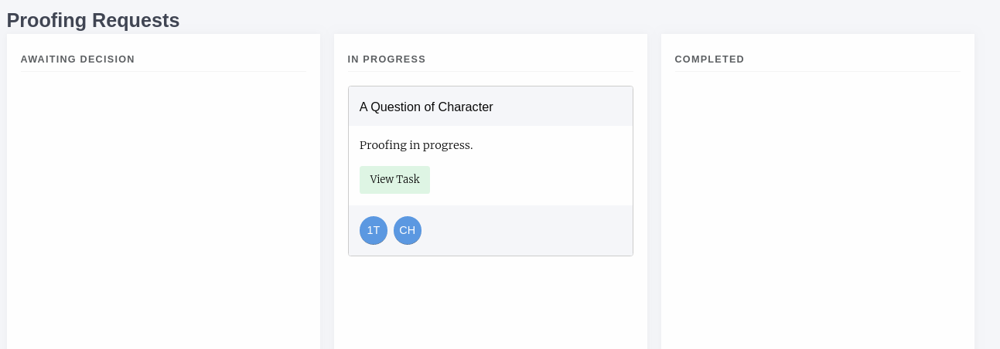
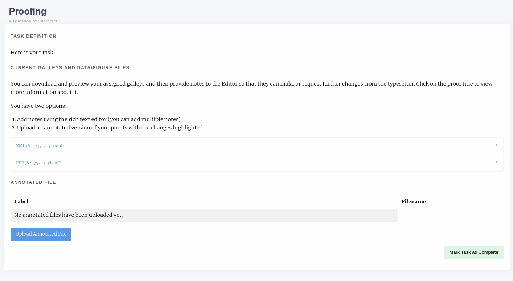
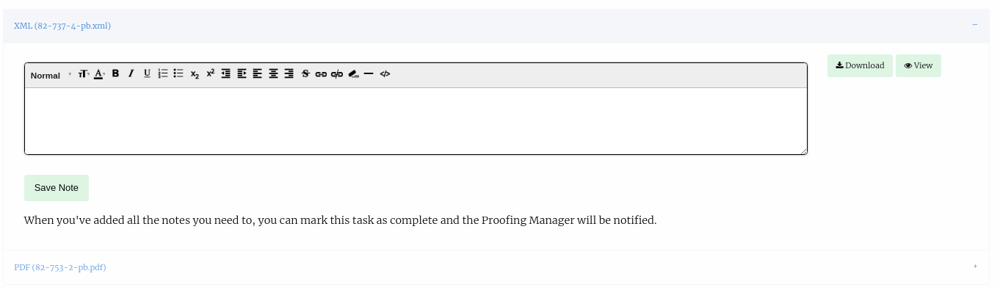

Proofreader Guide
=================
As a proofreader you may be assigned proofing tasks for a paper. When a new assignment is made you will receive and email and be able to see the requests from the journal dashboard. The list of potential proofreaders for a paper is made up of:

- Authors of the paper
- Editors
- Users with the Proofreader role

From the dashboard you will be able to see a list of New, In Progress and Completed proofing requests. Once you have accepted a new task you can use the View button to begin proofing.

    A proofing task that has been accepted

.. tip::
    Hover over the initials/pictures to see the names and roles of those involved in the paper. PM means Proofing Manager

Proofing Task
-------------
The proofing task page is broken down into three sections

- Task Definition
- Galleys
- File Upload

    A proofing task that has been accepted

Task Definition
^^^^^^^^^^^^^^^
The task definition is a note written by the Proofing Manager when they create the proofing task.

Galleys
^^^^^^^
This section lists the galleys that the Proofing Manager has assigned you. Common galley types are:

- PDF
- HTML
- XML

For HTML and XML galleys Janeway has a preview button that will render the galley into a viewable block so you don't need to understand the underlying markup to proof them.

Each of the Galleys has an accordian-type drop down so if you click on its name you will see a new section appear with more information.

    An XML galley expanded

You now have the option to Download or View the galley, this will open in a new tab in your browser. You can then use the notes box to write notes on the galley file.

.. tip::
    You can write as many notes as you like, press Save Note to create a new one and the box will reset.

In addition you can download and annotate the galley documents and then upload them again if you require.

When you have proofed *all* of the galley files you can mark the task as complete, it will be moved to the completed task list.

