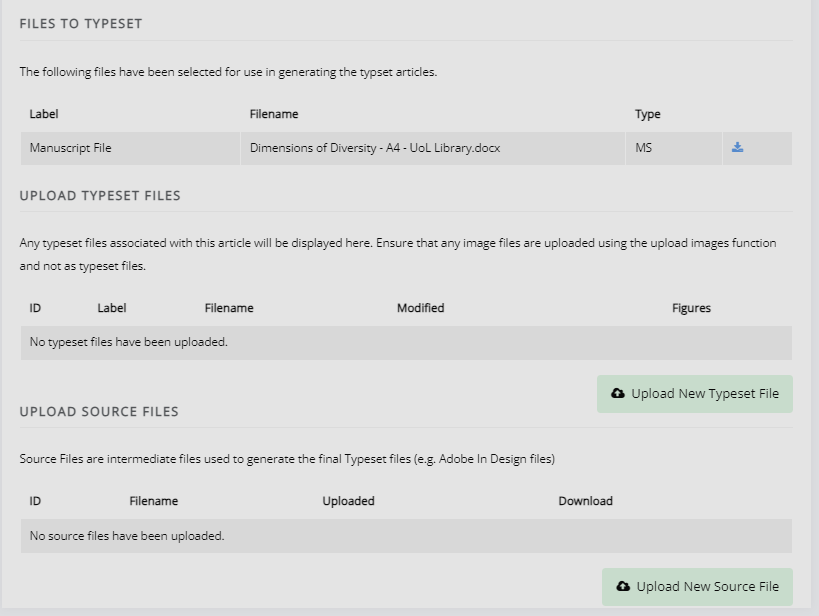
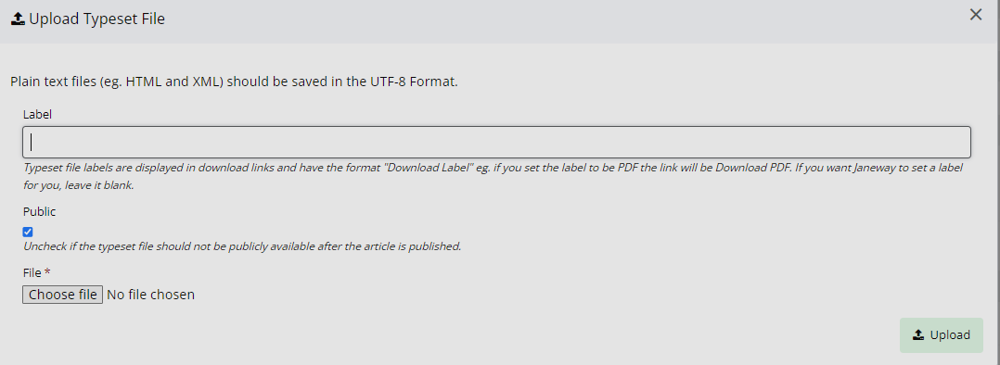
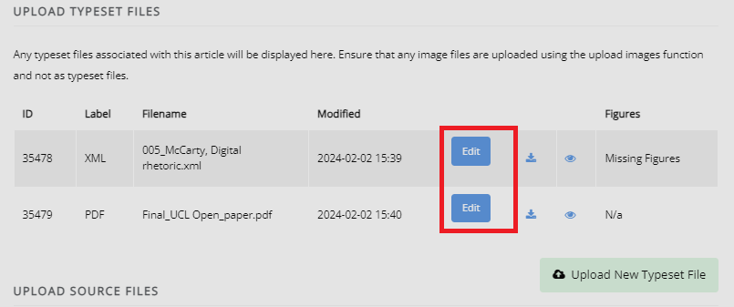
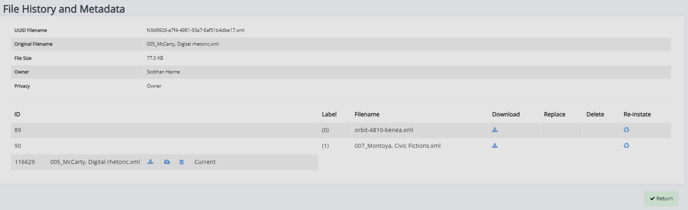
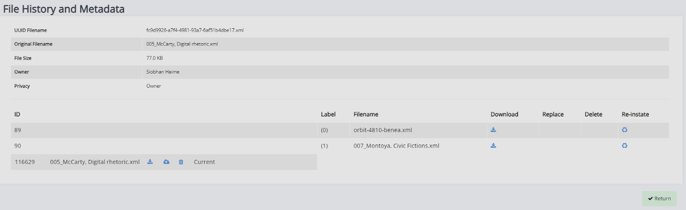
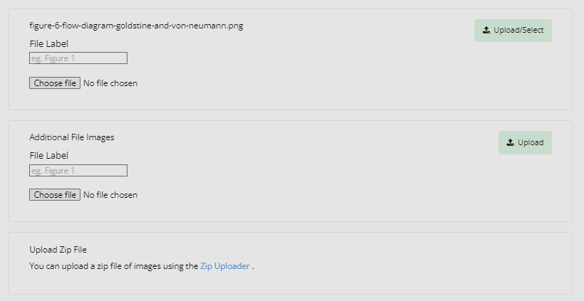
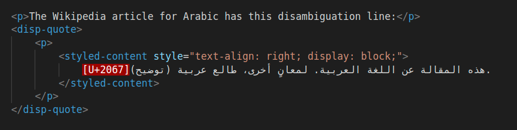
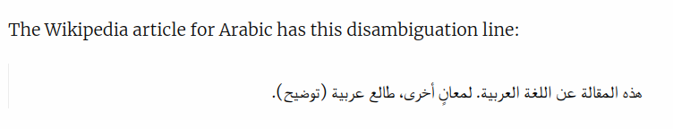
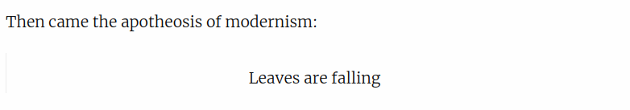

Typesetter Guide
================
When you have been assigned a typesetting task, you will receive an email notification containing a link. This link will lead to the Janeway Dashboard.

.. note:: 
    This workflow guide assumes you are using the updated typesetting workflow (also known as the 'typsetting plugin'). If you are not, please contact us as we may need to update your install.

.. figure:: ../nstatic/typesetting_dashboardblock.png
    :alt: The typesetter Dashboard displaying the number of typesetter tasks assigned.

From here, you will be able to see the number of open typesetting assignments you have. If you click on this, it will take you to the ‘Typesettings Assignments’ page and you will be able to see both your currently open typesetting assignments (the top block) and your completed assignments (the bottom block).

For the open assignments, it will display:
- Title
- Current typesetting round
- Date is was assigned
- Due date
- Time to due date

For the completed assignments, it will display:
- Title
- Typesetting round
- Date it was assigned
- Completion date

.. figure:: ../nstatic/typesetting_assignments.png
	:alt: The Typesettings assignments page.
	:class: Screenshot

You can then click ‘View Assignment’ to display the assignment page.

Typesetting a Paper
-------------------
On this page, you will find relevant information about the typesetting task. This will include the instructions, manuscript files, metadata, options to accept or decline the task, and space to upload completed files.

.. figure:: ../nstatic/typesetting_assignments.png
	:alt: The ‘Assignment information’ page.
	:class: Screenshot

This page is broken in three sections.

- Assignmentment information
	- In this section, you will be able to see any comments from the editor or proofreaders which have been provided to you. 
	- You will also be able to view and download the files to typeset (manuscript files) and any supplementary files. 
	- Under this, you will find space to upload your completed work and (if required) any source files.

- Metadata
	- This is where you will find all of the relevant metadata for the typesetting task.

- Complete typesetting
	- Under this section, you can leave any notes you may have to the editors. 
	- This is also where you will mark the assignment as complete to submit the uploaded files.

Uploading a Typeset File
^^^^^^^^^^^^^^^^^^^^^^^^

Click ‘Upload a New Typeset File’ button to upload your completed work. 
Source files (such as Adobe In Design files) can be uploaded using the ‘Upload New Source File’ button (if required).

In this box, you will find the option to label your file with its filetype. For instance, if this is an HTML file, you should label it as ‘HTML’, if it is a PDF, you should label it as ‘PDF’, etc. Janeway will attempt to provide an appropriate label if this is left blank. However, if you wish to make sure the label is correct, you can enter the filetype manually. For instructions on how to edit a label, please see the section below.

.. Warning::
    Janeway operates with the UTF-8 encoding. Please ensure that any HTML and XML files (plain text galleys) you upload use this encoding.

Editing typeset files and uploading additional files
^^^^^^^^^^^^^^^^^^^^^^^^^^^^^^^^^^^^^^^^^^^^^^^^^^^^
If you need to make changes to the typeset files, reupload them or upload additional files, this can be done through the ‘Edit Typeset File’ page. This page can be accessed by clicking on the ‘Edit’ button.

This page is broken into three sections.

- The typeset file
	- Here you can replace the typeset file and see the file history.

- Typeset file details
	- This is where you can edit the file label which denotes the filetype.

- Additional file uploads
	- If authors or editors have already provided images, you can find and select them here. 
	- You can upload images yourself, either as individual image files or a .zip file.
	- There is space to upload a CSS file to go along with the galley. 
	- You can also change the XSLT file used to render the galley from here. 

Managing typeset files
^^^^^^^^^^^^^^^^^^^^^^
In the first section of the page, you can view the file currently uploaded, and replace or download it. You can also view the file's history by clicking on the button under 'History'. 

This will open a page where you can download and reinstate previous versions, or delete the current file entirely (in case you have uploaded an incorrect file).

Managing images and figure files
^^^^^^^^^^^^^^^^^^^^^^^^^^^^^^^^

When a file that has been typeset in HTML or XML contains image links, Janeway will detect these and prompt you to upload the image files. The file names should match the src or href used in the XML/HTML and should be relative (e.g. src="fig1.jpg").

If the image files have already been uploaded onto Janeway, you can select them instead.

If you need to upload a large number of images, it might be faster to use the zip uploader (see ‘Upload Zip File’ in the image below). To do so, create a .zip archive file with all of the image files. The image filenames must match the links in the typeset file, otherwise it will not import them.

Styling
^^^^^^^
On this page, you can also upload a CSS file associated with the article for an individual style, if required. We recommend avoiding style changes to the header and footer type elements as this will affect the layout of the page.

You can also select the XSL file used for rendering the HTML out of the file. This will be the Janeway default (1.4.3.) except if explicitly instructed otherwise. In that case, this will be communicated by the editors as part of the typesetting task or agreement.

Finishing Up
------------
Once you are done with the typesetting (or correction) task, you can leave a note for the editor and click the button to complete the task to send it to the editor to review. Please note that once you complete the task, you will be unable to return to this page.

.. note:: If you attempt to complete the typesetting task with potential issues remaining (e.g. missing image files, typeset files that have not been corrected), Janeway will warn you about this.

.. figure:: ../nstatic/typesetting/images_missing_warning.png
    :alt: A missing figure warning. It reads "Some of the typeset files don't have their images uploaded." Below it the file and filetype are displayed and the following text: "You can add images to the typeset file by hitting 'Edit'. A menu will show you which images are missing."

Typesetting Recipes
-------------------

Right-to-Left Text Direction
^^^^^^^^^^^^^^^^^^^^^^^^^^^^

.. highlight:: xml

Arabic and many other languages are written right to left, requiring special markup in an XHTML environment that operates left-to-right by default.

Here is an example in JATS XML of an isolated bit of Arabic text in a document that is otherwise left-to-right:

Make sure you use a text editor that shows zero-width unicode characters, like U-2067. The above screenshot is an XML file opened in VS Code.

Here is the rendered output:

Notice the following about the code sample:

1. On each line, begin with the `RLI unicode character (U+2067) <https://www.unicode.org/reports/tr9/#Explicit_Directional_Isolates>`_ at the beginning of the line to explicitly trigger  right-to-left rendering for the remainder of the line, including symbols like periods that the browser would otherwise render left-to-right. This is roughly equivalent to the HTML attribute `dir="rtl"`. If working with periods or other punctuation, note that they may appear on the right in your code editor, but render on the left in the browser.

2. Wrap each line in the `styled-content JATS element <https://jats.nlm.nih.gov/publishing/tag-library/1.3/element/styled-content.html>`_ and apply a `style attribute <https://jats.nlm.nih.gov/publishing/tag-library/1.3/attribute/style.html>`_ specifying CSS for right text alignment and block display.

3. When working with long lines of text, make sure not to introduce arbitrary line breaks.

Center Alignment
^^^^^^^^^^^^^^^^

.. highlight:: xml

In some cases you might need to center-align text::

    
Then came the apotheosis of modernism:

    <disp-quote>
        <styled-content style="text-align: center; display: block;">
            Leaves are falling
        </styled-content>
    </disp-quote>

The output is:

This is accomplished with the the `styled-content JATS element <https://jats.nlm.nih.gov/publishing/tag-library/1.3/element/styled-content.html>`_ and a `style attribute <https://jats.nlm.nih.gov/publishing/tag-library/1.3/attribute/style.html>`_ specifying CSS for center text alignment and block display.
